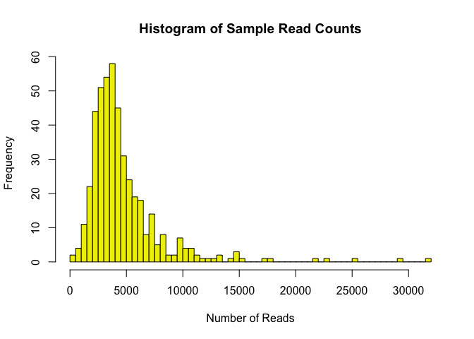
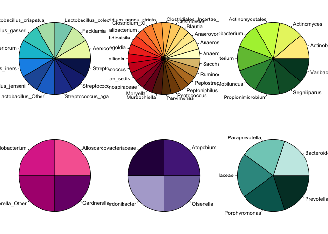
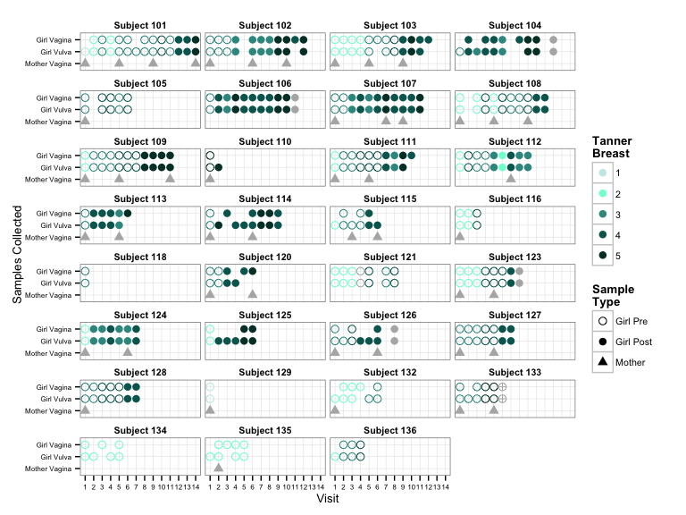

# Preparation of bacterial read abundance data and participant metadata
Roxana J. Hickey <roxana.hickey@gmail.com> and Matthew L. Settles <mattsettles@gmail.com>  
Last updated January 12, 2015  

***
# Description
This is a supplement to the paper "Vaginal microbiota of adolescent girls prior to the onset of menarche resemble those of reproductive-age women" by Hickey et al. The code works through the preparation of bacterial read abundance data (from Roche 454 pyrosequencing) and participant metadata for subsequent analysis. It also generates the custom color palettes used to make figures for downstream analyses. The analyses can be run directly from the R Markdown file using RStudio. Before starting, you will want to check that the necessary packages are installed (see the library calls in the first section).

See the project repository at http://github.com/roxanahickey/adolescent for more information.

**Update 2015-01-08: I added "echo=FALSE" options to the chunks of code that make a graph. View full code in R Markdown script.**

***
# Initial setup

```r
## Clear current workspace
rm(list=ls())

## Load packages
library(Biobase)
```

```
## Loading required package: BiocGenerics
## Loading required package: parallel
## 
## Attaching package: 'BiocGenerics'
## 
## The following objects are masked from 'package:parallel':
## 
##     clusterApply, clusterApplyLB, clusterCall, clusterEvalQ,
##     clusterExport, clusterMap, parApply, parCapply, parLapply,
##     parLapplyLB, parRapply, parSapply, parSapplyLB
## 
## The following object is masked from 'package:stats':
## 
##     xtabs
## 
## The following objects are masked from 'package:base':
## 
##     anyDuplicated, append, as.data.frame, as.vector, cbind,
##     colnames, do.call, duplicated, eval, evalq, Filter, Find, get,
##     intersect, is.unsorted, lapply, Map, mapply, match, mget,
##     order, paste, pmax, pmax.int, pmin, pmin.int, Position, rank,
##     rbind, Reduce, rep.int, rownames, sapply, setdiff, sort,
##     table, tapply, union, unique, unlist
## 
## Welcome to Bioconductor
## 
##     Vignettes contain introductory material; view with
##     'browseVignettes()'. To cite Bioconductor, see
##     'citation("Biobase")', and for packages 'citation("pkgname")'.
```

```r
library(gplots)
```

```
## Warning: package 'gplots' was built under R version 3.1.1
```

```
## KernSmooth 2.23 loaded
## Copyright M. P. Wand 1997-2009
## 
## Attaching package: 'gplots'
## 
## The following object is masked from 'package:stats':
## 
##     lowess
```

```r
library(RColorBrewer)

## Display session info
sessionInfo()
```

```
## R version 3.1.0 (2014-04-10)
## Platform: x86_64-apple-darwin10.8.0 (64-bit)
## 
## locale:
## [1] en_US.UTF-8/en_US.UTF-8/en_US.UTF-8/C/en_US.UTF-8/en_US.UTF-8
## 
## attached base packages:
## [1] parallel  stats     graphics  grDevices utils     datasets  methods  
## [8] base     
## 
## other attached packages:
## [1] RColorBrewer_1.0-5  gplots_2.14.1       Biobase_2.24.0     
## [4] BiocGenerics_0.10.0
## 
## loaded via a namespace (and not attached):
##  [1] bitops_1.0-6       caTools_1.17       colorspace_1.2-4  
##  [4] digest_0.6.4       evaluate_0.5.5     formatR_0.10      
##  [7] gdata_2.13.3       ggplot2_1.0.0      grid_3.1.0        
## [10] gtable_0.1.2       gtools_3.4.1       htmltools_0.2.4   
## [13] KernSmooth_2.23-12 knitr_1.6          lattice_0.20-29   
## [16] lme4_1.1-7         MASS_7.3-33        Matrix_1.1-4      
## [19] minqa_1.2.3        munsell_0.4.2      nlme_3.1-117      
## [22] nloptr_1.0.4       plyr_1.8.1         proto_0.3-10      
## [25] Rcpp_0.11.2        reshape2_1.4       rmarkdown_0.2.49  
## [28] scales_0.2.4       splines_3.1.0      stringr_0.6.2     
## [31] tools_3.1.0        yaml_2.1.13
```

```r
## Make new directory for output
#dir.create("data-postproc")

## Create new directory for 'miscellaneous' figures (Figure S1 at end of script)
# dir.create("figures")
# dir.create("supplemental")
```

***
# I: Process bacterial read abundance data

This section takes the bacterial read abundance data (post-cleaning and following taxonomic assignment using RDP Bayesian Classifier and PATRIC) and summarizes it into abundance and proportion tables of community composition per sample.  

## Input bacterial read abundance data
Sequence data were generated by Roche 454 pyrosequencing and summarized into taxon abundance tables following preprocessing steps described in the manuscript methods and supplementary materials. At this stage we input the phylotype abundance data. Most taxa are assigned to the genus level or higher, with the exception of *Gardnerella*, *Lactobacillus* and *Streptococcus*, which were speciated using the PATRIC database and a dynamic tree-cutting algorithm in WGCNA to cluster 16S V1-V3 sequences. This resulted in many hits to known species, but also a lot of "species" clusters that did not have a named top hit. These were written into the species abundance table with names like "Lactobacillus c.1", "Lactobacillus c.2" and so forth. These may represent different strains or "ribotypes", but many (especially the low-abundance ones) could simply be artifacts of differences in 454 read length. Since we are not interested in these for the purpose of our analysis, we will collapse them back to the genus level and retain only the named species. To do this we will extract the species we want from the species abundance table, substract their totals from the appropriate genus in the genus abundance table, then combine them into one table. We will check total read counts as we move along to ensure we do not mistakenly add or lose anything in the process.


```r
## Read in genus abundance table
abund.g <- read.table("data/genus-abund.txt", 
                      sep="\t", header=T, row.names=1, as.is=T)
da.g <- dim(abund.g)
abund.g <- abund.g[-da.g[1],] # remove last row (ReadTotals)
abund.g <- abund.g[,-da.g[2]] # remove last column (groupTotal)
level.g <- abund.g$Level
abund.g$Level <- NULL

## Read in species abundance table
abund.s <- read.table("data/species-abund.txt", 
                      sep="\t", header=T, row.names=1, as.is=T)
da.s <- dim(abund.s)
abund.s <- abund.s[-da.s[1],] # remove last row (ReadTotals)
abund.s <- abund.s[,-da.s[2]] # remove last column (groupTotal)
abund.s$Level <- NULL

## Extract Lactobacillus species
abund.lacto <- abund.s[grep("Lactobacillus", rownames(abund.s)),]
abund.lacto.spp <- abund.lacto[-grep("Lactobacillus c.", 
                                     rownames(abund.lacto), 
                                     fixed=TRUE),]
rownames(abund.lacto.spp)
```

```
##  [1] "Lactobacillus acidophilus;Lactobacillus amylolyticus;Lactobacillus amylovorus;Lactobacillus crispatus;Lactobacillus helveticus;Lactobacillus kefiranofaciens;Lactobacillus ultunensis"
##  [2] "Lactobacillus antri;Lactobacillus oris"                                                                                                                                               
##  [3] "Lactobacillus casei;Lactobacillus paracasei;Lactobacillus rhamnosus"                                                                                                                  
##  [4] "Lactobacillus coleohominis"                                                                                                                                                           
##  [5] "Lactobacillus delbrueckii"                                                                                                                                                            
##  [6] "Lactobacillus fermentum"                                                                                                                                                              
##  [7] "Lactobacillus gasseri;Lactobacillus johnsonii"                                                                                                                                        
##  [8] "Lactobacillus gastricus;Lactobacillus mucosae"                                                                                                                                        
##  [9] "Lactobacillus gigeriorum"                                                                                                                                                             
## [10] "Lactobacillus iners"                                                                                                                                                                  
## [11] "Lactobacillus jensenii"                                                                                                                                                               
## [12] "Lactobacillus reuteri"                                                                                                                                                                
## [13] "Lactobacillus salivarius"
```

```r
## Simplify names that have multiple top hits (currently appended in 
## alphabetical order). We know L. crispatus and L. gasseri are commonly 
## found in the vagina, so we select those names over the rest. For all 
## the others, just keep the first name.
rownames(abund.lacto.spp)[c(1,2,3,7,8)] <- c("Lactobacillus crispatus", 
                                             "Lactobacillus antri",
                                             "Lactobacillus casei",
                                             "Lactobacillus gasseri",
                                             "Lactobacillus gastricus")
rownames(abund.lacto.spp)
```

```
##  [1] "Lactobacillus crispatus"    "Lactobacillus antri"       
##  [3] "Lactobacillus casei"        "Lactobacillus coleohominis"
##  [5] "Lactobacillus delbrueckii"  "Lactobacillus fermentum"   
##  [7] "Lactobacillus gasseri"      "Lactobacillus gastricus"   
##  [9] "Lactobacillus gigeriorum"   "Lactobacillus iners"       
## [11] "Lactobacillus jensenii"     "Lactobacillus reuteri"     
## [13] "Lactobacillus salivarius"
```

```r
## Extract Gardnerella species
abund.gard <- abund.s[grep("Gardnerella", rownames(abund.s)),]
abund.gard.vaginalis <- abund.gard[-grep("Gardnerella c.", 
                                         rownames(abund.gard), 
                                         fixed=TRUE),]
rownames(abund.gard.vaginalis)
```

```
## [1] "Gardnerella vaginalis"
```

```r
## Extract Streptococcus species
abund.strep <- abund.s[grep("Streptococcus", rownames(abund.s)),]
abund.strep.spp <- abund.strep[-grep("Streptococcus c.", 
                                     rownames(abund.strep), 
                                     fixed=TRUE),]
rownames(abund.strep.spp)
```

```
## [1] "Streptococcus agalactiae"                                                                                                                                                                                                                                                
## [2] "Streptococcus anginosus;Streptococcus intermedius"                                                                                                                                                                                                                       
## [3] "Streptococcus australis;Streptococcus cristatus;Streptococcus gordonii;Streptococcus infantis;Streptococcus mitis;Streptococcus oralis;Streptococcus parasanguinis;Streptococcus peroris;Streptococcus pneumoniae;Streptococcus pseudopneumoniae;Streptococcus sanguinis"
## [4] "Streptococcus bovis;Streptococcus constellatus;Streptococcus downei;Streptococcus equinus;Streptococcus gallolyticus;Streptococcus infantarius;Streptococcus intermedius;Streptococcus macedonicus;Streptococcus pasteurianus"                                           
## [5] "Streptococcus canis;Streptococcus dysgalactiae;Streptococcus equi;Streptococcus ictaluri;Streptococcus iniae;Streptococcus parauberis;Streptococcus porcinus;Streptococcus pseudoporcinus;Streptococcus pyogenes;Streptococcus uberis;Streptococcus urinalis"            
## [6] "Streptococcus mutans;Streptococcus pneumoniae;Streptococcus ratti"                                                                                                                                                                                                       
## [7] "Streptococcus salivarius;Streptococcus thermophilus;Streptococcus vestibularis"
```

```r
## Simplify names following same strategy as before (take first name). For 
## Streptococcus anginosis/intermedius, we'll prefer anginosis since 
## intermedius is a member of the anginosis group anyway.
rownames(abund.strep.spp)[c(2,3,4,5,6,7)] <- c("Streptococcus anginosis",
                                               "Streptococcus australis",
                                               "Streptococcus bovis",
                                               "Streptococcus canis",
                                               "Streptococcus mutans",
                                               "Streptococcus salivarius")
rownames(abund.strep.spp)
```

```
## [1] "Streptococcus agalactiae" "Streptococcus anginosis" 
## [3] "Streptococcus australis"  "Streptococcus bovis"     
## [5] "Streptococcus canis"      "Streptococcus mutans"    
## [7] "Streptococcus salivarius"
```

```r
## Calculate the counts remaining at genus level
abund.lacto.other <- abund.g["Lactobacillus",] - colSums(abund.lacto.spp)
abund.gard.other <- abund.g["Gardnerella",] - colSums(abund.gard.vaginalis)
abund.strep.other <- abund.g["Streptococcus",] - colSums(abund.strep.spp)

## Sanity check (each should equal zero)
sum(abund.g["Lactobacillus",] - colSums(abund.lacto.spp) - abund.lacto.other)
```

```
## [1] 0
```

```r
sum(abund.g["Gardnerella",] - colSums(abund.gard.vaginalis) - abund.gard.other)
```

```
## [1] 0
```

```r
sum(abund.g["Streptococcus",] - colSums(abund.strep.spp) - abund.strep.other)
```

```
## [1] 0
```

```r
## Write the new combined table
abund.tmp <- abund.g
dim(abund.tmp)
```

```
## [1] 419 457
```

```r
level.tmp <- level.g
length(level.tmp)
```

```
## [1] 419
```

```r
## Remove the genera we are going to replace
rem <- which(rownames(abund.tmp) %in% 
               c("Lactobacillus","Gardnerella","Streptococcus"))
abund.tmp <- abund.tmp[-rem,]
dim(abund.tmp)
```

```
## [1] 416 457
```

```r
level.tmp <- level.tmp[-rem]
length(level.tmp)
```

```
## [1] 416
```

```r
## Put it all together
abund <- rbind(abund.lacto.spp, abund.lacto.other,
               abund.gard.vaginalis, abund.gard.other,
               abund.strep.spp, abund.strep.other,
               abund.tmp)

## Sanity check (should equal zero)
sum(colSums(abund) - colSums(abund.g))
```

```
## [1] 0
```

```r
## Add level back
abund$Level <- c(rep("species", nrow(abund.lacto.spp)), "genus",
                 rep("species", nrow(abund.gard.vaginalis)), "genus",
                 rep("species", nrow(abund.strep.spp)), "genus",
                 level.tmp)

## Reorder the rownames and colnames
ord <- sort(rownames(abund))
abund <- abund[ord,]

## Set level as new object and remove from abund
level <- abund$Level
names(level) <- rownames(abund)
abund$Level <- NULL

## Cleanup
rm(abund.gard, abund.gard.other, abund.gard.vaginalis,
   abund.lacto, abund.lacto.other, abund.lacto.spp,
   abund.strep, abund.strep.other, abund.strep.spp,
   abund.g, abund.s, abund.tmp, da.g, da.s, level.tmp, 
   level.g, ord, rem)
```

## Check read counts
Next, we check read counts and discard any samples that are too low. I was fairly liberal and tossed only one sample that had just one read.


```r
## Input read counts
readData <- read.table("data/read-counts.txt", 
                       sep="\t", header=TRUE)

## Update colnames to simplify names and match with metadata
colnames(abund) <- sub("^X", "", colnames(abund))

## Sort abund by colnames (sample names) in alphabetical order
ord <- sort(colnames(abund))
abund <- abund[,ord]

## Sanity check (should equal 0.1079849)
abund["Lactobacillus gasseri","10201Vag1"]/sum(abund[,"10201Vag1"])
```

```
## [1] 0.108
```

```r
## Remove any rows with 0 reads (none in this case)
rem <- which(rowSums(abund)==0)
if (length(rem) > 0){
  abund <- abund[-rem,]
  level <- level[-rem]
}

## Save original abundance data and taxa levels
abund.orig <- abund # 440 obs. (taxa) of 457 variables (samples)
level.orig <- level

## Check how many samples have at least 1000 reads
remSample <- colSums(abund) >= 1000 & !is.na(colSums(abund))
table(remSample)
```

```
## remSample
## FALSE  TRUE 
##     7   450
```

```r
colSums(abund[which(remSample==FALSE)])
```

```
## 10206Vul1 11306Vul1 12302Vag1 12302Vul1 12303Vag1 12304Vul1 12401Vag1 
##       467         1       840       930       950       934       462
```

```r
## Remove 11306Vul1 (only has 1 read)
abund$"11306Vul1" <- NULL # should have 456 columns after doing this

## Histogram of read counts
hist(colSums(abund), breaks=50, xlab="Number of Reads", 
     main="Histogram of Sample Read Counts", col="yellow2")
```

 

```r
mean(colSums(abund))
```

```
## [1] 4723
```

```r
median(colSums(abund))
```

```
## [1] 3876
```

## Simplify the abundance table
Now we reduce the read abundance table to a more manageable size, keeping only the most common taxa (comprising 1% or more of the community in at least two samples, or 5% or more of the community in at least one sample). The rest will be grouped in the "Other Bacteria" category. We are not discarding anything, just regrouping.


```r
## Prepare to reduce abundance data
abund.red <- abund # make new abund object prior to reduction
level.red <- level # make new level object prior to reduction
prop.red <- sweep(abund.red, 2, colSums(abund.red), "/") # proportion table

## Sanity check (should equal 0.1079849)
prop.red["Lactobacillus gasseri","10201Vag1"]
```

```
## [1] 0.108
```

```r
## Reduce table and combine Bacteria-level taxa into "Other"
id.nm <- rownames(abund.red)
id.nm[level=="species"] <- sapply(strsplit(rownames(abund.red)[level=="species"], 
                                           split=" "), "[[", 1L)
species2red <- unique(id.nm[level=="species"]) # genera with multiple species 
for(tax in species2red){
  ind <- id.nm %in% tax
  ## Keep all taxa present at a proportion of >= 0.01 in more than one sample, 
  ## or present at >= 0.05 in at least one sample
  keepRows <- ((apply(prop.red[ind,] >= 0.01, 1, sum, na.rm=TRUE) > 1) | 
                 (apply(prop.red[ind,] >= 0.05, 1, sum,na.rm=TRUE) > 0))
  Other <- colSums(abund.red[ind,][!keepRows,]) # Combine non-species

  abund.tmp <- abund.red[ind,][keepRows,]
  level.tmp <- level.red[ind][keepRows]
  nms.tmp <- c(rownames(abund.tmp),paste(tax,"spp.",sep=" "))
  abund.tmp <- rbind(abund.tmp,Other)
  level.tmp <- c(level.tmp,"species")
  rownames(abund.tmp) <- nms.tmp
  
  abund.red <- abund.red[!ind,]
  abund.red <- rbind(abund.red,abund.tmp)
  level.red <- level.red[!ind]
  level.red <- c(level.red,level.tmp)  

  prop.red <- sweep(abund.red,2,colSums(abund.red),"/")
  id.nm <- rownames(abund.red)
  id.nm[level.red=="species"] <- sapply(strsplit(rownames(abund.red)[level.red=="species"],
                                                 split=" "),"[[",1L)  
}

## Sanity check
prop.red["Lactobacillus gasseri","10201Vag1"] ## should equal 0.1079849
```

```
## [1] 0.108
```

```r
## Sort abund, level and prop by taxa names
ord <- order(rownames(abund.red))
abund.red <- abund.red[ord,]
level.red <- level.red[ord]
prop.red <- prop.red[ord,] 

## Remove taxa with < 0.05 and only found in 1
keepRows <- ((apply(prop.red >= 0.01,1,sum,na.rm=TRUE) > 1) | 
               (apply(prop.red >= 0.05, 1, sum,na.rm=TRUE) > 0)) | 
  level.red == "species"
keepRows["Bacteria"] <- FALSE

## Combine non-species into "Other"
Other <- colSums(abund.red[!keepRows,])
abund.red <- abund.red[keepRows,] # reduced to 81 obs.
level.red <- level.red[keepRows]
abund.red <- rbind(abund.red,"Other Bacteria"=Other) # 82 including "Other Bacteria"
level.red <- c(level.red,"Bacteria")

## Combine "Lactobacillus Other" with "Lactobacillus"
abund.red["Lactobacillus Other",] <- colSums(abund.red[c("Lactobacillus", 
                                                         "Lactobacillus spp."),])

## Combine "Gardnerella Other" with "Gardnerella"
abund.red["Gardnerella Other",] <- colSums(abund.red[c("Gardnerella", 
                                                       "Gardnerella spp."),])

## Combine "Streptococcus Other" with "Streptococcus"
abund.red["Streptococcus Other",] <- colSums(abund.red[c("Streptococcus", 
                                                         "Streptococcus spp."),])

## Remove "Lactobacillus", "Gardnerella" and "Streptococcus" since
## these are now included with the other categories
rem <- which(rownames(abund.red) %in% c("Lactobacillus", "Lactobacillus spp.",
                                        "Gardnerella", "Gardnerella spp.",
                                        "Streptococcus", "Streptococcus spp."))
abund.red <- abund.red[-rem,]
level.red <- level.red[-rem]
level.red <- c(level.red, rep("genus", 3))
names(level.red)[76:79] <- c("Other Bacteria", 
                             "Lactobacillus Other",
                             "Gardnerella Other",
                             "Streptococcus Other")

## Reorder rows
ord <- sort(rownames(abund.red))
abund.red <- abund.red[ord,]
level.red <- level.red[ord]

## Sanity check (should equal 0)
sum(colSums(abund) - colSums(abund.red))
```

```
## [1] 0
```

```r
## Replace spaces and periods with underscores
rownames(abund.red) <- sub("  ", "_", rownames(abund.red))
rownames(abund.red) <- sub(" ", "_", rownames(abund.red))

## Re-compute proportions from reduced abund table
prop.red <- sweep(abund.red, 2, colSums(abund.red),"/")

## Sanity check (should equal 0.1079849)
prop.red["Lactobacillus_gasseri","10201Vag1"]
```

```
## [1] 0.108
```

```r
rownames(abund.red) <- gsub("  ", " ", rownames(abund.red))
rownames(abund.red) <- gsub(" ", "_", rownames(abund.red))
rownames(abund.red) <- gsub("/", "_", rownames(abund.red))
rownames(prop.red) <- rownames(abund.red)
```

## Output phylotype abundance and proportion tables
Our reduced abundance and proportion tables should now have 79 rows (taxa), including an "Other Bacteria" category. Note that we did not actually discard any reads in the previous step but rather collapsed most of the very low-abundance taxa into the "Other Bacteria" category (or in the case of speciated Lactobacillus, Gardnerella and Streptococccus, these were collapsed into their own "Other" categories. We will save these as CSV files.


```r
## Write tables of taxon counts and proportions 
## (note that R inserts an "X" before colnames starting with a number)
write.csv(data.frame(Names=rownames(abund.red), Level=level.red, abund.red), 
          file="data-postproc/bacterial-community-count-postproc.csv", 
          row.names=FALSE)
write.csv(data.frame(Names=rownames(prop.red), Level=level.red, prop.red), 
          file="data-postproc/bacterial-community-proportion-postproc.csv", 
          row.names=FALSE)

## Cleanup
rm(abund, abund.tmp, id.nm, ind, keepRows, level, level.tmp, nms.tmp, 
   ord, Other, rem, remSample, species2red, tax, readData)
```

***
# II: Process participant metadata

This section reads in the participant metadata and summarizes it into tables for downstream analysis.  

Initially, participant metadata include the following variables:

* subject = subject ID (100's are girls, 200's are moms; last two digits indicate matching girl-mom pairs)
* visit = clinical visit number
* sample.ID.vag = sample ID for vaginal swab
* sample.ID.vul = sample ID for vulvar swab (collected from girls only)
* vag = logical indicator for whether vaginal swab was collected at visit
* vul = logical indicator for whether vulvar swab was collected at visit
* type = girl or mom
* age.sampling = age of girl at time of visit/sampling
* men.stat = menarcheal status (pre=premenarcheal, post=postmenarcheal, mom.post=mom)
* tan.br.self = self-assessed Tanner breast score (1-5 discrete)
* tan.gen.self = self-assessed Tanner genital score (1-5 discrete)
* tan.br.dr = clinician-assessed Tanner breast score (1-5 discrete)
* tan.gen.dr = clinician-assessed Tannger genital score (1-5 discrete)
* ph = vaginal pH (range 4-7.5 continuous)
* nugent = Nugent score (0-10 discrete)
* race = race classification (bla=Black, cauc=Caucasian, ami=American Indian)
* ethn = ethnicity (nhis=Non-Hispanic, hisp=Hispanic)
  
## Input metadata


```r
## Read in metadata file
meta.tmp <- read.csv("./data/participant-metadata.csv", 
                     header=TRUE, na.strings="NA")

## Set subject (i.e., participant) as a factor
meta.tmp$subject <- as.factor(meta.tmp$subject)

## Set 11306Vul1 to "FALSE" for vulvar sample 
## (because we removed it from the prop and abund tables)
meta.tmp$vul[meta.tmp$subject==113 & meta.tmp$visit==6] <- FALSE

## Save original metadata object
meta.orig <- meta.tmp

## Make "full" metadata object with vagina and vulva samples on separate rows
meta <- rbind(meta.tmp[which(meta.tmp$vag==TRUE),-c(3,4)],
              meta.tmp[which(meta.tmp$vul==TRUE),-c(3,4)])

names <- c(as.character(meta.tmp$sample.ID.vag[which(meta.tmp$vag==TRUE)]),
           as.character(meta.tmp$sample.ID.vul[which(meta.tmp$vul==TRUE)]))

rownames(meta) <- names
ord <- order(rownames(meta))
meta <- meta[ord,]

## Add a few more variables to metadata
## Set "vag" or "vul" for site
meta$site <- paste("v", substr(rownames(meta), 7, 8), sep="")

## Extract last two numbers of subject ID to match girls and moms
meta$gm.pair <- substr(meta$subject, 2, 3)

## Longer version of gm.pair for labeling plots
meta$gm.pair.fullID <- paste("Subject 1", meta$gm.pair, sep="")

## Concatenate type and site
meta$type.site <- paste(meta$type, meta$site, sep=".")

## Concatenate type, site and men.stat
meta$type.site.men.stat <- paste(meta$type, 
                                 meta$site, 
                                 meta$men.stat, sep=".")

## And take these out because we no longer need them
meta$vag <- NULL
meta$vul <- NULL

## Cleanup
rm(meta.tmp, names, ord)
```

## Output metadata for all vaginal and vulvar samples from girls and mothers

```r
## Save metadata
write.csv(meta, file="data-postproc/metadata-expanded.csv", row.names=TRUE)
```

***
# III: Define custom color palettes and functions

This section sets custom color palettes for use in plotting. Includes specific colors for:

* Custom 50-color palette for miscellaneous graphs
* Metadata variables including subject/gm.pair, type, site, men.stat, Tanner scores, Nugent scores
* Heatmap color palette (for proportions 0 to 1)
* Bacterial taxa colors

## Define color palettes for participant metadata

```
## null device 
##           1
```

### Combine into metadata color palette object

```r
col.meta <- data.frame(cbind(col.gm.pair[factor(meta$gm.pair)],
                             col.type[factor(meta$type)],
                             col.site[factor(meta$site)],
                             col.men.stat[factor(meta$men.stat)],
                             col.tanner[factor(meta$tan.br.dr)],
                             col.tanner[factor(meta$tan.gen.dr)],
                             col.tanner[factor(meta$tan.br.self)],
                             col.tanner[factor(meta$tan.gen.self)],
                             col.nugent),
                            stringsAsFactors=FALSE, row.names=rownames(meta))
colnames(col.meta) <- c("gm.pair", "type", "site", "men.stat", "tan.br.dr", 
                        "tan.gen.dr", "tan.br.self", "tan.gen.self", "nugent")

## Set point character for sample type x menarche status
col.meta$pch.sample.gp <- as.numeric(c(NA,16,1,NA,15,0,17)[factor(meta$type.site.men.stat)])
```

## Define custom heatmap color palette

```r
col.heatmap <- colorRampPalette(c("#FFF68F", "#90EE90", "#00CDCD", "#3288BD", 
                                  "#5E4FA2", "#D02090", "#D53E4F", "#8B0000"))(100)
```

## Define color palette for taxa

```r
df <- read.csv("data/79taxa.csv", header=TRUE)

## There are 17 unique orders and 7 unique phyla

YlGnBu <- brewer.pal(9, "YlGnBu")
YlOrRd <- brewer.pal(9, "YlOrRd")
RdPu <- brewer.pal(9, "RdPu")
YlGn <- brewer.pal(9, "YlGn")
PuOr <- brewer.pal(11, "PuOr")
Greys <- brewer.pal(9, "Greys")
BrBG <- brewer.pal(11, "BrBG")

df$order.col <- rep("NA", nrow(df))

par(mfrow=c(2,3), mar=c(1,1,1,1))

lacto.col <- colorRampPalette(c(YlGnBu[2:4], "cyan3", "dodgerblue2", YlGnBu[7:9]))(length(df$order.col[grep("Lactobacillales", df$Order)]))
df$order.col[grep("Lactobacillales", df$Order)] <- lacto.col[c(1,2,4,3,5,6,7,9,8,10,11,12)]
pie(rep(1,12), col=df$order.col[grep("Lactobacillales", df$Order)], labels=df$taxon[grep("Lactobacillales", df$Order)])

df$order.col[grep("Clostridiales", df$Order)] <- colorRampPalette(c(YlOrRd, BrBG[1:4]))(length(df$order.col[grep("Clostridiales", df$Order)]))
pie(rep(1,23), col=df$order.col[grep("Clostridiales", df$Order)], labels=df$taxon[grep("Clostridiales", df$Order)])

df$order.col[grep("Actinomycetales", df$Order)] <- colorRampPalette(c("lightgoldenrod1", "olivedrab1", YlGn[c(7,9)]))(length(df$order.col[grep("Actinomycetales", df$Order)]))
pie(rep(1,9), col=df$order.col[grep("Actinomycetales", df$Order)], labels=df$taxon[grep("Actinomycetales", df$Order)])

df$order.col[grep("Bifidobacteriales", df$Order)] <- RdPu[5:8]
pie(rep(1,4), col=df$order.col[grep("Bifidobacteriales", df$Order)], labels=df$taxon[grep("Bifidobacteriales", df$Order)])

df$order.col[grep("Coriobacteriales", df$Order)] <- PuOr[c(10,11,8,9)]
pie(rep(1,4), col=df$order.col[grep("Coriobacteriales", df$Order)], labels=df$taxon[grep("Coriobacteriales", df$Order)])

df$order.col[grep("Bacteroidales", df$Order)] <- BrBG[7:11]
pie(rep(1,5), col=df$order.col[grep("Bacteroidales", df$Order)], labels=df$taxon[grep("Bacteroidales", df$Order)])
```

 

```r
df$order.col[!(df$Order %in% c("Lactobacillales",
                               "Clostridiales",
                               "Actinomycetales",
                               "Bifidobacteriales",
                               "Coriobacterialies",
                               "Bacteroidales"))] <- colorRampPalette(Greys[2:8])(length(df$order.col[!(df$Order %in% c("Lactobacillales",
                                                                                                                        "Clostridiales",
                                                                                                                        "Actinomycetales",
                                                                                                                        "Bifidobacteriales",
                                                                                                                        "Coriobacterialies",
                                                                                                                        "Bacteroidales"))]))

## Write new taxa color palette
col.taxa <- df$order.col
names(col.taxa) <- df$taxon

## Cleanup
rm(df, lacto.col, YlGnBu, YlOrRd, RdPu, YlGn, PuOr, Greys, BrBG, i)
```

## Load custom ggplot themes and functions

```r
source("./scripts/custom-ggplot-settings.R") # custom ggplot settings
source("./scripts/heatmap.3.rjh.R") # modified from heatmap.3 (see file for reference)
source("./scripts/hcoplot.R") # from Borcard, Gillet and Legendre (2009) Numerical Ecology with R. Springer.
```

Finally, now that we have our bacterial abundance data, metadata and color palettes defined, we can make Figure S1, which is a summary of all the samples collected from girls and mothers during the study.

## Figure S1. Summary of all vaginal and vulvar samples collected from girls and mothers.
Each panel shows all of the vaginal and vulvar samples collected from an individual participant (circles), as well as vaginal samples collected from her mother (triangles) when applicable. The x-axis indicates the clinical visit at which each sample was collected; visits occurred approximately every three months. Open circles signify premenarcheal status, and filled circles signify postmenarcheal status in girls. e menarcheal status was unknown for subject 133 at visit 6, indicated by an open circle with crosshatch. Points are color-coded to signify the Tanner breast stage of the girls as shown in the legend at top right (mother samples and those with missing values are colored gray).

 

***
# Save R workspace
This will save the workspace (data) in two separate images: one named with today's date, in case you ever need to restore that version, and another with a non-dated name that can be easily loaded into subsequent analyses.


```r
save.image(paste("data-postproc/01-data-prep-", Sys.Date(), ".RData", sep=""))
save.image(paste("data-postproc/01-data-prep-last-run.RData", sep=""))
```
