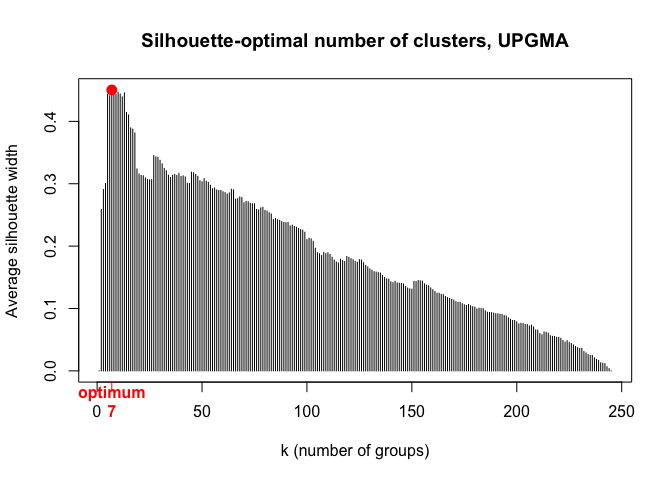
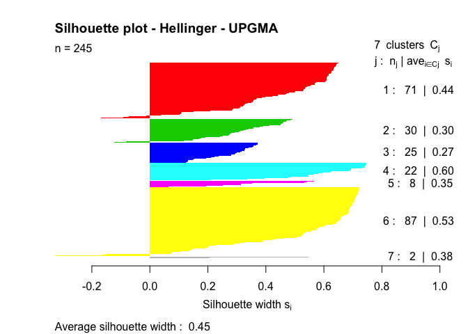
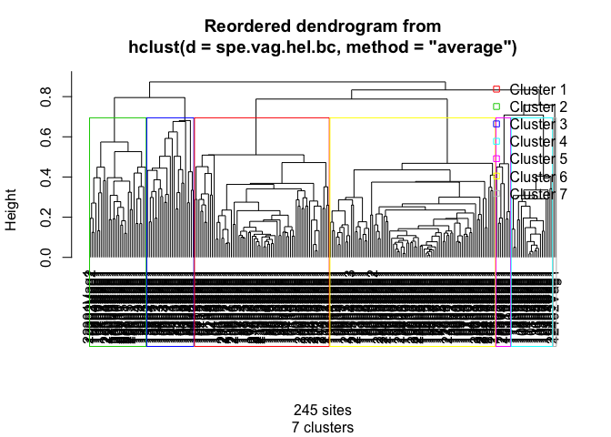
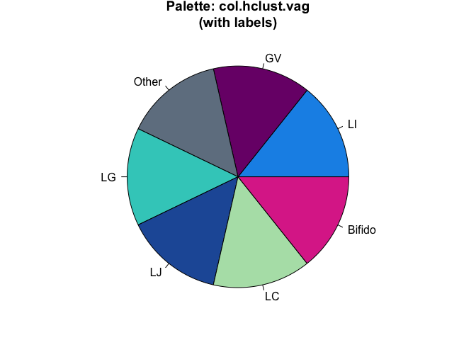
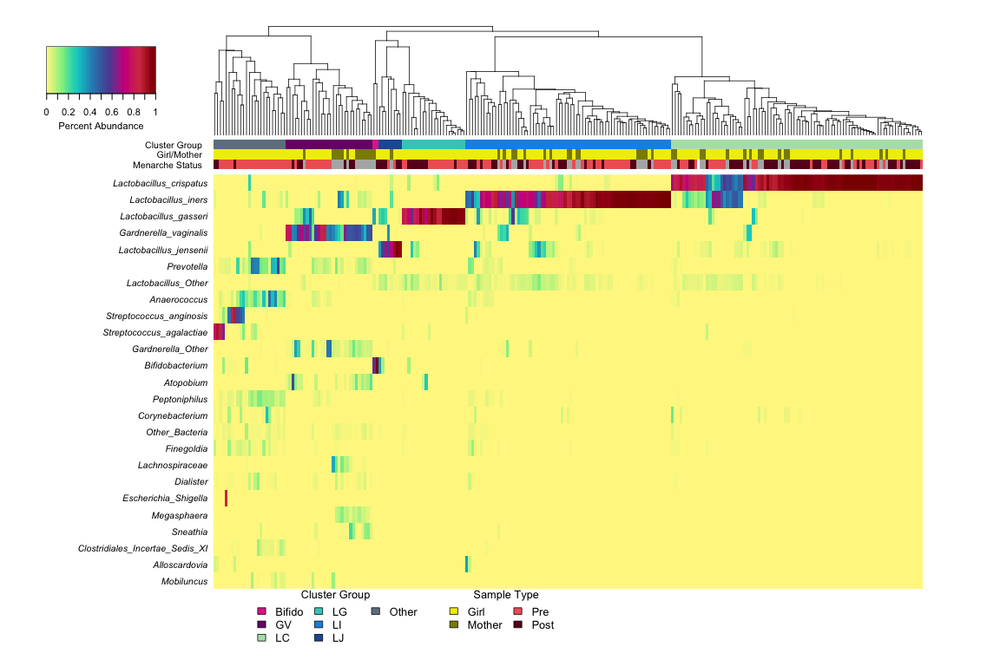
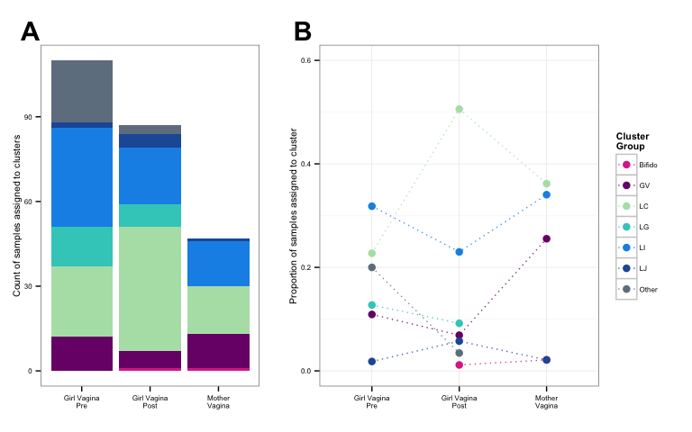
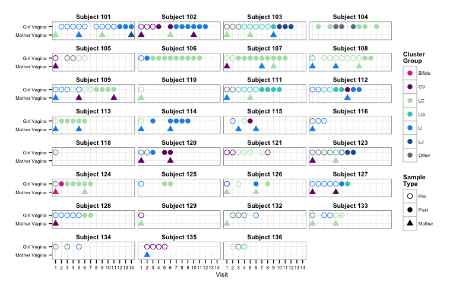
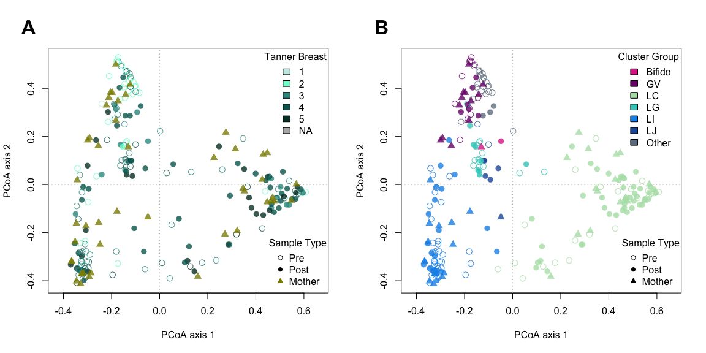
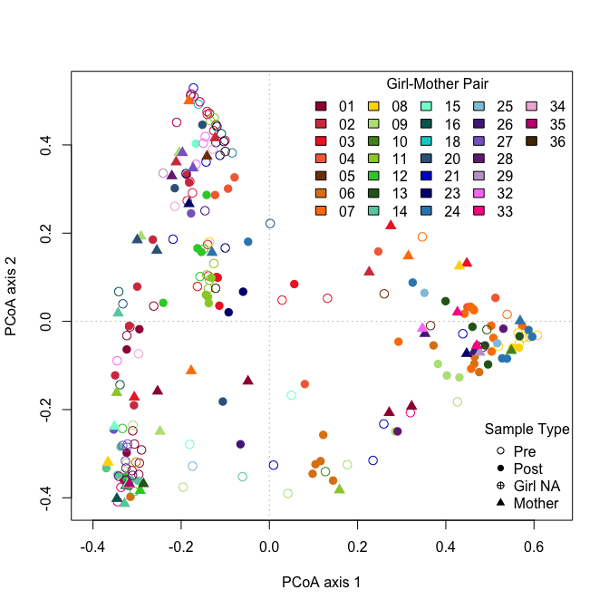
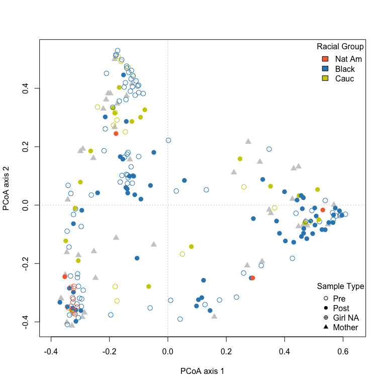

# Hierarchical clustering and ordination analysis of vaginal microbiota
Roxana J. Hickey <roxana.hickey@gmail.com>  
Last updated January 12, 2015  

***
# Description
This is a supplement to the paper "Vaginal microbiota of adolescent girls prior to the onset of menarche resemble those of reproductive-age women" by Hickey et al. The code works through the first set of analyses and generation of figures related to the assessment of vaginal microbiota composition in girls and mothers. The analyses can be run directly from the R Markdown file using RStudio. It should be run after "01-data-prep.Rmd", which prepares the data and color palettes used in this script.

See the project repository at http://github.com/roxanahickey/adolescent for more information.

**Update 2015-01-08: I added "echo=FALSE" options to the chunks of code that make a graph. View full code in R Markdown script.**

## Objective
The first major objective of this study is to characterize the composition of vaginal microbiota in girls both premenarche and postmenarche as well as mothers in this study. To do this we will first perform hierarchical clustering analysis of the vaginal microbiota from girls and mothers to determine what the major types of communities are and how they are distributed across the sample groups we are interested in. Then we will perform principal coordinates analysis to get a different perspective of the similarity among samples in relation to other variables of interest.

***
# Initial setup
After running adolescent-supp-01.Rmd, two RData files named "01-data-prep-[date].RData" and "01-data-prep-last-run.RData" are saved in the data-postproc directory (two files are written so as to preserve older versions if necessary). Load either file to get all of the data necessary to run the analyses and generate figures below.

*Note: If you run the R Markdown script 'as is' from the same directory containing it and the 'data' and 'data-postproc' subdirectories, all figures will be printed inside the resulting PDF or HTML output. If you want to save the figures as individual files, uncomment the lines below starting with 'dir.create()' as well as any lines throughout the script starting with 'ggsave()' or 'pdf()'. I made note of each of these within the chunk code.*


```r
## Clear current workspace
rm(list=ls())

## Load the RData file created from adolescent-supp-01.Rmd
load("data-postproc/01-data-prep-last-run.RData")

## Load packages
library(ape)
```

```
## Warning: package 'ape' was built under R version 3.1.1
```

```r
library(cluster)
library(gclus)
library(ggplot2)
library(gplots)
```

```
## Warning: package 'gplots' was built under R version 3.1.1
```

```
## KernSmooth 2.23 loaded
## Copyright M. P. Wand 1997-2009
## 
## Attaching package: 'gplots'
## 
## The following object is masked from 'package:stats':
## 
##     lowess
```

```r
library(grid)
library(plyr)
library(reshape)
```

```
## 
## Attaching package: 'reshape'
## 
## The following objects are masked from 'package:plyr':
## 
##     rename, round_any
```

```r
library(scatterplot3d)
library(vegan)
```

```
## Loading required package: permute
## Loading required package: lattice
## This is vegan 2.0-10
```

```r
## Display session info
sessionInfo()
```

```
## R version 3.1.0 (2014-04-10)
## Platform: x86_64-apple-darwin10.8.0 (64-bit)
## 
## locale:
## [1] en_US.UTF-8/en_US.UTF-8/en_US.UTF-8/C/en_US.UTF-8/en_US.UTF-8
## 
## attached base packages:
## [1] grid      stats     graphics  grDevices utils     datasets  methods  
## [8] base     
## 
## other attached packages:
##  [1] vegan_2.0-10         lattice_0.20-29      permute_0.8-3       
##  [4] scatterplot3d_0.3-35 reshape_0.8.5        plyr_1.8.1          
##  [7] gplots_2.14.1        ggplot2_1.0.0        gclus_1.3.1         
## [10] cluster_1.15.2       ape_3.1-4           
## 
## loaded via a namespace (and not attached):
##  [1] bitops_1.0-6       caTools_1.17       colorspace_1.2-4  
##  [4] digest_0.6.4       evaluate_0.5.5     formatR_0.10      
##  [7] gdata_2.13.3       gtable_0.1.2       gtools_3.4.1      
## [10] htmltools_0.2.4    KernSmooth_2.23-12 knitr_1.6         
## [13] lme4_1.1-7         MASS_7.3-33        Matrix_1.1-4      
## [16] minqa_1.2.3        munsell_0.4.2      nlme_3.1-117      
## [19] nloptr_1.0.4       proto_0.3-10       Rcpp_0.11.2       
## [22] reshape2_1.4       rmarkdown_0.2.49   scales_0.2.4      
## [25] splines_3.1.0      stringr_0.6.2      tools_3.1.0       
## [28] yaml_2.1.13
```

```r
## Create directories for figure output
# dir.create("hclust")
# dir.create("pcoa")
```

## Subset data
The dataframes from the first step contain both vagina and vulva samples. Since we are only interested in the vagina samples at this step, we first subset the data for ease of use. Below we make new phylotype/taxon abundance and proportion tables from the 'abund.red' and 'prop.red' tables, a new metadata table from the 'meta' dataframe, and a reduced color palette table from 'col.meta'.


```r
## Subset abund and prop tables to include only vagina samples
spe.abund.vag <- t(abund.red[,meta$site=="vag"])
spe.prop.vag <- t(prop.red[,meta$site=="vag"])

## Subset the metadata table
meta.vag <- subset(meta, site=="vag")

## Subset the metadata color palette
col.meta.vag <- col.meta[meta$site=="vag",]
```

## Hellinger standardization of taxon abundance data
Next, we standardize the taxon abundances using the Hellinger method. This is a recommended approach when the "species" are sparsely populated at some sites, resulting in many zeros in the species abundance matrix. We then compute the Bray-Curtis dissimilarity matrix from the Hellinger-standardized abundance matrix. This will be used in subsequent clustering and ordination analyses. It does not matter whether you apply the Hellinger transformation to the count (spe.abund.vag) or proportion (spe.prop.vag) table; they will produce the same result.


```r
## Perform the Hellinger transformation
spe.vag.hel <- decostand(spe.abund.vag, method="hellinger")

## Compute the Bray-Curtis dissimilarity matrix 
spe.vag.hel.bc <- vegdist(spe.vag.hel, method="bray")
```

***
# I: Perform hierarchical clustering

## Hierarchical clustering analysis
The first set of analyses involves clustering the samples based on community composition and selecting the optimal clustering model and number of clusters. The approaches are based on those outlined in the following texts:

* Legendre P, Legendre L. (2012). _Cluster analysis_. 3rd ed. Elsevier.
* Borcard D, Gillet F, Legendre P. (2011). _Numerical ecology with R_. Springer.

*Note: vegan and other ecological software commonly refer to "sites" and "species". In our case, "sites" refers to the individual samples (vaginal and vulvar swabs) while "species" refers to the taxa present in each sample (our "species" are actually taxa at multiple taxonomic levels, mostly genus).*

We start by performing hierarchical clustering using multiple linkage strategies (single, complete, average/UPGMA, Ward) and select the optimal one using Gower's distance. After that, we select the optimal number of clusters using the maximum silhouette width. First, compute the clusters and look at the dendrograms:

 

```
## null device 
##           1
```

## Selection of optimal clustering model
Now we select the best clustering method by determining the cophenetic distance of each hierarchical clustering, followed by calculation of the Gower distance (Gower 1983), which is the sum of squared differences between the original and cophenetic distances. The method with the lowest Gower distance is considered the optimal clustering model for the distance matrix used. Below, this method identifies average/UPGMA is the best clustering model.


```r
## Calculate cophenetic distance for each hclust object
spe.vag.hb.single.coph <- cophenetic(spe.vag.hb.single)
spe.vag.hb.complete.coph <- cophenetic(spe.vag.hb.complete)
spe.vag.hb.upgma.coph <- cophenetic(spe.vag.hb.upgma)
spe.vag.hb.ward.coph <- cophenetic(spe.vag.hb.ward)

## Calculate the Gower distance
gow.vag.dist.single <- sum((spe.vag.hel.bc-spe.vag.hb.single.coph)^2)
gow.vag.dist.complete <- sum((spe.vag.hel.bc-spe.vag.hb.complete.coph)^2)
gow.vag.dist.upgma <- sum((spe.vag.hel.bc-spe.vag.hb.upgma.coph)^2)
gow.vag.dist.ward <- sum((spe.vag.hel.bc-spe.vag.hb.ward.coph)^2)

## Compare Gower distances and identify the lowest
gow.vag.dist.single
```

```
## [1] 6384
```

```r
gow.vag.dist.complete
```

```
## [1] 1355
```

```r
gow.vag.dist.upgma
```

```
## [1] 427.5
```

```r
gow.vag.dist.ward
```

```
## [1] 20826257
```

## Selection of optimal number of clusters
Now we pick the optimal number of clusters according silhouette widths (Rousseew quality index). To do this we plot the average silhouette widths for all partitions except for the trivial partition in a single group (k=1). Below, we find that seven clusters are identified as optimal.


```r
## Create an empty vector for the average silhouette width values
asw <- numeric(nrow(spe.abund.vag))

## This function calculates and plots the silhouette width, indicating the 
## optimal number in red (function from Borcard et al. 2011)
for (k in 2:(nrow(spe.abund.vag)-1)) {
  sil <- silhouette(cutree(spe.vag.hb.upgma, k=k), spe.vag.hel.bc)
  asw[k] <- summary(sil)$avg.width
}

k.best <- which.max(asw)

plot(1:nrow(spe.abund.vag), asw, type="h", 
     main="Silhouette-optimal number of clusters, UPGMA",
     xlab="k (number of groups)", ylab="Average silhouette width")
axis(1, k.best, paste("optimum",k.best,sep="\n"), col="red", font=2, col.axis="red")
points(k.best, max(asw), pch=16, col="red", cex=1.5)
```

 

```r
cat("", "Silhouette-optimal number of clusters k =", k.best, "\n", 
    "with an average silhouette width of", max(asw), "\n")
```

```
##  Silhouette-optimal number of clusters k = 7 
##  with an average silhouette width of 0.4504
```

Now we can look at how well the number of clusters agrees with the hierarchical clustering of our samples:

```r
## Set the optimal cluster number found above
k <- 7

## Cut the tree and assign samples to each of the seven groups
cutg <- cutree(spe.vag.hb.upgma, k=k)
sil <- silhouette(cutg, spe.vag.hel.bc)
rownames(sil) <- row.names(spe.abund.vag)

## Plot silhouette partition
plot(sil, main="Silhouette plot - Hellinger - UPGMA", 
     cex.names=0.8, col=2:(k+1), nmax=100)
```

 

```r
## Plot dendrogram with group labels
hcoplot(spe.vag.hb.upgma, spe.vag.hel.bc, k=7)
```

 

Assign the group IDs as a new variable in the metadata and define colors/names for each group:

```r
## Add the group assignments as a new variable to the metadata
meta.vag$hclust <- cutg

## Define new colors and names for hclust groups (I determined these by
## looking at the heatmap in the next step then coming back to name the
## clusters and set colors that match the dominant taxon, if any)
col.hclust.vag <- c("1"=col.taxa["Lactobacillus_iners"], 
                    "2"=col.taxa["Gardnerella_vaginalis"], 
                    "3"="slategrey", 
                    "4"=col.taxa["Lactobacillus_gasseri"], 
                    "5"=col.taxa["Lactobacillus_jensenii"], 
                    "6"=col.taxa["Lactobacillus_crispatus"], 
                    "7"=col.taxa["Bifidobacterium"])
names(col.hclust.vag) <- c("LI", "GV", "Other", "LG", "LJ", "LC", "Bifido")

## Replace cluster numbers with new names in metadata
meta.vag$hclust <- gsub("1", "LI", meta.vag$hclust)
meta.vag$hclust <- gsub("2", "GV", meta.vag$hclust)
meta.vag$hclust <- gsub("3", "Other", meta.vag$hclust)
meta.vag$hclust <- gsub("4", "LG", meta.vag$hclust)
meta.vag$hclust <- gsub("5", "LJ", meta.vag$hclust)
meta.vag$hclust <- gsub("6", "LC", meta.vag$hclust)
meta.vag$hclust <- gsub("7", "Bifido", meta.vag$hclust)

## Add these colors as a new variable to col.meta.vag
col.meta.vag$hclust <- col.hclust.vag[meta.vag$hclust]

## Print pie charts to show color palette
par(mar=c(1,1,2,1))
pie(rep(1,7), col=col.hclust.vag, 
    main="Palette: col.hclust.vag\n(with labels)", 
    labels=names(col.hclust.vag))
```

 

```r
dev.off()
```

```
## null device 
##           1
```

Now we visualize community composition as a heatmap along with the UPGMA dendrogram and cluster assignments just determined.

## Figure 1. Bacterial community composition of the vaginal microbiota of girls and mothers sampled longitudinally.
Each column in the dendrogram and heatmap represents the vaginal microbiota sampled from a single individual at a single time point. In total 198 samples from 31 girls and 47 samples from 24 mothers are represented. The dendrogram represents the average linkage (UPGMA) hierarchical clustering of samples based on the Bray-Curtis dissimilarity matrix computed from Hellinger-standardized taxon abundance data. The colored bars below the dendrogram represent cluster group (top row) and sample type (second and third rows). Clusters are named to signify the most abundant taxon, when applicable: LC (_Lactobacillus crispatus_ dominant, n=87), LI (_L. iners_, n=71), LG (_L. gasseri_, n=22), LJ (_L. jensenii_, n=8), ‘Bifido’ (_Bifidobacterium_, n=2), GV (_Gardnerella vaginalis_, n=30) and ‘Other’ (n=25). The heatmap represents proportions (before Hellinger standardization) of the 25 overall most abundant taxa within each community as indicated by the legend at top right. Sample type categories include girl/mother and premenarche/postmenarche (no menarche status is indicated for mother samples, colored gray).

 

```
## null device 
##           1
```

Next we want to count up the number of samples in each group (girl pre, girl post, mom) assigned to the different clusters.


## Figure 2. Hierarchical cluster assignment by sample type.
198 vaginal microbiota from 31 girls and 47 vaginal microbiota from 24 mothers were separated into seven groups by hierarchical clustering. (a) Count of girl premenarcheal (n=110), girl postmenarcheal (n=87), and mother vaginal microbiota (n=47) assigned to each cluster group (cluster names same as in Figure 1). (b) Proportion of samples in each group assigned to each cluster. The dotted lines serve to highlight differences between sample types and do not represent changes in cluster group prevalence over time.


```
## Warning: Removed 7 rows containing missing values (position_stack).
## Warning: Removed 1 rows containing missing values (geom_point).
## Warning: Removed 1 rows containing missing values (geom_path).
```

 

```
## null device 
##           1
```

Finally, we look at the cluster assignments for all samples from each subject at each visit.

## Figure 3. Hierarchical cluster assignment over time within individual participants.
Each panel shows the hierarchical cluster assignment (same as in Figure 1) of vaginal microbiota samples from an individual girl (circles) and her mother (triangles), when applicable. The x-axis indicates the clinical visit at which each sample was collected (visits occurred approximately every three months). Open circles signify premenarcheal status, and filled circles signify postmenarcheal status in girls. The menarcheal status was not recorded for subject 133 at visit 6, indicated by an open circle with crosshatch.

 

### Cleanup

```r
rm(spe.vag.hb.single, spe.vag.hb.complete, spe.vag.hb.ward, 
   spe.vag.hb.single.coph, spe.vag.hb.complete.coph, spe.vag.hb.upgma.coph, 
   spe.vag.hb.ward.coph, gow.vag.dist.single, gow.vag.dist.complete, 
   gow.vag.dist.upgma, gow.vag.dist.ward, asw, sil, k.best, k, cutg, 
   csum, pick, fcol, df, ord, gg.hclust.clust, gg.hclust.prop, 
   gg.hclust.type, gg.hclust.vag.samp)
```

```
## Warning: object 'gg.hclust.clust' not found
```

***
# II: Perform principal coordinates analysis (PCoA)

Now we perform PCoA to obtain a more nuanced picture of the similarities and differences among vaginal samples. PCoA is an ordination technique that, like principal components analysis (PCA), projects the distance or dissimilarity among objects (i.e., samples) onto a reduced set of orthogonal axes that maximize the variance explained by their multivariate descriptors (i.e., taxon abundances). Unlike PCA, it can be performed on any distance or dissimilarity matrix and need not conform to the Euclidean distance requirement of PCA. Therefore it is ideal to use with our Bray-Curtis dissimilarity matrix computed from Hellinger-standardized taxon abundance data. Again, the approaches below are based on those outlined in the following texts:

* Legendre P, Legendre L. (2012). _Cluster analysis_. 3rd ed. Elsevier.  
* Borcard D, Gillet F, Legendre P. (2011). _Numerical ecology with R_. Springer.  

## Setup PCoA
*Note: the PCoA method below produces negative eigenvalues unless corrected, which can be problematic for interpreting the R^2\-like ratio (essentially variance explained by an eigenvalue in PCA). See Legendre & Legendre Numerical Ecology Ch 9 for more discussion of this (p. 505 in 3rd edition 2012). However, as long as the largest-value negative eigenvalue is smaller in absolute value than any of the positive eigenvalues of interest (typically the first two), the interpretation is still meaningful. A correction was suggested by Cailliez & Pagès to adjust the R^2^-like ratio when negative eigenvalues are present -- see Legendre & Legendre p. 506, eq. 9.48.*


```r
## Calculate PCoA on Bray-Curtis dissimilarity matrix
spe.vag.hb.pcoa <- cmdscale(vegdist(spe.vag.hel), eig=TRUE, k=nrow(spe.vag.hel)-1)
```

```
## Warning: only 100 of the first 244 eigenvalues are > 0
```

```r
## Calculate species scores
spe.vag.hb.wa <- wascores(spe.vag.hb.pcoa$points, spe.vag.hel)

## Apply Cailliez correction using ape::pcoa to obtain R^2-like ratios
spe.vag.hb.c.pcoa <- pcoa(vegdist(spe.vag.hel), correction="cailliez")

## R^2-like ratio for first three axes
spe.vag.hb.c.pcoa$values$Rel_corr_eig[1:3]
```

```
## [1] 0.16794 0.10954 0.07619
```

```r
## ~ Total variance explained by first three axes
sum(spe.vag.hb.c.pcoa$values$Rel_corr_eig[1:3])
```

```
## [1] 0.3537
```

```r
## Note: we will still use the PCoA computed from cmdscale for plotting 
## since it is compatible with vegan's ordiplot functions (next section). 
## I had difficulty applying the Cailliez correction to the cmdscale PCoA 
## object which is why I used the above ape::pcoa function. If you run it 
## without the Cailliez correction (uncomment spe.hb.pcoa.2 above first), 
## you get the same eigenvalues as from the cmdscale method. See below:

## PCoA from ape::pcoa without the Cailliez correction
spe.vag.hb.pcoa.2 <- pcoa(vegdist(spe.vag.hel))

## Compare to PCoA from stats::cmdscale
head(spe.vag.hb.pcoa$eig)
```

```
## [1] 24.316 16.741 11.682  6.851  3.897  2.055
```

```r
head(spe.vag.hb.pcoa.2$values$Eigenvalues)
```

```
## [1] 24.316 16.741 11.682  6.851  3.897  2.055
```

Now we can plot the PCoA and overlay different variables with point shapes and colors. We'll keep it simple by using only the first 2-3 axes, which as we saw above account for ~35% of the variance after applying the Cailliez correction. We'll look at the same plot colored according to different metadata variables to look for any interesting patterns in the data:

**Update 2014-01-08: PCoA figures combined into Figure S3 (previously Figure 4 and Figure S2)**

* Color-coding by Tanner breast score (Figure S3A)
* Color-coding by hierarchical cluster group (Figure S3B)

## Figure S3. PCoA of vaginal microbiota from girls and mothers.
Principal Coordinates analysis (PCoA) was performed on the Bray-Curtis dissimilarity matrix computed from Hellinger-standardized taxon abundance data. Each point represents the vaginal microbiota sampled from a single individual at a single point in time (198 samples from girls and 47 from mothers). (A) Points color-coded according to Tanner breast stage (mother samples are colored green). (B) Points color-coded according to groups determined by UPGMA hierarchical clustering. After applying a Cailliez correction to adjust for negative eigenvalues, the corrected R^2-like ratios (essentially percent variance explained) for the first and second PCoA axes are 0.168 and 0.110 (16.8% and 11.0%), respectively.


```
## Warning: Species scores not available
## Warning: Species scores not available
```

 

```
## null device 
##           1
```

As part of exploratory data analysis, I color-coded by several different variables. These are not reported in the manuscript but may be interesting to look at.

Color-coding by girl-mom pair:

```
## Warning: Species scores not available
```

 

```
## null device 
##           1
```

Color-coding by race:

```
## Warning: Species scores not available
```

 

```
## null device 
##           1
```

***
# Save R workspace
This will save the workspace (data) in two separate images: one named with today's date, in case you ever need to restore that version, and another with a non-dated name that can be easily loaded into subsequent analyses.

### Cleanup

```r
rm(spe.vag.hb.c.pcoa, spe.vag.hb.pcoa.2, col.tb.vag.alpha15, col.tb.vag.alpha80, 
   col.hclust.vag.alpha15, col.hclust.vag.alpha80, p1, vag.hclust.count.lg,
   vag.hclust.count.wd, vag.hclust.prop, vag.hclust.prop.lg)
```

```
## Warning: object 'p1' not found
```


```r
save.image(paste("data-postproc/02-hclust-pcoa-", Sys.Date(), ".RData", sep=""))
save.image(paste("data-postproc/02-hclust-pcoa-last-run.RData", sep=""))
```
