# Vaginal microbiota dynamics and pubertal development
Roxana J. Hickey <roxana.hickey@gmail.com>  
Last updated March 9, 2015  

***
## Description
This is a supplement to the paper "Vaginal microbiota of adolescent girls prior to the onset of menarche resemble those of reproductive-age women" by Hickey et al. The code works through qualitative analyses and generation of figures related to community dynamics of vaginal and vulvar microbiota over time. The analyses can be run directly from the R Markdown file using RStudio. It should be run after "01-data-prep.Rmd" and "02-hclust-pcoa.Rmd".

See the project repository at http://github.com/roxanahickey/adolescent for more information.

**Update 2015-01-08: I added “echo=FALSE” options to the chunks of code that make a graph. View full code in R Markdown script.**

**Update 2015-03-09: Updated all figure legends and numbering to be consistent with final publication version (accepted 2015-02-18).**

## Objective
Earlier analyses dealt with characterizing vaginal microbiota composition and identifying major groups using clustering and ordination approaches. Next, we will take a closer look at the dynamics of these communities over time as girls progress through puberty and menarche. Special attention is devoted to assessing trends in the relative abundance of lactic acid bacteria and vaginal pH, as these are generally considered indicators of a 'healthy' vaginal microbiota in reproductive age women.

***
# Initial setup

Clear the workspace, load data from the previous step, and load necessary packages.

*Note: If you run the R Markdown script 'as is' from the same directory containing it and the 'data' and 'data-postproc' subdirectories, all figures will be printed inside the resulting PDF or HTML output. If you want to save the figures as individual files, uncomment the lines below starting with 'dir.create()' as well as any lines throughout the script starting with 'ggsave()' or 'pdf()'. I made note of each of these within the chunk code.*


```r
## Clear current workspace
rm(list=ls())

## Load the RData file created from adolescent-supp-02.Rmd
## (this contains data from 01-data-prep as well)
load("data-postproc/02-hclust-pcoa-last-run.RData")

## Load packages
library(ape)
```

```
## Warning: package 'ape' was built under R version 3.1.1
```

```r
library(ggplot2)
library(gplots)
```

```
## Warning: package 'gplots' was built under R version 3.1.1
```

```
## KernSmooth 2.23 loaded
## Copyright M. P. Wand 1997-2009
## 
## Attaching package: 'gplots'
## 
## The following object is masked from 'package:stats':
## 
##     lowess
```

```r
library(grid)
library(gridExtra)
library(reshape)
library(scales)

## Display session info
sessionInfo()
```

```
## R version 3.1.0 (2014-04-10)
## Platform: x86_64-apple-darwin10.8.0 (64-bit)
## 
## locale:
## [1] en_US.UTF-8/en_US.UTF-8/en_US.UTF-8/C/en_US.UTF-8/en_US.UTF-8
## 
## attached base packages:
## [1] grid      stats     graphics  grDevices utils     datasets  methods  
## [8] base     
## 
## other attached packages:
## [1] scales_0.2.4    reshape_0.8.5   gridExtra_0.9.1 gplots_2.14.1  
## [5] ggplot2_1.0.0   ape_3.1-4      
## 
## loaded via a namespace (and not attached):
##  [1] bitops_1.0-6       caTools_1.17       colorspace_1.2-4  
##  [4] digest_0.6.4       evaluate_0.5.5     formatR_0.10      
##  [7] gdata_2.13.3       gtable_0.1.2       gtools_3.4.1      
## [10] htmltools_0.2.4    KernSmooth_2.23-12 knitr_1.6         
## [13] lattice_0.20-29    lme4_1.1-7         MASS_7.3-33       
## [16] Matrix_1.1-4       minqa_1.2.3        munsell_0.4.2     
## [19] nlme_3.1-117       nloptr_1.0.4       plyr_1.8.1        
## [22] proto_0.3-10       Rcpp_0.11.2        reshape2_1.4      
## [25] rmarkdown_0.2.49   splines_3.1.0      stringr_0.6.2     
## [28] tools_3.1.0        yaml_2.1.13
```

```r
## Function to get rid of pesky auto-factor (acknowledgement: Matthew W. Pennell, University of Idaho)
unfactor <- function(x){
  as.character(levels(x))[x]
}
```

***
# I: Summarize community dynamics of vaginal (and vulvar) microbiota

First we will create an individual summary for each individual participant (and her mother, if applicable) to look at community composition of the vaginal and vulvar microbiota, along with selected metadata, at every visit during the study. The output is a PDF file with each page containing the following plots for a given subject (this is included as Figure S4 in the paper):

* Community composition of girl's vaginal microbiota
* Community composition of girl's vulvar microbiota
* Community composition of mother's vaginal microbiota
* Girl's menarcheal status
* Girl's Tanner breast and pubic stages (clinician-assessed)
* Vaginal pH of girl and mother (when available)


```r
## g_legend function from http://stackoverflow.com/questions/11883844/
## inserting-a-table-under-the-legend-in-a-ggplot2-histogram
g_legend <- function(a.gplot){
  tmp <- ggplot_gtable(ggplot_build(a.gplot))
  leg <- which(sapply(tmp$grobs, function(x) x$name) == "guide-box")
  legend <- tmp$grobs[[leg]]
  return(legend)}

# uncomment line below to write figure s4
# source("scripts/community_dynamics_profiles.R")
```

## Highlight examples of _Lactobacillus_ dominant vaginal microbiota

Next we will plot just a few examples of vaginal microbiota with _Lactobacillus_ predominant by menarche. I have selected subjects 102, 103, 107 and 109. We will plot only the vaginal microbiota composition, menarche status, and Tanner breast stage for each. This also requires a bit of setup:


```r
## Subset prop and meta for subjects 102, 103, 107 and 109
meta.fig4 <- subset(meta, subject %in% c(102, 103, 107, 109) & site=="vag")
prop.fig4 <- prop.red[,colnames(prop.red) %in% rownames(meta.fig4)]

taxa.pick40 <- order(rowMeans(as.matrix(prop.fig4), na.rm=TRUE),
                     decreasing=T)[1:40]
prop.fig4.top40 <- prop.fig4[taxa.pick40,]
    
mp.fig4 <- data.frame(cbind(as.character(meta.fig4$subject),
                            meta.fig4$visit, 
                            as.character(meta.fig4$men.stat),
                            meta.fig4$tan.br.dr,
                            t(prop.fig4.top40)))
colnames(mp.fig4)[1:4] <- c("subject",
                            "visit",
                            "men.stat",
                            "tan.br.dr")

mp.fig4.lg <- melt(mp.fig4, id.vars=c("subject",
                                      "visit",
                                      "men.stat",
                                      "tan.br.dr"))

mp.fig4.lg$visit <- as.integer(unfactor(mp.fig4.lg$visit))
mp.fig4.lg$value <- as.numeric(unfactor(mp.fig4.lg$value))

mp.fig4.lg$tan.br.dr <- factor(mp.fig4.lg$tan.br.dr, levels=c(1,2,3,4,5))

mp.s102 <- subset(mp.fig4.lg, subject==102)
mp.s103 <- subset(mp.fig4.lg, subject==103)
mp.s107 <- subset(mp.fig4.lg, subject==107)
mp.s109 <- subset(mp.fig4.lg, subject==109)

## Plot vaginal microbiota composition of subject 102 (w/ legend)
gg.taxa.bar.102 <- ggplot(mp.s102, aes(x=visit, y=value, fill=variable)) +
  geom_bar(stat="identity") +
  scale_fill_manual(values=col.taxa[taxa.pick40], 
                    name="Taxon") +
  scale_x_discrete(limits=seq(1, max(mp.s102$visit), by=1), 
                   name="") +
  ylab("Proportion") +
  ggtitle("Subject 102") +
  theme_cust +
  guides(fill=guide_legend(ncol=8)) +
  theme(axis.text.x=element_blank(),
        legend.text=element_text(size=7),
        legend.title=element_text(size=8),
        legend.position=c(0,0),
        legend.justification=c(0,0),
        legend.direction="horizontal")

## Plot vaginal microbiota composition of subject 103
gg.taxa.bar.103 <- ggplot(mp.s103, aes(x=visit, y=value, fill=variable)) +
  geom_bar(stat="identity") +
  scale_fill_manual(values=col.taxa[taxa.pick40], name="Taxon") +
  scale_x_discrete(limits=seq(1, max(mp.s103$visit), by=1), 
                   name="") +
  ylab("Proportion") +
  ggtitle("Subject 103") +
  theme_cust +
  theme(axis.text.x=element_blank(),
        legend.position="none")

## Plot vaginal microbiota composition of subject 107
gg.taxa.bar.107 <- ggplot(mp.s107, aes(x=visit, y=value, fill=variable)) +
  geom_bar(stat="identity") +
  scale_fill_manual(values=col.taxa[taxa.pick40], name="Taxon") +
  scale_x_discrete(limits=seq(1, max(mp.s107$visit), by=1), 
                   name="") +
  ylab("Proportion") +
  ggtitle("Subject 107") +
  theme_cust +
  theme(axis.text.x=element_blank(),
       legend.position="none")

## Plot vaginal microbiota composition of subject 109
gg.taxa.bar.109 <- ggplot(mp.s109, aes(x=visit, y=value, fill=variable)) +
  geom_bar(stat="identity") +
  scale_fill_manual(values=col.taxa[taxa.pick40], name="Taxon") +
  scale_x_discrete(limits=seq(1, max(mp.s109$visit), by=1), 
                   name="") +
  ylab("Proportion") +
  ggtitle("Subject 109") +
  theme_cust +
  theme(axis.text.x=element_blank(),
        legend.position="none")

## Plot Tanner/menarche of subject 102 (w/ legend)
gg.tb.dot.102 <- ggplot(mp.s102, aes(x=visit, y=subject, 
                                     shape=men.stat, color=tan.br.dr)) + 
  geom_point(size=5) +  
  scale_color_manual(values=col.tanner,
                     name="Tanner breast",
                     drop=FALSE) +
  scale_shape_manual(breaks=c("pre", "post"),
                     labels=c("Pre", "Post"),
                     values=c(16,1),
                     name="Menarche status") +
  scale_x_discrete(limits=seq(1, max(mp.s102$visit), by=1), 
                   name="Visit") +
  ylab("") +
  theme_cust +
  theme(axis.ticks.y=element_blank(),
        axis.text.y=element_blank(),
        legend.text=element_text(size=7),
        legend.title=element_text(size=8),
        legend.position=c(0.8,0.5),
        legend.justification=c(0.5,0.5),
        legend.direction="horizontal")

## Plot Tanner/menarche of subject 103
gg.tb.dot.103 <- ggplot(mp.s103, aes(x=visit, y=subject, 
                                     shape=men.stat, color=tan.br.dr)) + 
  geom_point(size=5) +  
  scale_color_manual(values=col.tanner,
                     name="Tanner breast",
                     drop=FALSE) +
  scale_shape_manual(breaks=c("pre", "post"),
                     labels=c("Pre", "Post"),
                     values=c(16,1),
                     name="Menarche status") +
  scale_x_discrete(limits=seq(1, max(mp.s103$visit), by=1), 
                   name="Visit") +
  ylab("") +
  theme_cust +
  theme(axis.ticks.y=element_blank(),
        axis.text.y=element_blank(),
        legend.position="none")

## Plot Tanner/menarche of subject 107
gg.tb.dot.107 <- ggplot(mp.s107, aes(x=visit, y=subject, 
                                     shape=men.stat, color=tan.br.dr)) + 
  geom_point(size=5) +  
  scale_color_manual(values=col.tanner,
                     name="Tanner breast",
                     drop=FALSE) +
  scale_shape_manual(breaks=c("pre", "post"),
                     labels=c("Pre", "Post"),
                     values=c(16,1),
                     name="Menarche status") +
  scale_x_discrete(limits=seq(1, max(mp.s107$visit), by=1), 
                   name="Visit") +
  ylab("") +
  theme_cust +
  theme(axis.ticks.y=element_blank(),
        axis.text.y=element_blank(),
        legend.position="none")

## Plot Tanner/menarche of subject 109
gg.tb.dot.109 <- ggplot(mp.s109, aes(x=visit, y=subject, 
                                     shape=men.stat, color=tan.br.dr)) + 
  geom_point(size=5) +  
  scale_color_manual(values=col.tanner,
                     name="Tanner breast",
                     drop=FALSE) +
  scale_shape_manual(breaks=c("pre", "post"),
                     labels=c("Pre", "Post"),
                     values=c(16,1),
                     name="Menarche status") +
  scale_x_discrete(limits=seq(1, max(mp.s109$visit), by=1), 
                   name="Visit") +
  ylab("") +
  theme_cust +
  theme(axis.ticks.y=element_blank(),
        axis.text.y=element_blank(),
        legend.position="none")
```

## Figure 4. Transitions to _Lactobacillus_-dominant vaginal microbiota in four perimenarcheal girls.
Panels show the vaginal bacterial community profiles and associated pubertal development of four participants sampled longitudinally. Bar plots represent the proportions of bacterial taxa in the community (legend at bottom left). Below each bar plot the menarcheal status and clinician-assessed Tanner stage of breast development are indicated by symbol fill and color, respectively (legend at bottom right). Empty spaces in the plots indicate a skipped visit.

**Update 2015-01-08: changed to Figure 4, previously Figure 5.**

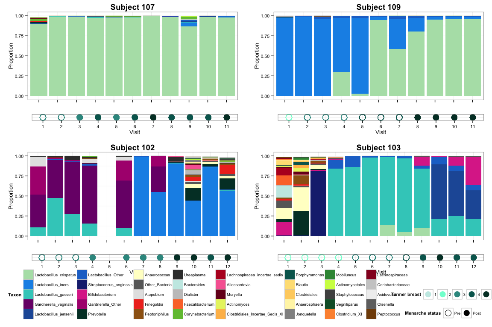 

***
# II. _Gardnerella_ in perimenarcheal vaginal microbiota

_Gardnerella vaginalis_ was surprisingly common among girls in our study. This is notable because the species (or genus) is commonly associated with bacterial vaginosis, and some have argued it is acquired through sexual contact. However, the girls in this study had no history of sexual activity and reported themselves in good health. Below we plot the changes in proportion of _Gardnerella_ over time in girls who had at least 5% _Gardnerella_ in her vaginal microbiota at any point in time during the study.


```r
meta.vag$Gvag <- spe.prop.vag[,"Gardnerella_vaginalis"]
meta.vag$Gardnerella <- rowSums(spe.prop.vag[,grep("Gardnerella", colnames(spe.prop.vag))])

meta.vag.gard.10 <- subset(meta.vag, type=="girl" & Gardnerella >= 0.05)
unique(meta.vag.gard.10$subject) # n=11
```

```
##  [1] 102 105 112 115 116 120 121 124 126 129 135
## 55 Levels: 101 102 103 104 105 106 107 108 109 110 111 112 113 114 ... 235
```

```r
## We want to plot Gardnerella over time in all of the girls who carried it at some point, 
## so we need to grab all the obervations for the girls listed above.
meta.vag.gard.10.fullobs <- meta.vag[meta.vag$subject %in% meta.vag.gard.10$subject,]
```

## Figure S5. Proportion of _Gardnerella_ over time in the vaginal microbiota of girls.
_Gardnerella_ was present in the vaginal microbiota at a relative abundance of 10% or greater at least once in 11/31 adolescent participants. Each panel shows the proportion of _Gardnerella_ (encompassing sequence reads assigned to either the species level as _G. vaginalis_ or genus level as _Gardnerella_) in the vaginal microbiota of a single participant at each clinical visit. Open circles represent premenarcheal samples, and filled circles represent postmenarcheal samples. The x-axis indicates the clinical visit at which each sample was collected; visits occurred approximately every three months.


```
## geom_path: Each group consist of only one observation. Do you need to adjust the group aesthetic?
```

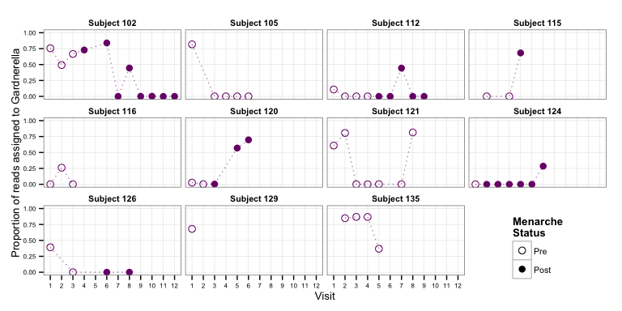 

## _Gardnerella_ in vaginal and vulvar microbiota

I was also curious to see whether the same patterns were observed in the vulva. Not surprisingly, they are fairly similar, although in some cases the vulva contained a much higher proportion of _Gardnerella_ than the vagina.


```r
meta$Gvag <- t(prop.red["Gardnerella_vaginalis",])
meta$Gardnerella <- colSums(prop.red[grep("Gardnerella", rownames(prop.red)),])

meta.girl.gard.10 <- subset(meta, type=="girl" & Gardnerella >= 0.10)
unique(meta.girl.gard.10$subject) # n=11
```

```
##  [1] 102 105 112 115 116 120 121 124 126 129 135
## 55 Levels: 101 102 103 104 105 106 107 108 109 110 111 112 113 114 ... 235
```

```r
## Subjects who had Gardnerella in vagina
unique(meta.girl.gard.10$subject[meta.girl.gard.10$site=="vag"]) # n=11
```

```
##  [1] 102 105 112 115 116 120 121 124 126 129 135
## 55 Levels: 101 102 103 104 105 106 107 108 109 110 111 112 113 114 ... 235
```

```r
## Subjects who had Gardnerella on vulva
unique(meta.girl.gard.10$subject[meta.girl.gard.10$site=="vul"]) # n=9
```

```
## [1] 102 105 112 115 121 124 126 129 135
## 55 Levels: 101 102 103 104 105 106 107 108 109 110 111 112 113 114 ... 235
```

```r
meta.girl.gard.10.fullobs <- meta[meta$subject %in% meta.girl.gard.10$subject,]
```

Plot vaginal and vulvar samples of girls with at least 10% _Gardnerella_:

```
## geom_path: Each group consist of only one observation. Do you need to adjust the group aesthetic?
```

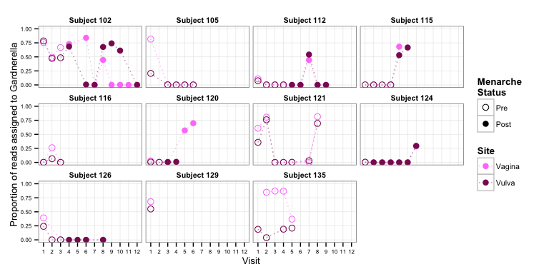 

***
# III. Trends in LAB and vaginal pH with pubertal development

## Correlation of Tanner scores


```r
## Spearman
cor.sp <- cor(meta[meta$type=="girl" & meta$site=="vag", c("tan.gen.dr","tan.gen.self","tan.br.dr","tan.br.self")], 
              use="pairwise.complete.obs", method="spearman")
cor.sp
```

```
##              tan.gen.dr tan.gen.self tan.br.dr tan.br.self
## tan.gen.dr       1.0000       0.6834    0.7273      0.5678
## tan.gen.self     0.6834       1.0000    0.5942      0.7072
## tan.br.dr        0.7273       0.5942    1.0000      0.6336
## tan.br.self      0.5678       0.7072    0.6336      1.0000
```

***Correlations of Tanner breast and pubic scores according to self and clinician assessment.*** Spearman’s correlation coefficients were calculated to determine how well breast/pubic scores agreed for both clinician- (upper left) and self-assessment (upper right). Physician- and self-assessments for Tanner breast (lower left) and Tanner pubic (lower right) scores were also correlated. Correlation coefficients are reported in the header of each plot. Physician-assessed Tanner breast scores were primarily used for analyses described in the paper.


```
## Warning: Removed 12 rows containing missing values (geom_point).
## Warning: Removed 9 rows containing missing values (geom_point).
## Warning: Removed 8 rows containing missing values (geom_point).
## Warning: Removed 12 rows containing missing values (geom_point).
```

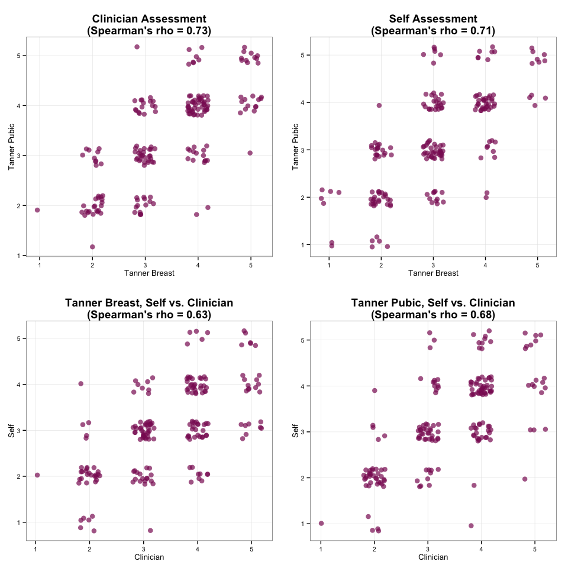 

```
## null device 
##           1
```

As the plots above show, the Tanner scores (breast and pubic area, self and clinician) are fairly well correlated. This is not too surprising since the Tanner scores for breast and pubic area were designed to capture simultaneous stages of development. One of the inclusion criteria for participation in the study was Tanner breast of at least stage 2, so it makes intuitive sense to rely the Tanner breast score as a proxy for pubertal development in our study. Additionally, the clinician-assessed Tanner breast score has more complete observations (192 out of 198 vagina samples) than the clinician assessed Tanner pubic score (186/198). Therefore, we'll just use the Tanner breast score for the subsequent analyses.

## Get proportions of lactic acid bacteria (LAB)

```r
## First we add the proportions of individual Lactobacillus spp., Lactobacillus genus, and lactic acid bacteria as additional variables to the metadata table
meta$Lactobacillus_crispatus <- t(prop.red["Lactobacillus_crispatus",])
meta$Lactobacillus_gasseri <- t(prop.red["Lactobacillus_gasseri",])
meta$Lactobacillus_iners <- t(prop.red["Lactobacillus_iners",])
meta$Lactobacillus_jensenii <- t(prop.red["Lactobacillus_jensenii",])
meta$Lactobacillus <- colSums(prop.red[grep("Lactobacillus", rownames(prop.red)),])
meta$LAB <- colSums(prop.red[c(6, 28, 43:49, 72:74),]) # 6=Aerococcus, 28=Facklamia, 43:49=Lactobacillus, 72:74=Streptococcus
```

*Note: In order to perform linear regression on proportional data (e.g., LAB proportions), the data should be approximately normally distributed. However, our proportions of LAB are heavily skewed with many close to 1 and quite a few close to zero, with far less in the middle. Here we subject the data to a logit transform, log(y/(1-y)), described by Warton and Hui as a preferred method for ecological non-binomial data such as proportions. However, because we have 0's and 1's in our data matrix, these would result in some -Inf and Inf values that cause problems for the linear model. An ad hoc solution to this is to add a nominal value epsilon to the numerator and denominator during the logit transform. Because our data are more skewed toward proportions close to 1 (e.g., check this with hist(meta.vagLAB)), we take as epsilon the difference between 1 and the largest proportion less than 1. This is defined below as eps. For discussion and justification of this approach, see Warton and Hui (2011) The arcsine is asinine: the analysis of proportions in ecology. Ecology 92:3–10.*

## Logit-transform LAB proportions

```r
## Define modified logit transform so we can specify epsilon adjustment
mod.logit <- function(x, eps) { log((x+eps)/(1-x+eps)) }

## Calculate epsilon:
## Subtract values of LAB from 1 
dif.lab <- 1-meta$LAB

## Take the smallest absolute difference greater than zero (~0.000075)
eps.lab <- min(dif.lab[dif.lab > 0])
eps.lab
```

```
## [1] 7.471e-05
```

```r
## Add logit-transformed LAB proportions to metadata
meta$LAB.logit <- mod.logit(meta$LAB, eps.lab)
```

## Trends in LAB associated with participant metadata
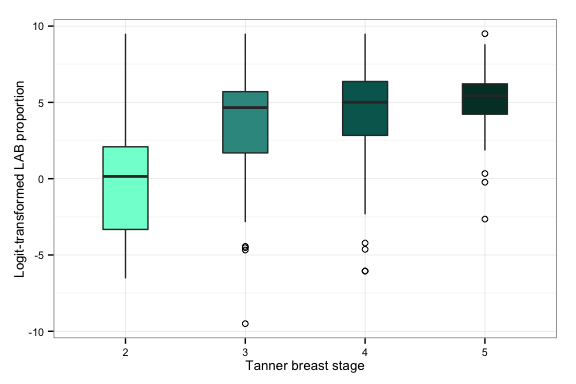 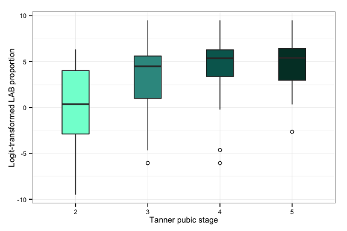 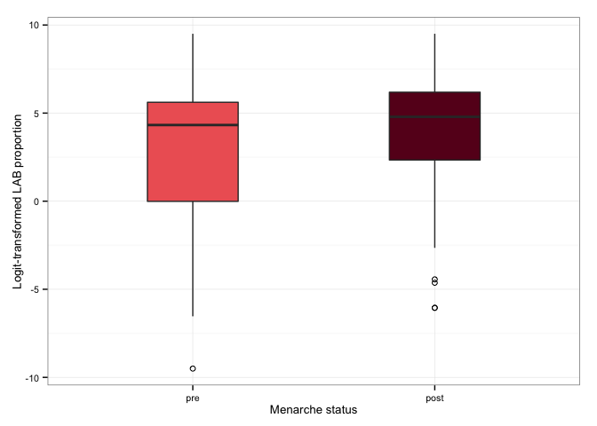 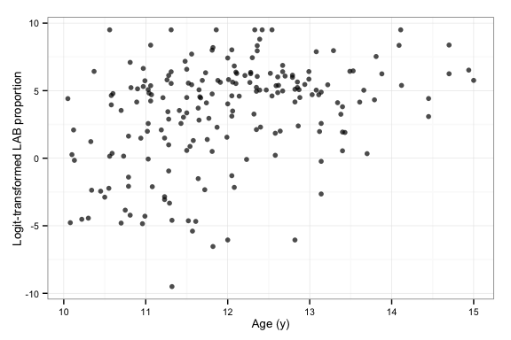 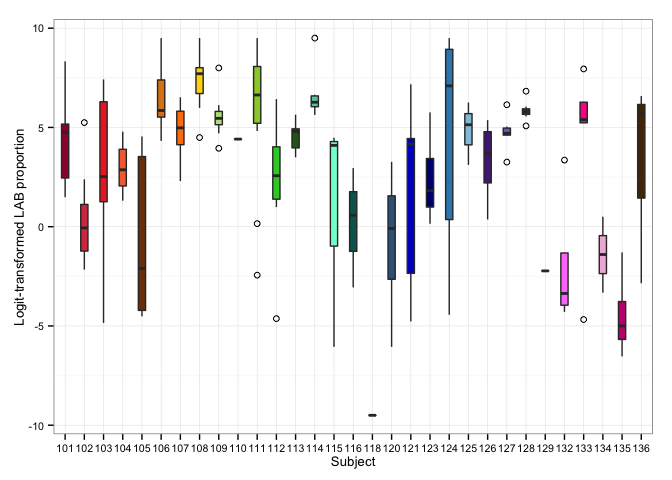 

## Trends in vaginal pH associated with participant metadata

```
## Warning: Removed 62 rows containing non-finite values (stat_boxplot).
```

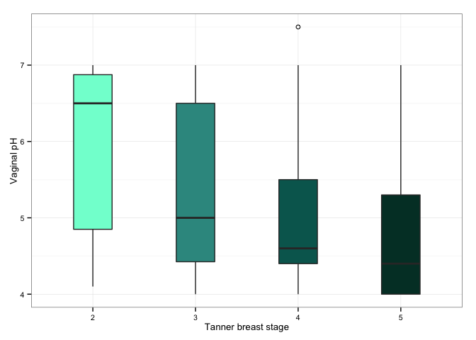 

```
## Warning: Removed 61 rows containing non-finite values (stat_boxplot).
```

 

```
## Warning: Removed 76 rows containing non-finite values (stat_boxplot).
```

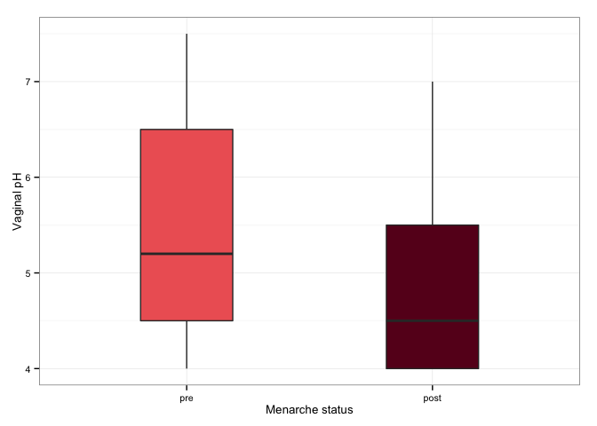 

```
## Warning: Removed 68 rows containing missing values (geom_point).
```

 

```
## Warning: Removed 68 rows containing non-finite values (stat_boxplot).
```

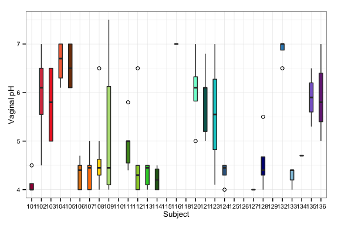 

## Figure 5. Trends in relative abundance of lactic acid bacteria and vaginal pH in relation to pubertal development and menarche status.
Upper and lower panels show box plots of (A) the logit-transformed proportion of lactic acid bacteria (LAB; includes _Lactobacillus_, _Streptococcus_, _Aerococcus_ and _Facklamia_) and (B) vaginal pH of 31 perimenarcheal girls. In the left column, box plots show the relationship to Tanner breast stage; in the middle column, Tanner pubic stage; and in the right column, menarche status. In each plot the box represents the interquartile range, the whiskers represent the upper and lower quartiles, the horizontal line represents the median, and open circles represent outliers.

**Update 2015-01-08: added moms to box plots (third column) and change to Figure 5**


```
## Warning: Removed 62 rows containing non-finite values (stat_boxplot).
## Warning: Removed 61 rows containing non-finite values (stat_boxplot).
## Warning: Removed 76 rows containing non-finite values (stat_boxplot).
```

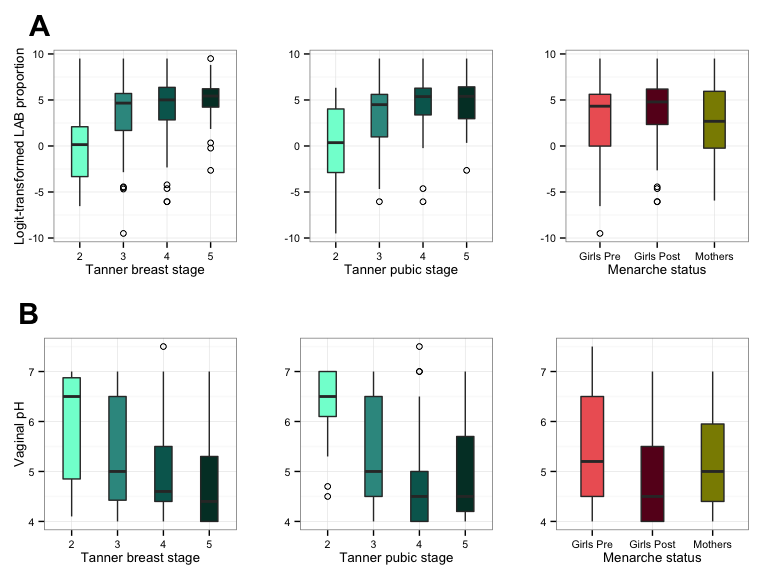 

## Discordance between high LAB and low pH

An interesting observation was that not all samples with high proportions of LAB were associated with a low pH. We hypothesized this could be due to lower total bacterial counts in the vaginas of adolescent girls. We performed a coarse test of that hypothesis but were unable to detect a significant difference in estimated number of 16S rRNA gene copies.

***Relationship between proportion of lactic acid bacteria and pH in vaginal samples collected from girls.*** 197 vaginal microbiota samples from perimenarcheal girls are plotted to show the relationship between the proportion of lactic acid bacteria (LAB; includes _Lactobacillus_, _Streptococcus_, _Aerococcus_ and _Facklamia_) on the x-axis and vaginal pH on the y-axis. Menarche status is either premenarcheal (open circles) or postmenarcheal (filled circles). Points are color-coded to indicate Tanner stage of breast development (clinician-assessed) as indicated by the legend at right (NA values are colored gray). Points are slightly jittered to decrease crowding around similar values. The magenta dashed line at vaginal pH 4.5 represents the upper range of the traditional ‘hallmark’ healthy vaginal pH of 4.0-4.5.


```
## Warning: Removed 68 rows containing missing values (geom_point).
```

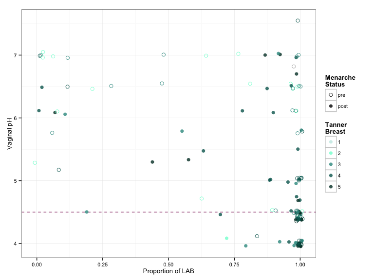 

***
# Save R workspace
This will save the workspace (data) in two separate images: one named with today's date, in case you ever need to restore that version, and another with a non-dated name that can be easily loaded into subsequent analyses.

### Cleanup

```r
rm(meta.fig4, meta.girl.gard.10, meta.girl.gard.10.fullobs, meta.vag.gard.10,
   meta.vag.gard.10.fullobs, mp.fig4, mp.fig4.lg, mp.s102, mp.s103, mp.s107,
   mp.s109, prop.fig4, prop.fig4.top40, box.lab.logit.ms, box.lab.logit.sub,
   box.lab.logit.tb, box.lab.logit.tg, box.ph.ms, box.ph.sub, box.ph.tb, 
   box.ph.tg, dif.lab, eps.lab, fig.lab.logit.ph.1, fig.lab.logit.ph.2,
   fig.lab.logit.ph.3, fig.lab.logit.ph.4, fig.lab.logit.ph.5, fig.lab.logit.ph.6,
   gg.girl.gard, gg.lab.logit.age, gg.lab.logit.ms, gg.lab.logit.sub, gg.lab.logit.tb,
   gg.lab.logit.tg, gg.lab.ph, gg.ph.age, gg.ph.ms, gg.ph.sub, gg.ph.tb, gg.ph.tg,
   gg.tan.dr, gg.tan.self, gg.taxa.bar.102, gg.taxa.bar.103, gg.taxa.bar.107,
   gg.taxa.bar.109, gg.tb.dot.102, gg.tb.dot.103, gg.tb.dot.107, gg.tb.dot.109,
   gg.tb.dr.self, gg.tg.dr.self, scatter.lab.logit.age, scatter.ph.age, taxa.pick40)
```


```r
save.image(paste("data-postproc/03-community-dynamics-", Sys.Date(), ".RData", sep=""))
save.image(paste("data-postproc/03-community-dynamics-last-run.RData", sep=""))
```
