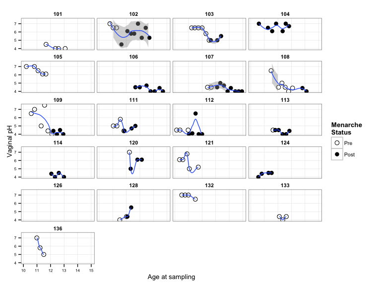
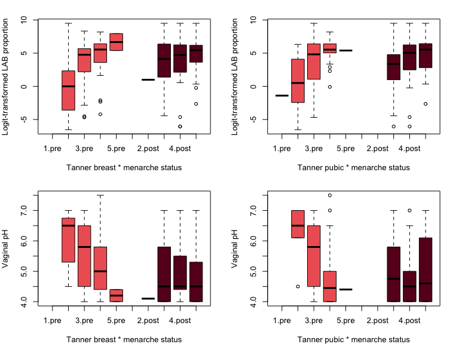

# Linear mixed-effects modeling of trends in lactic acid bacteria proportion and vaginal pH
Roxana J. Hickey <roxana.hickey@gmail.com>  
Last updated January 12, 2015  

***
# Description
This is a supplement to the paper "Vaginal microbiota of adolescent girls prior to the onset of menarche resemble those of reproductive-age women" by Hickey et al. The code works through linear mixed effects modeling of trends observed in lactic acid bacteria and vaginal pH of perimenarcheal girls. The analyses can be run directly from the R Markdown file using RStudio. It should be run after "01-data-prep.Rmd", "02-hclust-pcoa.Rmd" and "03-community-dynamics.Rmd".

See the project repository at http://github.com/roxanahickey/adolescent for more information.

**Update 2015-01-08: I added “echo=FALSE” options to the chunks of code that make a graph. View full code in R Markdown script.**

## Objective
Previously in our qualitative assessment of vaginal microbiota dynamic trends over time, we saw that lactic acid bacteria (LAB) tended to increase as girls progressed through puberty, while vaginal pH decreased. This analysis attempts to explain and quantify the observed trends in relation to Tanner stage, menarche status, and age.

***
# Initial setup

Clear the workspace, load data from the previous step, and load necessary packages.


```r
## Clear current workspace
rm(list=ls())

load("data-postproc/03-community-dynamics-last-run.RData")

library(ggplot2)
library(lme4)
```

```
## Warning: package 'lme4' was built under R version 3.1.1
```

```
## Loading required package: Matrix
## Loading required package: Rcpp
```

```r
library(lmerTest)
```

```
## Warning: package 'lmerTest' was built under R version 3.1.2
```

```
## KernSmooth 2.23 loaded
## Copyright M. P. Wand 1997-2009
## 
## Attaching package: 'lmerTest'
## 
## The following object is masked from 'package:lme4':
## 
##     lmer
## 
## The following object is masked from 'package:stats':
## 
##     step
```

```r
## Display session info
sessionInfo()
```

```
## R version 3.1.0 (2014-04-10)
## Platform: x86_64-apple-darwin10.8.0 (64-bit)
## 
## locale:
## [1] en_US.UTF-8/en_US.UTF-8/en_US.UTF-8/C/en_US.UTF-8/en_US.UTF-8
## 
## attached base packages:
## [1] stats     graphics  grDevices utils     datasets  methods   base     
## 
## other attached packages:
## [1] lmerTest_2.0-20 lme4_1.1-7      Rcpp_0.11.2     Matrix_1.1-4   
## [5] ggplot2_1.0.0  
## 
## loaded via a namespace (and not attached):
##  [1] bitops_1.0-6        caTools_1.17        cluster_1.15.2     
##  [4] colorspace_1.2-4    digest_0.6.4        evaluate_0.5.5     
##  [7] formatR_0.10        Formula_1.1-2       gdata_2.13.3       
## [10] gplots_2.14.1       grid_3.1.0          gtable_0.1.2       
## [13] gtools_3.4.1        Hmisc_3.14-4        htmltools_0.2.4    
## [16] KernSmooth_2.23-12  knitr_1.6           lattice_0.20-29    
## [19] latticeExtra_0.6-26 MASS_7.3-33         minqa_1.2.3        
## [22] munsell_0.4.2       nlme_3.1-117        nloptr_1.0.4       
## [25] numDeriv_2012.9-1   plyr_1.8.1          proto_0.3-10       
## [28] RColorBrewer_1.0-5  reshape2_1.4        rmarkdown_0.2.49   
## [31] scales_0.2.4        splines_3.1.0       stringr_0.6.2      
## [34] survival_2.37-7     tools_3.1.0         yaml_2.1.13
```

***
# I: Set up for linear mixed effects modeling of LAB and vaginal pH
*Note: In order to perform linear regression on proportional data (e.g., LAB proportions), the data should be approximately normally distributed. However, our proportions of LAB are heavily skewed with many close to 1 and quite a few close to zero, with far less in the middle. Previously, in the third segment of our analyses, we created a logit-transformed LAB proportion variable termed "LAB.logit". We will use this variable rather than direct LAB proportions for constructing our mixed effects models.*

## Set up data
First we make a dataframe with the variables we are interested in testing. Then we separate it into two dataframes for testing LAB and pH separately, excluding any subjects with less than 3 observations in each case. For LAB, this removes subjects 110, 118 and 129 (all with just one observation). In addition to those, for pH this removes subjects 115, 116, 123, 125, 126, 127, 134 and 135. This should help with controlling the error estimates.


```r
## Subset metadata to only girl vagina samples and variables of interest
data <- meta[meta$type=="girl" & meta$site=="vag",
             c("subject", "tan.br.dr", "tan.gen.dr",
               "age.sampling", "men.stat", 
               "LAB", "LAB.logit", "ph")]

## Set these variables as factors
data$tan.br.dr <- factor(data$tan.br.dr, ordered = TRUE)
data$tan.gen.dr <- factor(data$tan.gen.dr, ordered = TRUE)
data$men.stat <- factor(data$men.stat, levels=c("pre","post"))
data$subject <- factor(data$subject)

data.lab <- data[!(data$subject %in% c(110,118,129)),]
data.lab$ph <- NULL

data.ph <- data[!(data$subject %in% c(110,115,116,118,123,125,127,129,134,135)),]
data.ph$LAB <- NULL
data.ph$LAB.logit <- NULL
```

## Exploratory data analysis
It is a good idea to start out with some basic plots or exploratory data analysis so we have an idea of what kinds of trends to expect in the data.

### Plot trends within individuals over time
View trends in LAB, LAB.logit and pH over time within individuals.

   

### Box plots showing relationship with Tanner stage, menarche status

 

```
## null device 
##           1
```

From these plots we probably expect to see a positive trend in LAB.logit and decreasing trend in pH with respect to either Tanner breast or pubic scores. There may also be a significant interaction between Tanner score and menarche status, particularly for pH, so this is something we'll want to look at in our models. However, since Tanner breast and pubic scores are highly correlated (based on the nature of the scores, and we also quantified this using Pearson correlations), it doesn't make sense to include both factors as fixed effects due to their colinearity. It likely doesn't matter which one we select, but below I have set up some simple models to compare (two each for LAB.logit and pH). In each model, subject is a random effect (meaning we are controlling for non-independence among repeat samples from the same subject), and the only fixed effect is either Tanner breast or pubic score. We are omitting any rows with NA values since not all samples have complete observations for both Tanner scores.

### Test whether using Tanner breast or pubic scores makes a difference


```r
(fit1a <- lmer(LAB.logit ~ factor(tan.br.dr) + (1|subject), data=na.omit(data.lab), contrasts=list(`factor(tan.br.dr)`=MASS::contr.sdif)))
```

```
## Linear mixed model fit by REML ['merModLmerTest']
## Formula: LAB.logit ~ factor(tan.br.dr) + (1 | subject)
##    Data: na.omit(data.lab)
## REML criterion at convergence: 921.8
## Random effects:
##  Groups   Name        Std.Dev.
##  subject  (Intercept) 2.10    
##  Residual             2.72    
## Number of obs: 183, groups:  subject, 28
## Fixed Effects:
##          (Intercept)  factor(tan.br.dr)2-1  factor(tan.br.dr)3-2  
##                2.871                 4.041                -0.164  
## factor(tan.br.dr)4-3  
##                0.736
```

```r
(fit1b <- lmer(LAB.logit ~ factor(tan.gen.dr) + (1|subject), data=na.omit(data.lab), contrasts=list(`factor(tan.gen.dr)`=MASS::contr.sdif)))
```

```
## Linear mixed model fit by REML ['merModLmerTest']
## Formula: LAB.logit ~ factor(tan.gen.dr) + (1 | subject)
##    Data: na.omit(data.lab)
## REML criterion at convergence: 927.9
## Random effects:
##  Groups   Name        Std.Dev.
##  subject  (Intercept) 2.09    
##  Residual             2.82    
## Number of obs: 183, groups:  subject, 28
## Fixed Effects:
##           (Intercept)  factor(tan.gen.dr)2-1  factor(tan.gen.dr)3-2  
##                2.3083                 0.9297                 2.6476  
## factor(tan.gen.dr)4-3  factor(tan.gen.dr)5-4  
##                0.8295                 0.0856
```

```r
anova(fit1b, fit1a)
```

```
## refitting model(s) with ML (instead of REML)
```

```
## Data: na.omit
## Data: data.lab
## Models:
## ..1: LAB.logit ~ factor(tan.br.dr) + (1 | subject)
## object: LAB.logit ~ factor(tan.gen.dr) + (1 | subject)
##        Df AIC BIC logLik deviance Chisq Chi Df Pr(>Chisq)
## ..1     6 936 956   -462      924                        
## object  7 949 971   -468      935     0      1          1
```

```r
(fit1c <- lmer(ph ~ factor(tan.br.dr) + (1|subject), data=na.omit(data.ph), contrasts=list(`factor(tan.br.dr)`=MASS::contr.sdif)))
```

```
## Linear mixed model fit by REML ['merModLmerTest']
## Formula: ph ~ factor(tan.br.dr) + (1 | subject)
##    Data: na.omit(data.ph)
## REML criterion at convergence: 276
## Random effects:
##  Groups   Name        Std.Dev.
##  subject  (Intercept) 0.839   
##  Residual             0.639   
## Number of obs: 117, groups:  subject, 20
## Fixed Effects:
##          (Intercept)  factor(tan.br.dr)2-1  factor(tan.br.dr)3-2  
##                5.261                -0.603                -0.293  
## factor(tan.br.dr)4-3  
##               -0.238
```

```r
(fit1d <- lmer(ph ~ factor(tan.gen.dr) + (1|subject), data=na.omit(data.ph), contrasts=list(`factor(tan.gen.dr)`=MASS::contr.sdif)))
```

```
## Linear mixed model fit by REML ['merModLmerTest']
## Formula: ph ~ factor(tan.gen.dr) + (1 | subject)
##    Data: na.omit(data.ph)
## REML criterion at convergence: 262.4
## Random effects:
##  Groups   Name        Std.Dev.
##  subject  (Intercept) 0.799   
##  Residual             0.601   
## Number of obs: 117, groups:  subject, 20
## Fixed Effects:
##           (Intercept)  factor(tan.gen.dr)2-1  factor(tan.gen.dr)3-2  
##                 5.320                 -1.076                 -0.276  
## factor(tan.gen.dr)4-3  
##                -0.135
```

```r
anova(fit1d, fit1c)
```

```
## refitting model(s) with ML (instead of REML)
```

```
## Data: na.omit
## Data: data.ph
## Models:
## object: ph ~ factor(tan.gen.dr) + (1 | subject)
## ..1: ph ~ factor(tan.br.dr) + (1 | subject)
##        Df AIC BIC logLik deviance Chisq Chi Df Pr(>Chisq)
## object  6 268 285   -128      256                        
## ..1     6 282 299   -135      270     0      0          1
```

For both LAB.logit and pH, comparing the two models with an ANOVA shows they are not significantly different. Therefore, we can pick either factor. I chose to use Tanner breast since there are more observations overall (189 for breast, 183 for genital). Both Tanner scores are present for all 123 non-NA pH data points. For consistency we'll use Tanner breast scores for modeling both variables. **I also tested Tanner pubic scores; these are included at the end of this analysis, although they are not discussed in depth in the manuscript.**

***
# II: Linear mixed effects modeling of LAB (using Tanner breast scores)

## Stepwise model comparisons

```r
# Simplest model with only Tanner breast, controlling for subject
(lab.fit.null <- lmer(LAB.logit ~ (1|subject), data=data.lab))
```

```
## Linear mixed model fit by REML ['merModLmerTest']
## Formula: LAB.logit ~ (1 | subject)
##    Data: data.lab
## REML criterion at convergence: 1017
## Random effects:
##  Groups   Name        Std.Dev.
##  subject  (Intercept) 2.61    
##  Residual             2.89    
## Number of obs: 195, groups:  subject, 28
## Fixed Effects:
## (Intercept)  
##        2.96
```

```r
(lab.fit1 <- lmer(LAB.logit ~ factor(tan.br.dr) + (1|subject), 
                  data=data.lab, contrasts=list(`factor(tan.br.dr)`=MASS::contr.sdif)))
```

```
## Linear mixed model fit by REML ['merModLmerTest']
## Formula: LAB.logit ~ factor(tan.br.dr) + (1 | subject)
##    Data: data.lab
## REML criterion at convergence: 953.3
## Random effects:
##  Groups   Name        Std.Dev.
##  subject  (Intercept) 2.15    
##  Residual             2.73    
## Number of obs: 189, groups:  subject, 28
## Fixed Effects:
##          (Intercept)  factor(tan.br.dr)2-1  factor(tan.br.dr)3-2  
##                2.866                 3.746                -0.180  
## factor(tan.br.dr)4-3  
##                0.927
```

```r
anova(lab.fit1, lab.fit.null) # p = 2.187e-13 *** -> keep tan.br.dr
```

```
## refitting model(s) with ML (instead of REML)
```

```
## Data: data.lab
## Models:
## ..1: LAB.logit ~ (1 | subject)
## object: LAB.logit ~ factor(tan.br.dr) + (1 | subject)
##        Df  AIC  BIC logLik deviance Chisq Chi Df Pr(>Chisq)    
## ..1     3 1024 1034   -509     1018                            
## object  6  968  987   -478      956    62      3    2.2e-13 ***
## ---
## Signif. codes:  0 '***' 0.001 '**' 0.01 '*' 0.05 '.' 0.1 ' ' 1
```

```r
summary(lab.fit1)
```

```
## Linear mixed model fit by REML t-tests use Satterthwaite approximations
##   to degrees of freedom [merModLmerTest]
## Formula: LAB.logit ~ factor(tan.br.dr) + (1 | subject)
##    Data: data.lab
## 
## REML criterion at convergence: 953.3
## 
## Scaled residuals: 
##    Min     1Q Median     3Q    Max 
## -3.361 -0.495  0.092  0.563  1.926 
## 
## Random effects:
##  Groups   Name        Variance Std.Dev.
##  subject  (Intercept) 4.62     2.15    
##  Residual             7.44     2.73    
## Number of obs: 189, groups:  subject, 28
## 
## Fixed effects:
##                      Estimate Std. Error      df t value Pr(>|t|)    
## (Intercept)             2.866      0.469  28.600    6.11  1.2e-06 ***
## factor(tan.br.dr)2-1    3.746      0.691 184.500    5.42  1.9e-07 ***
## factor(tan.br.dr)3-2   -0.180      0.504 166.600   -0.36     0.72    
## factor(tan.br.dr)4-3    0.927      0.687 172.300    1.35     0.18    
## ---
## Signif. codes:  0 '***' 0.001 '**' 0.01 '*' 0.05 '.' 0.1 ' ' 1
## 
## Correlation of Fixed Effects:
##             (Intr) f(..)2 f(..)3
## fctr(..)2-1 -0.066              
## fctr(..)3-2 -0.021 -0.406       
## fctr(..)4-3  0.172  0.043 -0.354
```

```r
# Add menarche status
(lab.fit2 <- lmer(LAB.logit ~ factor(tan.br.dr) + men.stat + (1|subject), 
                  data=data.lab, contrasts=list(`factor(tan.br.dr)`=MASS::contr.sdif)))
```

```
## Linear mixed model fit by REML ['merModLmerTest']
## Formula: LAB.logit ~ factor(tan.br.dr) + men.stat + (1 | subject)
##    Data: data.lab
## REML criterion at convergence: 951.8
## Random effects:
##  Groups   Name        Std.Dev.
##  subject  (Intercept) 2.18    
##  Residual             2.73    
## Number of obs: 189, groups:  subject, 28
## Fixed Effects:
##          (Intercept)  factor(tan.br.dr)2-1  factor(tan.br.dr)3-2  
##             3.083466              3.806612             -0.000842  
## factor(tan.br.dr)4-3          men.statpost  
##             1.057523             -0.512876
```

```r
anova(lab.fit2, lab.fit1) # p = 0.3777 -> men.stat ns, keep model 1
```

```
## refitting model(s) with ML (instead of REML)
```

```
## Data: data.lab
## Models:
## ..1: LAB.logit ~ factor(tan.br.dr) + (1 | subject)
## object: LAB.logit ~ factor(tan.br.dr) + men.stat + (1 | subject)
##        Df AIC BIC logLik deviance Chisq Chi Df Pr(>Chisq)
## ..1     6 968 987   -478      956                        
## object  7 969 992   -478      955  0.78      1       0.38
```

```r
# Add age
(lab.fit3 <- lmer(LAB.logit ~ factor(tan.br.dr) + age.sampling + (1|subject), 
                  data=data.lab, contrasts=list(`factor(tan.br.dr)`=MASS::contr.sdif)))
```

```
## Linear mixed model fit by REML ['merModLmerTest']
## Formula: LAB.logit ~ factor(tan.br.dr) + age.sampling + (1 | subject)
##    Data: data.lab
## REML criterion at convergence: 949.3
## Random effects:
##  Groups   Name        Std.Dev.
##  subject  (Intercept) 2.11    
##  Residual             2.71    
## Number of obs: 189, groups:  subject, 28
## Fixed Effects:
##          (Intercept)  factor(tan.br.dr)2-1  factor(tan.br.dr)3-2  
##               -6.061                 3.269                -0.614  
## factor(tan.br.dr)4-3          age.sampling  
##                0.428                 0.749
```

```r
anova(lab.fit3, lab.fit1) # p = 0.03752 * -> age.sampling signif, keep model 3
```

```
## refitting model(s) with ML (instead of REML)
```

```
## Data: data.lab
## Models:
## ..1: LAB.logit ~ factor(tan.br.dr) + (1 | subject)
## object: LAB.logit ~ factor(tan.br.dr) + age.sampling + (1 | subject)
##        Df AIC BIC logLik deviance Chisq Chi Df Pr(>Chisq)  
## ..1     6 968 987   -478      956                          
## object  7 966 988   -476      952  4.33      1      0.038 *
## ---
## Signif. codes:  0 '***' 0.001 '**' 0.01 '*' 0.05 '.' 0.1 ' ' 1
```

```r
summary(lab.fit3)
```

```
## Linear mixed model fit by REML t-tests use Satterthwaite approximations
##   to degrees of freedom [merModLmerTest]
## Formula: LAB.logit ~ factor(tan.br.dr) + age.sampling + (1 | subject)
##    Data: data.lab
## 
## REML criterion at convergence: 949.3
## 
## Scaled residuals: 
##    Min     1Q Median     3Q    Max 
## -3.215 -0.466  0.075  0.497  1.906 
## 
## Random effects:
##  Groups   Name        Variance Std.Dev.
##  subject  (Intercept) 4.44     2.11    
##  Residual             7.34     2.71    
## Number of obs: 189, groups:  subject, 28
## 
## Fixed effects:
##                      Estimate Std. Error      df t value Pr(>|t|)    
## (Intercept)            -6.061      4.357 150.600   -1.39    0.166    
## factor(tan.br.dr)2-1    3.269      0.724 183.900    4.51  1.1e-05 ***
## factor(tan.br.dr)3-2   -0.614      0.544 176.200   -1.13    0.260    
## factor(tan.br.dr)4-3    0.428      0.724 176.700    0.59    0.555    
## age.sampling            0.749      0.363 151.700    2.06    0.041 *  
## ---
## Signif. codes:  0 '***' 0.001 '**' 0.01 '*' 0.05 '.' 0.1 ' ' 1
## 
## Correlation of Fixed Effects:
##             (Intr) f(..)2 f(..)3 f(..)4
## fctr(..)2-1  0.314                     
## fctr(..)3-2  0.386 -0.228              
## fctr(..)4-3  0.350  0.146 -0.177       
## age.samplng -0.994 -0.323 -0.390 -0.334
```

```r
# Add interaction with term
(lab.fit4 <- lmer(LAB.logit ~ factor(tan.br.dr)*age.sampling + (1|subject), 
                  data=data.lab, contrasts=list(`factor(tan.br.dr)`=MASS::contr.sdif)))
```

```
## Linear mixed model fit by REML ['merModLmerTest']
## Formula: LAB.logit ~ factor(tan.br.dr) * age.sampling + (1 | subject)
##    Data: data.lab
## REML criterion at convergence: 938.5
## Random effects:
##  Groups   Name        Std.Dev.
##  subject  (Intercept) 2.21    
##  Residual             2.66    
## Number of obs: 189, groups:  subject, 28
## Fixed Effects:
##                       (Intercept)               factor(tan.br.dr)2-1  
##                            -9.374                             12.197  
##              factor(tan.br.dr)3-2               factor(tan.br.dr)4-3  
##                            12.240                              2.392  
##                      age.sampling  factor(tan.br.dr)2-1:age.sampling  
##                             1.072                             -0.871  
## factor(tan.br.dr)3-2:age.sampling  factor(tan.br.dr)4-3:age.sampling  
##                            -1.075                             -0.129
```

```r
anova(lab.fit4, lab.fit3) # p = 0.06579 . -> interaction term is only marginally signif
```

```
## refitting model(s) with ML (instead of REML)
```

```
## Data: data.lab
## Models:
## ..1: LAB.logit ~ factor(tan.br.dr) + age.sampling + (1 | subject)
## object: LAB.logit ~ factor(tan.br.dr) * age.sampling + (1 | subject)
##        Df AIC BIC logLik deviance Chisq Chi Df Pr(>Chisq)  
## ..1     7 966 988   -476      952                          
## object 10 964 997   -472      944   7.2      3      0.066 .
## ---
## Signif. codes:  0 '***' 0.001 '**' 0.01 '*' 0.05 '.' 0.1 ' ' 1
```

```r
summary(lab.fit4)
```

```
## Linear mixed model fit by REML t-tests use Satterthwaite approximations
##   to degrees of freedom [merModLmerTest]
## Formula: LAB.logit ~ factor(tan.br.dr) * age.sampling + (1 | subject)
##    Data: data.lab
## 
## REML criterion at convergence: 938.5
## 
## Scaled residuals: 
##     Min      1Q  Median      3Q     Max 
## -3.0454 -0.4393  0.0588  0.5567  2.0593 
## 
## Random effects:
##  Groups   Name        Variance Std.Dev.
##  subject  (Intercept) 4.91     2.21    
##  Residual             7.07     2.66    
## Number of obs: 189, groups:  subject, 28
## 
## Fixed effects:
##                                   Estimate Std. Error      df t value
## (Intercept)                         -9.374      5.006 163.700   -1.87
## factor(tan.br.dr)2-1                12.197     10.946 174.400    1.11
## factor(tan.br.dr)3-2                12.240      6.755 158.300    1.81
## factor(tan.br.dr)4-3                 2.392     10.606 167.600    0.23
## age.sampling                         1.072      0.419 164.000    2.56
## factor(tan.br.dr)2-1:age.sampling   -0.871      0.982 175.800   -0.89
## factor(tan.br.dr)3-2:age.sampling   -1.075      0.564 158.100   -1.90
## factor(tan.br.dr)4-3:age.sampling   -0.129      0.815 166.500   -0.16
##                                   Pr(>|t|)  
## (Intercept)                          0.063 .
## factor(tan.br.dr)2-1                 0.267  
## factor(tan.br.dr)3-2                 0.072 .
## factor(tan.br.dr)4-3                 0.822  
## age.sampling                         0.011 *
## factor(tan.br.dr)2-1:age.sampling    0.376  
## factor(tan.br.dr)3-2:age.sampling    0.059 .
## factor(tan.br.dr)4-3:age.sampling    0.875  
## ---
## Signif. codes:  0 '***' 0.001 '**' 0.01 '*' 0.05 '.' 0.1 ' ' 1
## 
## Correlation of Fixed Effects:
##             (Intr) fc(..)2-1 fc(..)3-2 fc(..)4-3 ag.smp f(..)2-1:
## fctr(..)2-1 -0.258                                               
## fctr(..)3-2 -0.100 -0.411                                        
## fctr(..)4-3  0.376  0.035    -0.210                              
## age.samplng -0.994  0.289     0.108    -0.337                    
## fc(..)2-1:.  0.281 -0.998     0.387    -0.037    -0.313          
## fc(..)3-2:.  0.123  0.417    -0.997     0.202    -0.131 -0.395   
## fc(..)4-3:. -0.358 -0.036     0.219    -0.998     0.321  0.038   
##             f(..)3-2:
## fctr(..)2-1          
## fctr(..)3-2          
## fctr(..)4-3          
## age.samplng          
## fc(..)2-1:.          
## fc(..)3-2:.          
## fc(..)4-3:. -0.212
```

```r
# Compare models with AIC
AIC(lab.fit1, lab.fit3, lab.fit4) # model 4 is slightly preferred, but we'll keep model 3
```

```
##          df   AIC
## lab.fit1  6 965.3
## lab.fit3  7 963.3
## lab.fit4 10 958.5
```

```r
# Compare 'best' model to null
anova(lab.fit3, lab.fit.null)
```

```
## refitting model(s) with ML (instead of REML)
```

```
## Data: data.lab
## Models:
## ..1: LAB.logit ~ (1 | subject)
## object: LAB.logit ~ factor(tan.br.dr) + age.sampling + (1 | subject)
##        Df  AIC  BIC logLik deviance Chisq Chi Df Pr(>Chisq)    
## ..1     3 1024 1034   -509     1018                            
## object  7  966  988   -476      952  66.3      4    1.3e-13 ***
## ---
## Signif. codes:  0 '***' 0.001 '**' 0.01 '*' 0.05 '.' 0.1 ' ' 1
```

```r
## Specify selected model
fit.pick <- lab.fit3

## Check assumptions
par(mfrow=c(1,2))
plot(fitted(fit.pick), residuals(fit.pick), main="Residuals")
abline(h=0, col="blue")
qqnorm(residuals(fit.pick))
qqline(residuals(fit.pick), col="blue")
```

 

## Preliminary conclusion & testing of random slopes models
Selected model for LAB.logit is Tanner breast + age. But we're not done yet. What we have above is a "random intercept model" where we assume the effects are the same across all subjects. We should compare this to a "random slope model" where subjects are allowed to have different intercepts and slopes for the main effects.


```r
(lab.fit6 <- lmer(LAB.logit ~ tan.br.dr + age.sampling + (1+tan.br.dr|subject), 
                  data=data.lab))
```

```
## Linear mixed model fit by REML ['merModLmerTest']
## Formula: LAB.logit ~ tan.br.dr + age.sampling + (1 + tan.br.dr | subject)
##    Data: data.lab
## REML criterion at convergence: 945.2
## Random effects:
##  Groups   Name        Std.Dev. Corr             
##  subject  (Intercept) 2.189                     
##           tan.br.dr.L 1.620    -0.27            
##           tan.br.dr.Q 0.741     0.87 -0.69      
##           tan.br.dr.C 0.728    -0.77 -0.38 -0.41
##  Residual             2.581                     
## Number of obs: 189, groups:  subject, 28
## Fixed Effects:
##  (Intercept)   tan.br.dr.L   tan.br.dr.Q   tan.br.dr.C  age.sampling  
##       -6.385         2.104        -1.673         1.170         0.772
```

```r
coef(lab.fit6) # all slopes positive, but magnitude varies
```

```
## $subject
##     (Intercept) tan.br.dr.L tan.br.dr.Q tan.br.dr.C age.sampling
## 101      -5.875      0.8605     -1.2692     1.36908       0.7719
## 102     -10.240      3.5045     -2.9460     1.94794       0.7719
## 103      -6.761      1.6640     -1.6889     1.45129       0.7719
## 104      -6.946      2.3684     -1.8702     1.26346       0.7719
## 105      -9.227      2.6632     -2.5103     1.88683       0.7719
## 106      -4.810      1.9726     -1.2456     0.71685       0.7719
## 107      -6.569      2.4106     -1.7865     1.13824       0.7719
## 108      -2.741      0.3182     -0.3501     0.53353       0.7719
## 109      -4.129      1.4085     -0.9452     0.65940       0.7719
## 111      -4.325      4.0330     -1.5821    -0.01958       0.7719
## 112      -6.371      1.1129     -1.4423     1.43484       0.7719
## 113      -5.776      2.2502     -1.5509     0.93784       0.7719
## 114      -3.892      1.8587     -0.9925     0.47167       0.7719
## 115      -8.793      0.9626     -2.0351     2.26148       0.7719
## 116      -6.891      2.3911     -1.8652     1.24764       0.7719
## 120     -10.422      2.1567     -2.7009     2.40607       0.7719
## 121      -6.665      1.3662     -1.5862     1.48145       0.7719
## 123      -5.819      1.5401     -1.4031     1.15197       0.7719
## 124      -4.863      1.4995     -1.1649     0.89085       0.7719
## 125      -4.570      0.8956     -0.9416     0.94111       0.7719
## 126      -6.391      2.7041     -1.8034     0.99243       0.7719
## 127      -5.941      2.0225     -1.5432     1.05656       0.7719
## 128      -4.255      1.9617     -1.1046     0.55042       0.7719
## 132      -7.914      2.8563     -2.2308     1.44128       0.7719
## 133      -6.440      3.4215     -1.9728     0.79832       0.7719
## 134      -7.041      2.4131     -1.9081     1.28838       0.7719
## 135      -8.938      3.3069     -2.5888     1.63023       0.7719
## 136      -6.184      3.0003     -1.8150     0.83944       0.7719
## 
## attr(,"class")
## [1] "coef.mer"
```

```r
summary(lab.fit6)
```

```
## Linear mixed model fit by REML t-tests use Satterthwaite approximations
##   to degrees of freedom [merModLmerTest]
## Formula: LAB.logit ~ tan.br.dr + age.sampling + (1 + tan.br.dr | subject)
##    Data: data.lab
## 
## REML criterion at convergence: 945.2
## 
## Scaled residuals: 
##    Min     1Q Median     3Q    Max 
## -3.243 -0.477  0.083  0.544  2.080 
## 
## Random effects:
##  Groups   Name        Variance Std.Dev. Corr             
##  subject  (Intercept) 4.79     2.189                     
##           tan.br.dr.L 2.63     1.620    -0.27            
##           tan.br.dr.Q 0.55     0.741     0.87 -0.69      
##           tan.br.dr.C 0.53     0.728    -0.77 -0.38 -0.41
##  Residual             6.66     2.581                     
## Number of obs: 189, groups:  subject, 28
## 
## Fixed effects:
##              Estimate Std. Error      df t value Pr(>|t|)   
## (Intercept)    -6.385      4.230 120.000   -1.51   0.1338   
## tan.br.dr.L     2.104      0.835  39.000    2.52   0.0159 * 
## tan.br.dr.Q    -1.673      0.515  37.100   -3.25   0.0025 **
## tan.br.dr.C     1.170      0.409  20.500    2.86   0.0094 **
## age.sampling    0.772      0.353 118.800    2.19   0.0307 * 
## ---
## Signif. codes:  0 '***' 0.001 '**' 0.01 '*' 0.05 '.' 0.1 ' ' 1
## 
## Correlation of Fixed Effects:
##             (Intr) tn...L tn...Q tn...C
## tan.br.dr.L  0.558                     
## tan.br.dr.Q  0.029 -0.156              
## tan.br.dr.C  0.030  0.226 -0.098       
## age.samplng -0.994 -0.571  0.019 -0.057
```

```r
(lab.fit7 <- lmer(LAB.logit ~ tan.br.dr + age.sampling + (1+age.sampling|subject), 
                  data=data.lab))
```

```
## Linear mixed model fit by REML ['merModLmerTest']
## Formula: 
## LAB.logit ~ tan.br.dr + age.sampling + (1 + age.sampling | subject)
##    Data: data.lab
## REML criterion at convergence: 950.5
## Random effects:
##  Groups   Name         Std.Dev. Corr 
##  subject  (Intercept)  11.389        
##           age.sampling  0.985   -0.98
##  Residual               2.633        
## Number of obs: 189, groups:  subject, 28
## Fixed Effects:
##  (Intercept)   tan.br.dr.L   tan.br.dr.Q   tan.br.dr.C  age.sampling  
##       -6.348         1.946        -1.367         1.168         0.779
```

```r
coef(lab.fit7) # slopes vary, but most positive
```

```
## $subject
##     (Intercept) tan.br.dr.L tan.br.dr.Q tan.br.dr.C age.sampling
## 101     -1.4217       1.946      -1.367       1.168       0.4169
## 102     -8.8076       1.946      -1.367       1.168       0.7055
## 103     -6.8717       1.946      -1.367       1.168       0.8058
## 104     -0.1265       1.946      -1.367       1.168       0.2068
## 105    -21.2516       1.946      -1.367       1.168       1.8877
## 106     -4.5179       1.946      -1.367       1.168       0.7531
## 107     -7.3054       1.946      -1.367       1.168       0.8397
## 108     -4.5027       1.946      -1.367       1.168       0.9099
## 109     -1.2583       1.946      -1.367       1.168       0.5110
## 111    -18.1931       1.946      -1.367       1.168       1.9978
## 112      5.4198       1.946      -1.367       1.168      -0.2803
## 113     -7.2985       1.946      -1.367       1.168       0.9062
## 114     -5.2063       1.946      -1.367       1.168       0.8850
## 115     -1.1939       1.946      -1.367       1.168       0.1823
## 116     -8.0903       1.946      -1.367       1.168       0.8708
## 120      5.5995       1.946      -1.367       1.168      -0.5011
## 121     -7.2588       1.946      -1.367       1.168       0.8486
## 123     -5.2610       1.946      -1.367       1.168       0.7227
## 124     -8.1320       1.946      -1.367       1.168       1.0872
## 125     -1.2451       1.946      -1.367       1.168       0.4621
## 126     -7.8992       1.946      -1.367       1.168       0.9166
## 127     -5.9614       1.946      -1.367       1.168       0.7822
## 128     -6.8975       1.946      -1.367       1.168       1.0027
## 132    -12.0108       1.946      -1.367       1.168       1.1203
## 133    -14.2843       1.946      -1.367       1.168       1.4221
## 134     -8.4509       1.946      -1.367       1.168       0.8726
## 135     -8.3260       1.946      -1.367       1.168       0.6456
## 136     -6.9916       1.946      -1.367       1.168       0.8330
## 
## attr(,"class")
## [1] "coef.mer"
```

```r
summary(lab.fit7)
```

```
## Linear mixed model fit by REML t-tests use Satterthwaite approximations
##   to degrees of freedom [merModLmerTest]
## Formula: 
## LAB.logit ~ tan.br.dr + age.sampling + (1 + age.sampling | subject)
##    Data: data.lab
## 
## REML criterion at convergence: 950.5
## 
## Scaled residuals: 
##    Min     1Q Median     3Q    Max 
## -3.242 -0.491  0.052  0.484  1.965 
## 
## Random effects:
##  Groups   Name         Variance Std.Dev. Corr 
##  subject  (Intercept)  129.71   11.389        
##           age.sampling   0.97    0.985   -0.98
##  Residual                6.93    2.633        
## Number of obs: 189, groups:  subject, 28
## 
## Fixed effects:
##              Estimate Std. Error      df t value Pr(>|t|)   
## (Intercept)    -6.348      5.176   8.800   -1.23   0.2517   
## tan.br.dr.L     1.946      0.771 180.400    2.52   0.0125 * 
## tan.br.dr.Q    -1.367      0.485 149.200   -2.82   0.0055 **
## tan.br.dr.C     1.168      0.384 159.300    3.04   0.0028 **
## age.sampling    0.779      0.439   7.800    1.77   0.1149   
## ---
## Signif. codes:  0 '***' 0.001 '**' 0.01 '*' 0.05 '.' 0.1 ' ' 1
## 
## Correlation of Fixed Effects:
##             (Intr) tn...L tn...Q tn...C
## tan.br.dr.L  0.591                     
## tan.br.dr.Q  0.013  0.021              
## tan.br.dr.C  0.047  0.276 -0.026       
## age.samplng -0.996 -0.582  0.005 -0.043
```

From the coefficients we can see that allowing slope to vary with respect to Tanner stage changes the intercepts and slopes only slightly from individual to individual. Allowing slope to vary on age is a little less consistent across individuals.

***
# III: Linear mixed effects modeling of vaginal pH (using Tanner breast scores)

## Stepwise model comparisons

```r
# Simplest model with only Tanner breast, controlling for subject
(ph.fit.null <- lmer(ph ~ (1|subject), data=data.ph))
```

```
## Linear mixed model fit by REML ['merModLmerTest']
## Formula: ph ~ (1 | subject)
##    Data: data.ph
## REML criterion at convergence: 305.2
## Random effects:
##  Groups   Name        Std.Dev.
##  subject  (Intercept) 0.877   
##  Residual             0.692   
## Number of obs: 123, groups:  subject, 20
## Fixed Effects:
## (Intercept)  
##        5.17
```

```r
(ph.fit1 <- lmer(ph ~ factor(tan.br.dr) + (1|subject), 
                 data=data.ph, contrasts=list(`factor(tan.br.dr)`=MASS::contr.sdif)))
```

```
## Linear mixed model fit by REML ['merModLmerTest']
## Formula: ph ~ factor(tan.br.dr) + (1 | subject)
##    Data: data.ph
## REML criterion at convergence: 289.8
## Random effects:
##  Groups   Name        Std.Dev.
##  subject  (Intercept) 0.831   
##  Residual             0.651   
## Number of obs: 122, groups:  subject, 20
## Fixed Effects:
##          (Intercept)  factor(tan.br.dr)2-1  factor(tan.br.dr)3-2  
##                5.240                -0.555                -0.266  
## factor(tan.br.dr)4-3  
##               -0.220
```

```r
anova(ph.fit1, ph.fit.null) # p = 0.0001597 *** -> keep tan.br.dr
```

```
## refitting model(s) with ML (instead of REML)
```

```
## Data: data.ph
## Models:
## ..1: ph ~ (1 | subject)
## object: ph ~ factor(tan.br.dr) + (1 | subject)
##        Df AIC BIC logLik deviance Chisq Chi Df Pr(>Chisq)    
## ..1     3 310 318   -152      304                            
## object  6 296 313   -142      284  20.1      3    0.00016 ***
## ---
## Signif. codes:  0 '***' 0.001 '**' 0.01 '*' 0.05 '.' 0.1 ' ' 1
```

```r
summary(ph.fit1)
```

```
## Linear mixed model fit by REML t-tests use Satterthwaite approximations
##   to degrees of freedom [merModLmerTest]
## Formula: ph ~ factor(tan.br.dr) + (1 | subject)
##    Data: data.ph
## 
## REML criterion at convergence: 289.8
## 
## Scaled residuals: 
##    Min     1Q Median     3Q    Max 
## -2.516 -0.568 -0.097  0.339  3.722 
## 
## Random effects:
##  Groups   Name        Variance Std.Dev.
##  subject  (Intercept) 0.690    0.831   
##  Residual             0.423    0.651   
## Number of obs: 122, groups:  subject, 20
## 
## Fixed effects:
##                      Estimate Std. Error      df t value Pr(>|t|)    
## (Intercept)             5.240      0.200  20.100   26.25   <2e-16 ***
## factor(tan.br.dr)2-1   -0.555      0.247 108.400   -2.24    0.027 *  
## factor(tan.br.dr)3-2   -0.266      0.157 104.900   -1.69    0.094 .  
## factor(tan.br.dr)4-3   -0.220      0.187 104.300   -1.17    0.243    
## ---
## Signif. codes:  0 '***' 0.001 '**' 0.01 '*' 0.05 '.' 0.1 ' ' 1
## 
## Correlation of Fixed Effects:
##             (Intr) f(..)2 f(..)3
## fctr(..)2-1 -0.144              
## fctr(..)3-2 -0.025 -0.370       
## fctr(..)4-3  0.086  0.083 -0.352
```

```r
# Add menarche status
(ph.fit2 <- lmer(ph ~ factor(tan.br.dr) + men.stat + (1|subject), 
                 data=data.ph, contrasts=list(`factor(tan.br.dr)`=MASS::contr.sdif)))
```

```
## Linear mixed model fit by REML ['merModLmerTest']
## Formula: ph ~ factor(tan.br.dr) + men.stat + (1 | subject)
##    Data: data.ph
## REML criterion at convergence: 285.2
## Random effects:
##  Groups   Name        Std.Dev.
##  subject  (Intercept) 0.825   
##  Residual             0.634   
## Number of obs: 122, groups:  subject, 20
## Fixed Effects:
##          (Intercept)  factor(tan.br.dr)2-1  factor(tan.br.dr)3-2  
##                5.445                -0.508                -0.136  
## factor(tan.br.dr)4-3          men.statpost  
##               -0.124                -0.438
```

```r
anova(ph.fit2, ph.fit1) # p = 0.01078 * -> men.stat signif, keep model 2
```

```
## refitting model(s) with ML (instead of REML)
```

```
## Data: data.ph
## Models:
## ..1: ph ~ factor(tan.br.dr) + (1 | subject)
## object: ph ~ factor(tan.br.dr) + men.stat + (1 | subject)
##        Df AIC BIC logLik deviance Chisq Chi Df Pr(>Chisq)  
## ..1     6 296 313   -142      284                          
## object  7 291 311   -139      277   6.5      1      0.011 *
## ---
## Signif. codes:  0 '***' 0.001 '**' 0.01 '*' 0.05 '.' 0.1 ' ' 1
```

```r
summary(ph.fit2)
```

```
## Linear mixed model fit by REML t-tests use Satterthwaite approximations
##   to degrees of freedom [merModLmerTest]
## Formula: ph ~ factor(tan.br.dr) + men.stat + (1 | subject)
##    Data: data.ph
## 
## REML criterion at convergence: 285.2
## 
## Scaled residuals: 
##    Min     1Q Median     3Q    Max 
## -2.269 -0.523 -0.130  0.383  3.673 
## 
## Random effects:
##  Groups   Name        Variance Std.Dev.
##  subject  (Intercept) 0.680    0.825   
##  Residual             0.403    0.634   
## Number of obs: 122, groups:  subject, 20
## 
## Fixed effects:
##                      Estimate Std. Error      df t value Pr(>|t|)    
## (Intercept)             5.445      0.214  26.600   25.49   <2e-16 ***
## factor(tan.br.dr)2-1   -0.508      0.242 106.900   -2.10    0.038 *  
## factor(tan.br.dr)3-2   -0.136      0.162 104.100   -0.84    0.404    
## factor(tan.br.dr)4-3   -0.124      0.186 103.500   -0.67    0.506    
## men.statpost           -0.438      0.173 112.000   -2.54    0.013 *  
## ---
## Signif. codes:  0 '***' 0.001 '**' 0.01 '*' 0.05 '.' 0.1 ' ' 1
## 
## Correlation of Fixed Effects:
##             (Intr) f(..)2 f(..)3 f(..)4
## fctr(..)2-1 -0.103                     
## fctr(..)3-2  0.098 -0.326              
## fctr(..)4-3  0.153  0.096 -0.263       
## men.statpst -0.378 -0.075 -0.318 -0.201
```

```r
# Add age
(ph.fit3 <- lmer(ph ~ factor(tan.br.dr) + men.stat + age.sampling + (1|subject), 
                 data=data.ph, contrasts=list(`factor(tan.br.dr)`=MASS::contr.sdif)))
```

```
## Linear mixed model fit by REML ['merModLmerTest']
## Formula: ph ~ factor(tan.br.dr) + men.stat + age.sampling + (1 | subject)
##    Data: data.ph
## REML criterion at convergence: 280.3
## Random effects:
##  Groups   Name        Std.Dev.
##  subject  (Intercept) 0.777   
##  Residual             0.621   
## Number of obs: 122, groups:  subject, 20
## Fixed Effects:
##          (Intercept)  factor(tan.br.dr)2-1  factor(tan.br.dr)3-2  
##               9.3352               -0.3135               -0.0328  
## factor(tan.br.dr)4-3          men.statpost          age.sampling  
##               0.0334               -0.1750               -0.3354
```

```r
anova(ph.fit3, ph.fit2) # p = 0.005643 ** -> age signif, keep model 3
```

```
## refitting model(s) with ML (instead of REML)
```

```
## Data: data.ph
## Models:
## ..1: ph ~ factor(tan.br.dr) + men.stat + (1 | subject)
## object: ph ~ factor(tan.br.dr) + men.stat + age.sampling + (1 | subject)
##        Df AIC BIC logLik deviance Chisq Chi Df Pr(>Chisq)   
## ..1     7 291 311   -139      277                           
## object  8 286 308   -135      270  7.66      1     0.0056 **
## ---
## Signif. codes:  0 '***' 0.001 '**' 0.01 '*' 0.05 '.' 0.1 ' ' 1
```

```r
summary(ph.fit3)
```

```
## Linear mixed model fit by REML t-tests use Satterthwaite approximations
##   to degrees of freedom [merModLmerTest]
## Formula: ph ~ factor(tan.br.dr) + men.stat + age.sampling + (1 | subject)
##    Data: data.ph
## 
## REML criterion at convergence: 280.3
## 
## Scaled residuals: 
##    Min     1Q Median     3Q    Max 
## -2.634 -0.478 -0.068  0.345  3.624 
## 
## Random effects:
##  Groups   Name        Variance Std.Dev.
##  subject  (Intercept) 0.603    0.777   
##  Residual             0.386    0.621   
## Number of obs: 122, groups:  subject, 20
## 
## Fixed effects:
##                      Estimate Std. Error       df t value Pr(>|t|)    
## (Intercept)            9.3352     1.4323 112.5000    6.52  2.1e-09 ***
## factor(tan.br.dr)2-1  -0.3135     0.2473 108.6000   -1.27   0.2076    
## factor(tan.br.dr)3-2  -0.0328     0.1627 105.5000   -0.20   0.8408    
## factor(tan.br.dr)4-3   0.0334     0.1910 104.2000    0.17   0.8617    
## men.statpost          -0.1750     0.1937 115.5000   -0.90   0.3679    
## age.sampling          -0.3354     0.1222 113.4000   -2.74   0.0071 ** 
## ---
## Signif. codes:  0 '***' 0.001 '**' 0.01 '*' 0.05 '.' 0.1 ' ' 1
## 
## Correlation of Fixed Effects:
##             (Intr) f(..)2 f(..)3 f(..)4 mn.stt
## fctr(..)2-1  0.272                            
## fctr(..)3-2  0.241 -0.237                     
## fctr(..)4-3  0.321  0.175 -0.175              
## men.statpst  0.441  0.079 -0.156 -0.017       
## age.samplng -0.990 -0.290 -0.229 -0.302 -0.494
```

```r
# Add menarche interaction
(ph.fit4 <- lmer(ph ~ factor(tan.br.dr)*men.stat + age.sampling + (1|subject), 
                 data=data.ph, contrasts=list(`factor(tan.br.dr)`=MASS::contr.sdif)))
```

```
## Linear mixed model fit by REML ['merModLmerTest']
## Formula: ph ~ factor(tan.br.dr) * men.stat + age.sampling + (1 | subject)
##    Data: data.ph
## REML criterion at convergence: 272.4
## Random effects:
##  Groups   Name        Std.Dev.
##  subject  (Intercept) 0.761   
##  Residual             0.613   
## Number of obs: 122, groups:  subject, 20
## Fixed Effects:
##                       (Intercept)               factor(tan.br.dr)2-1  
##                             9.187                             -0.260  
##              factor(tan.br.dr)3-2               factor(tan.br.dr)4-3  
##                            -0.334                             -0.105  
##                      men.statpost                       age.sampling  
##                            -0.315                             -0.330  
## factor(tan.br.dr)2-1:men.statpost  factor(tan.br.dr)3-2:men.statpost  
##                             0.480                              0.648  
## factor(tan.br.dr)4-3:men.statpost  
##                             0.062
```

```r
anova(ph.fit4, ph.fit3) # p = 0.08574 . -> interaction only marginally signif
```

```
## refitting model(s) with ML (instead of REML)
```

```
## Data: data.ph
## Models:
## ..1: ph ~ factor(tan.br.dr) + men.stat + age.sampling + (1 | subject)
## object: ph ~ factor(tan.br.dr) * men.stat + age.sampling + (1 | subject)
##        Df AIC BIC logLik deviance Chisq Chi Df Pr(>Chisq)  
## ..1     8 286 308   -135      270                          
## object 11 285 316   -132      263   6.6      3      0.086 .
## ---
## Signif. codes:  0 '***' 0.001 '**' 0.01 '*' 0.05 '.' 0.1 ' ' 1
```

```r
# Add age interaction
(ph.fit5 <- lmer(ph ~ factor(tan.br.dr)*age.sampling + men.stat + (1|subject), 
                 data=data.ph, contrasts=list(`factor(tan.br.dr)`=MASS::contr.sdif)))
```

```
## Linear mixed model fit by REML ['merModLmerTest']
## Formula: ph ~ factor(tan.br.dr) * age.sampling + men.stat + (1 | subject)
##    Data: data.ph
## REML criterion at convergence: 282.8
## Random effects:
##  Groups   Name        Std.Dev.
##  subject  (Intercept) 0.770   
##  Residual             0.628   
## Number of obs: 122, groups:  subject, 20
## Fixed Effects:
##                       (Intercept)               factor(tan.br.dr)2-1  
##                            9.7574                            -1.5387  
##              factor(tan.br.dr)3-2               factor(tan.br.dr)4-3  
##                           -1.2285                            -0.9183  
##                      age.sampling                       men.statpost  
##                           -0.3771                            -0.1685  
## factor(tan.br.dr)2-1:age.sampling  factor(tan.br.dr)3-2:age.sampling  
##                            0.1155                             0.1000  
## factor(tan.br.dr)4-3:age.sampling  
##                            0.0717
```

```r
anova(ph.fit5, ph.fit3) # p = 0.7912 -> interaction ns
```

```
## refitting model(s) with ML (instead of REML)
```

```
## Data: data.ph
## Models:
## ..1: ph ~ factor(tan.br.dr) + men.stat + age.sampling + (1 | subject)
## object: ph ~ factor(tan.br.dr) * age.sampling + men.stat + (1 | subject)
##        Df AIC BIC logLik deviance Chisq Chi Df Pr(>Chisq)
## ..1     8 286 308   -135      270                        
## object 11 290 321   -134      268  1.04      3       0.79
```

```r
AIC(ph.fit3, ph.fit4) # AIC scores very close, so keep simpler model 3
```

```
##         df   AIC
## ph.fit3  8 296.3
## ph.fit4 11 294.4
```

```r
# Compare 'best' model to null
anova(ph.fit3, ph.fit.null)
```

```
## refitting model(s) with ML (instead of REML)
```

```
## Data: data.ph
## Models:
## ..1: ph ~ (1 | subject)
## object: ph ~ factor(tan.br.dr) + men.stat + age.sampling + (1 | subject)
##        Df AIC BIC logLik deviance Chisq Chi Df Pr(>Chisq)    
## ..1     3 310 318   -152      304                            
## object  8 286 308   -135      270  34.3      5    2.1e-06 ***
## ---
## Signif. codes:  0 '***' 0.001 '**' 0.01 '*' 0.05 '.' 0.1 ' ' 1
```

```r
## Specify selected model
fit.pick <- ph.fit3

## Check assumptions
par(mfrow=c(1,2))
plot(fitted(fit.pick), residuals(fit.pick), main="Residuals")
abline(h=0, col="blue")
qqnorm(residuals(fit.pick))
qqline(residuals(fit.pick), col="blue")
```

 

Best model for pH is Tanner breast + menarche status + age. Now check the random slopes model.

## Preliminary conclusion & testing of random slopes models

```r
(ph.fit6 <- lmer(ph ~ tan.br.dr + men.stat + age.sampling + (1+tan.br.dr|subject), data=data.ph))
```

```
## Linear mixed model fit by REML ['merModLmerTest']
## Formula: 
## ph ~ tan.br.dr + men.stat + age.sampling + (1 + tan.br.dr | subject)
##    Data: data.ph
## REML criterion at convergence: 273.3
## Random effects:
##  Groups   Name        Std.Dev. Corr             
##  subject  (Intercept) 0.836                     
##           tan.br.dr.L 0.409    -0.30            
##           tan.br.dr.Q 0.187     0.98 -0.10      
##           tan.br.dr.C 0.214     0.99 -0.40  0.95
##  Residual             0.581                     
## Number of obs: 122, groups:  subject, 20
## Fixed Effects:
##  (Intercept)   tan.br.dr.L   tan.br.dr.Q   tan.br.dr.C  men.statpost  
##       9.6447       -0.2095        0.1353       -0.0212       -0.0490  
## age.sampling  
##      -0.3663
```

```r
coef(ph.fit6) # slope negative for all but subject 112
```

```
## $subject
##     (Intercept) tan.br.dr.L tan.br.dr.Q tan.br.dr.C men.statpost
## 101       8.882    -0.05121   -0.027315   -0.218167     -0.04899
## 102      10.483    -0.02785    0.347616    0.174125     -0.04899
## 103      10.349    -0.41836    0.279464    0.164150     -0.04899
## 104      11.188    -0.29208    0.486730    0.363013     -0.04899
## 105      10.634    -0.20606    0.365786    0.221613     -0.04899
## 106       9.443    -0.09943    0.098667   -0.077448     -0.04899
## 107       9.476    -0.17488    0.099408   -0.064686     -0.04899
## 108       9.324    -0.22260    0.059425   -0.099339     -0.04899
## 109       9.630    -0.70390    0.085119    0.004222     -0.04899
## 111       9.283    -0.12106    0.059486   -0.115397     -0.04899
## 112       8.699     0.27663   -0.038771   -0.282322     -0.04899
## 113       8.918    -0.05019   -0.018697   -0.209226     -0.04899
## 114       8.998    -0.15394   -0.009920   -0.183482     -0.04899
## 120      10.834    -0.43699    0.390707    0.284603     -0.04899
## 121       9.568    -0.29417    0.109572   -0.035010     -0.04899
## 124       8.554    -0.05800   -0.104212   -0.298308     -0.04899
## 128       9.016    -0.16121   -0.006513   -0.178729     -0.04899
## 132      10.484    -0.40903    0.311752    0.196771     -0.04899
## 133       9.017    -0.16168   -0.006283   -0.178412     -0.04899
## 136      10.115    -0.42307    0.224689    0.107045     -0.04899
##     age.sampling
## 101      -0.3663
## 102      -0.3663
## 103      -0.3663
## 104      -0.3663
## 105      -0.3663
## 106      -0.3663
## 107      -0.3663
## 108      -0.3663
## 109      -0.3663
## 111      -0.3663
## 112      -0.3663
## 113      -0.3663
## 114      -0.3663
## 120      -0.3663
## 121      -0.3663
## 124      -0.3663
## 128      -0.3663
## 132      -0.3663
## 133      -0.3663
## 136      -0.3663
## 
## attr(,"class")
## [1] "coef.mer"
```

```r
(ph.fit7 <- lmer(ph ~ tan.br.dr + men.stat + age.sampling + (1+men.stat|subject), data=data.ph))
```

```
## Linear mixed model fit by REML ['merModLmerTest']
## Formula: 
## ph ~ tan.br.dr + men.stat + age.sampling + (1 + men.stat | subject)
##    Data: data.ph
## REML criterion at convergence: 279.2
## Random effects:
##  Groups   Name         Std.Dev. Corr 
##  subject  (Intercept)  0.935         
##           men.statpost 0.363    -0.77
##  Residual              0.601         
## Number of obs: 122, groups:  subject, 20
## Fixed Effects:
##  (Intercept)   tan.br.dr.L   tan.br.dr.Q   tan.br.dr.C  men.statpost  
##       9.1964       -0.1682        0.1953       -0.0508       -0.1968  
## age.sampling  
##      -0.3234
```

```r
coef(ph.fit7) # slope varies
```

```
## $subject
##     (Intercept) tan.br.dr.L tan.br.dr.Q tan.br.dr.C men.statpost
## 101       8.327     -0.1682      0.1953    -0.05079      0.06193
## 102      10.326     -0.1682      0.1953    -0.05079     -0.43599
## 103       9.911     -0.1682      0.1953    -0.05079     -0.41298
## 104      10.965     -0.1682      0.1953    -0.05079     -0.56835
## 105      10.131     -0.1682      0.1953    -0.05079     -0.47500
## 106       8.982     -0.1682      0.1953    -0.05079     -0.15177
## 107       8.900     -0.1682      0.1953    -0.05079     -0.02755
## 108       8.802     -0.1682      0.1953    -0.05079     -0.05792
## 109       9.242     -0.1682      0.1953    -0.05079     -0.47623
## 111       8.874     -0.1682      0.1953    -0.05079     -0.10605
## 112       8.079     -0.1682      0.1953    -0.05079      0.16270
## 113       8.441     -0.1682      0.1953    -0.05079     -0.02071
## 114       8.483     -0.1682      0.1953    -0.05079     -0.04694
## 120      10.518     -0.1682      0.1953    -0.05079     -0.58737
## 121       9.085     -0.1682      0.1953    -0.05079     -0.16356
## 124       8.154     -0.1682      0.1953    -0.05079      0.02204
## 128       8.511     -0.1682      0.1953    -0.05079      0.11900
## 132      10.169     -0.1682      0.1953    -0.05079     -0.48629
## 133       8.421     -0.1682      0.1953    -0.05079      0.03404
## 136       9.608     -0.1682      0.1953    -0.05079     -0.31952
##     age.sampling
## 101      -0.3234
## 102      -0.3234
## 103      -0.3234
## 104      -0.3234
## 105      -0.3234
## 106      -0.3234
## 107      -0.3234
## 108      -0.3234
## 109      -0.3234
## 111      -0.3234
## 112      -0.3234
## 113      -0.3234
## 114      -0.3234
## 120      -0.3234
## 121      -0.3234
## 124      -0.3234
## 128      -0.3234
## 132      -0.3234
## 133      -0.3234
## 136      -0.3234
## 
## attr(,"class")
## [1] "coef.mer"
```

```r
(ph.fit8 <- lmer(ph ~ tan.br.dr + men.stat + age.sampling + (1+age.sampling|subject), data=data.ph))
```

```
## Linear mixed model fit by REML ['merModLmerTest']
## Formula: ph ~ tan.br.dr + men.stat + age.sampling + (1 + age.sampling |  
##     subject)
##    Data: data.ph
## REML criterion at convergence: 278.3
## Random effects:
##  Groups   Name         Std.Dev. Corr 
##  subject  (Intercept)  3.875         
##           age.sampling 0.309    -0.98
##  Residual              0.587         
## Number of obs: 122, groups:  subject, 20
## Fixed Effects:
##  (Intercept)   tan.br.dr.L   tan.br.dr.Q   tan.br.dr.C  men.statpost  
##       9.8784       -0.0537        0.1291       -0.0234       -0.1239  
## age.sampling  
##      -0.3850
```

```r
coef(ph.fit8) # slope negative for all
```

```
## $subject
##     (Intercept) tan.br.dr.L tan.br.dr.Q tan.br.dr.C men.statpost
## 101       9.215    -0.05374      0.1291    -0.02341      -0.1239
## 102       9.241    -0.05374      0.1291    -0.02341      -0.1239
## 103      12.322    -0.05374      0.1291    -0.02341      -0.1239
## 104      10.030    -0.05374      0.1291    -0.02341      -0.1239
## 105      12.941    -0.05374      0.1291    -0.02341      -0.1239
## 106       9.288    -0.05374      0.1291    -0.02341      -0.1239
## 107       8.825    -0.05374      0.1291    -0.02341      -0.1239
## 108      10.927    -0.05374      0.1291    -0.02341      -0.1239
## 109      15.897    -0.05374      0.1291    -0.02341      -0.1239
## 111       8.384    -0.05374      0.1291    -0.02341      -0.1239
## 112       5.583    -0.05374      0.1291    -0.02341      -0.1239
## 113       8.858    -0.05374      0.1291    -0.02341      -0.1239
## 114       9.297    -0.05374      0.1291    -0.02341      -0.1239
## 120       9.676    -0.05374      0.1291    -0.02341      -0.1239
## 121      10.203    -0.05374      0.1291    -0.02341      -0.1239
## 124       6.197    -0.05374      0.1291    -0.02341      -0.1239
## 128       6.747    -0.05374      0.1291    -0.02341      -0.1239
## 132      12.636    -0.05374      0.1291    -0.02341      -0.1239
## 133       9.183    -0.05374      0.1291    -0.02341      -0.1239
## 136      12.116    -0.05374      0.1291    -0.02341      -0.1239
##     age.sampling
## 101     -0.39432
## 102     -0.25573
## 103     -0.52921
## 104     -0.28358
## 105     -0.58161
## 106     -0.35098
## 107     -0.31397
## 108     -0.48688
## 109     -0.90160
## 111     -0.28442
## 112     -0.08302
## 113     -0.35366
## 114     -0.38681
## 120     -0.28875
## 121     -0.42160
## 124     -0.14044
## 128     -0.16526
## 132     -0.54408
## 133     -0.38520
## 136     -0.54849
## 
## attr(,"class")
## [1] "coef.mer"
```

***
# IV. Additional models using Tanner pubic scores

## LAB

```r
# Simplest model with only Tanner breast, controlling for subject
(lab.fit.null <- lmer(LAB.logit ~ (1|subject), data=data.lab))
```

```
## Linear mixed model fit by REML ['merModLmerTest']
## Formula: LAB.logit ~ (1 | subject)
##    Data: data.lab
## REML criterion at convergence: 1017
## Random effects:
##  Groups   Name        Std.Dev.
##  subject  (Intercept) 2.61    
##  Residual             2.89    
## Number of obs: 195, groups:  subject, 28
## Fixed Effects:
## (Intercept)  
##        2.96
```

```r
(lab.fit1 <- lmer(LAB.logit ~ factor(tan.gen.dr) + (1|subject), 
                  data=data.lab, contrasts=list(`factor(tan.gen.dr)`=MASS::contr.sdif)))
```

```
## Linear mixed model fit by REML ['merModLmerTest']
## Formula: LAB.logit ~ factor(tan.gen.dr) + (1 | subject)
##    Data: data.lab
## REML criterion at convergence: 927.9
## Random effects:
##  Groups   Name        Std.Dev.
##  subject  (Intercept) 2.09    
##  Residual             2.82    
## Number of obs: 183, groups:  subject, 28
## Fixed Effects:
##           (Intercept)  factor(tan.gen.dr)2-1  factor(tan.gen.dr)3-2  
##                2.3083                 0.9297                 2.6476  
## factor(tan.gen.dr)4-3  factor(tan.gen.dr)5-4  
##                0.8295                 0.0856
```

```r
anova(lab.fit1, lab.fit.null) # p = 2.2e-16 *** -> keep tan.gen.dr
```

```
## refitting model(s) with ML (instead of REML)
```

```
## Data: data.lab
## Models:
## ..1: LAB.logit ~ (1 | subject)
## object: LAB.logit ~ factor(tan.gen.dr) + (1 | subject)
##        Df  AIC  BIC logLik deviance Chisq Chi Df Pr(>Chisq)    
## ..1     3 1024 1034   -509     1018                            
## object  7  949  971   -468      935  82.9      4     <2e-16 ***
## ---
## Signif. codes:  0 '***' 0.001 '**' 0.01 '*' 0.05 '.' 0.1 ' ' 1
```

```r
summary(lab.fit1)
```

```
## Linear mixed model fit by REML t-tests use Satterthwaite approximations
##   to degrees of freedom [merModLmerTest]
## Formula: LAB.logit ~ factor(tan.gen.dr) + (1 | subject)
##    Data: data.lab
## 
## REML criterion at convergence: 927.9
## 
## Scaled residuals: 
##     Min      1Q  Median      3Q     Max 
## -3.1465 -0.4420  0.0568  0.5595  1.9981 
## 
## Random effects:
##  Groups   Name        Variance Std.Dev.
##  subject  (Intercept) 4.35     2.09    
##  Residual             7.97     2.82    
## Number of obs: 183, groups:  subject, 28
## 
## Fixed effects:
##                       Estimate Std. Error       df t value Pr(>|t|)    
## (Intercept)             2.3083     0.7633 107.3000    3.02  0.00312 ** 
## factor(tan.gen.dr)2-1   0.9297     3.1869 176.9000    0.29  0.77083    
## factor(tan.gen.dr)3-2   2.6476     0.6997 177.1000    3.78  0.00021 ***
## factor(tan.gen.dr)4-3   0.8295     0.5409 162.4000    1.53  0.12707    
## factor(tan.gen.dr)5-4   0.0856     0.7878 166.9000    0.11  0.91363    
## ---
## Signif. codes:  0 '***' 0.001 '**' 0.01 '*' 0.05 '.' 0.1 ' ' 1
## 
## Correlation of Fixed Effects:
##             (Intr) f(..)2 f(..)3 f(..)4
## fctr(..)2-1 -0.784                     
## fctr(..)3-2 -0.082 -0.065              
## fctr(..)4-3 -0.003  0.002 -0.439       
## fctr(..)5-4  0.104 -0.005  0.025 -0.282
```

```r
# Add menarche status
(lab.fit2 <- lmer(LAB.logit ~ factor(tan.gen.dr) + men.stat + (1|subject), 
                  data=data.lab, contrasts=list(`factor(tan.gen.dr)`=MASS::contr.sdif)))
```

```
## Linear mixed model fit by REML ['merModLmerTest']
## Formula: LAB.logit ~ factor(tan.gen.dr) + men.stat + (1 | subject)
##    Data: data.lab
## REML criterion at convergence: 924.7
## Random effects:
##  Groups   Name        Std.Dev.
##  subject  (Intercept) 2.12    
##  Residual             2.81    
## Number of obs: 183, groups:  subject, 28
## Fixed Effects:
##           (Intercept)  factor(tan.gen.dr)2-1  factor(tan.gen.dr)3-2  
##                 2.660                  0.923                  2.848  
## factor(tan.gen.dr)4-3  factor(tan.gen.dr)5-4           men.statpost  
##                 1.165                  0.393                 -0.955
```

```r
anova(lab.fit2, lab.fit1) # p = 0.125 -> men.stat ns, keep model 1
```

```
## refitting model(s) with ML (instead of REML)
```

```
## Data: data.lab
## Models:
## ..1: LAB.logit ~ factor(tan.gen.dr) + (1 | subject)
## object: LAB.logit ~ factor(tan.gen.dr) + men.stat + (1 | subject)
##        Df AIC BIC logLik deviance Chisq Chi Df Pr(>Chisq)
## ..1     7 949 971   -468      935                        
## object  8 949 974   -466      933  2.35      1       0.12
```

```r
# Add age
(lab.fit3 <- lmer(LAB.logit ~ factor(tan.gen.dr) + age.sampling + (1|subject), 
                  data=data.lab, contrasts=list(`factor(tan.gen.dr)`=MASS::contr.sdif)))
```

```
## Linear mixed model fit by REML ['merModLmerTest']
## Formula: LAB.logit ~ factor(tan.gen.dr) + age.sampling + (1 | subject)
##    Data: data.lab
## REML criterion at convergence: 924.9
## Random effects:
##  Groups   Name        Std.Dev.
##  subject  (Intercept) 2.09    
##  Residual             2.81    
## Number of obs: 183, groups:  subject, 28
## Fixed Effects:
##           (Intercept)  factor(tan.gen.dr)2-1  factor(tan.gen.dr)3-2  
##                -5.785                  0.581                  2.221  
## factor(tan.gen.dr)4-3  factor(tan.gen.dr)5-4           age.sampling  
##                 0.308                 -0.320                  0.694
```

```r
anova(lab.fit3, lab.fit1) # p = 0.08341 . -> age.sampling only marginally signif
```

```
## refitting model(s) with ML (instead of REML)
```

```
## Data: data.lab
## Models:
## ..1: LAB.logit ~ factor(tan.gen.dr) + (1 | subject)
## object: LAB.logit ~ factor(tan.gen.dr) + age.sampling + (1 | subject)
##        Df AIC BIC logLik deviance Chisq Chi Df Pr(>Chisq)  
## ..1     7 949 971   -468      935                          
## object  8 948 974   -466      932     3      1      0.083 .
## ---
## Signif. codes:  0 '***' 0.001 '**' 0.01 '*' 0.05 '.' 0.1 ' ' 1
```

```r
summary(lab.fit3)
```

```
## Linear mixed model fit by REML t-tests use Satterthwaite approximations
##   to degrees of freedom [merModLmerTest]
## Formula: LAB.logit ~ factor(tan.gen.dr) + age.sampling + (1 | subject)
##    Data: data.lab
## 
## REML criterion at convergence: 924.9
## 
## Scaled residuals: 
##    Min     1Q Median     3Q    Max 
## -3.194 -0.485  0.078  0.534  1.970 
## 
## Random effects:
##  Groups   Name        Variance Std.Dev.
##  subject  (Intercept) 4.37     2.09    
##  Residual             7.87     2.81    
## Number of obs: 183, groups:  subject, 28
## 
## Fixed effects:
##                       Estimate Std. Error      df t value Pr(>|t|)   
## (Intercept)             -5.785      4.793 131.400   -1.21    0.230   
## factor(tan.gen.dr)2-1    0.581      3.175 176.200    0.18    0.855   
## factor(tan.gen.dr)3-2    2.221      0.739 176.500    3.01    0.003 **
## factor(tan.gen.dr)4-3    0.308      0.617 171.000    0.50    0.618   
## factor(tan.gen.dr)5-4   -0.320      0.818 175.200   -0.39    0.696   
## age.sampling             0.694      0.406 129.300    1.71    0.090 . 
## ---
## Signif. codes:  0 '***' 0.001 '**' 0.01 '*' 0.05 '.' 0.1 ' ' 1
## 
## Correlation of Fixed Effects:
##             (Intr) f(..)2 f(..)3 f(..)4 f(..)5
## fctr(..)2-1 -0.062                            
## fctr(..)3-2  0.320 -0.039                     
## fctr(..)4-3  0.484  0.032 -0.195              
## fctr(..)5-4  0.302  0.014  0.120 -0.093       
## age.samplng -0.987 -0.063 -0.336 -0.491 -0.290
```

```r
# Add interaction with term
(lab.fit4 <- lmer(LAB.logit ~ factor(tan.gen.dr)*age.sampling + (1|subject), 
                  data=data.lab, contrasts=list(`factor(tan.gen.dr)`=MASS::contr.sdif)))
```

```
## fixed-effect model matrix is rank deficient so dropping 1 column / coefficient
```

```
## Linear mixed model fit by REML ['merModLmerTest']
## Formula: LAB.logit ~ factor(tan.gen.dr) * age.sampling + (1 | subject)
##    Data: data.lab
## REML criterion at convergence: 902.5
## Random effects:
##  Groups   Name        Std.Dev.
##  subject  (Intercept) 2.53    
##  Residual             2.61    
## Number of obs: 183, groups:  subject, 28
## Fixed Effects:
##                        (Intercept)               factor(tan.gen.dr)2-1  
##                            -19.825                              -1.652  
##              factor(tan.gen.dr)3-2               factor(tan.gen.dr)4-3  
##                             32.291                              16.604  
##              factor(tan.gen.dr)5-4                        age.sampling  
##                             -6.481                               2.022  
## factor(tan.gen.dr)3-2:age.sampling  factor(tan.gen.dr)4-3:age.sampling  
##                             -2.788                              -1.359  
## factor(tan.gen.dr)5-4:age.sampling  
##                              0.501
```

```r
anova(lab.fit4, lab.fit3) # p = 0.0003954 *** -> interaction term is signif, keep model 4
```

```
## refitting model(s) with ML (instead of REML)
```

```
## Data: data.lab
## Models:
## ..1: LAB.logit ~ factor(tan.gen.dr) + age.sampling + (1 | subject)
## object: LAB.logit ~ factor(tan.gen.dr) * age.sampling + (1 | subject)
##        Df AIC BIC logLik deviance Chisq Chi Df Pr(>Chisq)    
## ..1     8 948 974   -466      932                            
## object 11 936 971   -457      914  18.2      3      4e-04 ***
## ---
## Signif. codes:  0 '***' 0.001 '**' 0.01 '*' 0.05 '.' 0.1 ' ' 1
```

```r
summary(lab.fit4)
```

```
## fixed-effect model matrix is rank deficient so dropping 1 column / coefficient
## fixed-effect model matrix is rank deficient so dropping 1 column / coefficient
## fixed-effect model matrix is rank deficient so dropping 1 column / coefficient
```

```
## Linear mixed model fit by REML t-tests use Satterthwaite approximations
##   to degrees of freedom [merModLmerTest]
## Formula: LAB.logit ~ factor(tan.gen.dr) * age.sampling + (1 | subject)
##    Data: data.lab
## 
## REML criterion at convergence: 902.5
## 
## Scaled residuals: 
##     Min      1Q  Median      3Q     Max 
## -3.1161 -0.4734  0.0293  0.6299  2.2872 
## 
## Random effects:
##  Groups   Name        Variance Std.Dev.
##  subject  (Intercept) 6.4      2.53    
##  Residual             6.8      2.61    
## Number of obs: 183, groups:  subject, 28
## 
## Fixed effects:
##                                    Estimate Std. Error      df t value
## (Intercept)                         -19.825      6.060 163.600   -3.27
## factor(tan.gen.dr)2-1                -1.652      3.060 171.500   -0.54
## factor(tan.gen.dr)3-2                32.291     11.408 164.500    2.83
## factor(tan.gen.dr)4-3                16.604      7.372 150.300    2.25
## factor(tan.gen.dr)5-4                -6.481     13.483 157.800   -0.48
## age.sampling                          2.022      0.526 163.200    3.85
## factor(tan.gen.dr)3-2:age.sampling   -2.788      1.021 165.800   -2.73
## factor(tan.gen.dr)4-3:age.sampling   -1.359      0.618 150.400   -2.20
## factor(tan.gen.dr)5-4:age.sampling    0.501      1.048 156.600    0.48
##                                    Pr(>|t|)    
## (Intercept)                         0.00131 ** 
## factor(tan.gen.dr)2-1               0.58998    
## factor(tan.gen.dr)3-2               0.00523 ** 
## factor(tan.gen.dr)4-3               0.02576 *  
## factor(tan.gen.dr)5-4               0.63143    
## age.sampling                        0.00017 ***
## factor(tan.gen.dr)3-2:age.sampling  0.00700 ** 
## factor(tan.gen.dr)4-3:age.sampling  0.02944 *  
## factor(tan.gen.dr)5-4:age.sampling  0.63361    
## ---
## Signif. codes:  0 '***' 0.001 '**' 0.01 '*' 0.05 '.' 0.1 ' ' 1
## 
## Correlation of Fixed Effects:
##             (Intr) f(..)2 fc(..)3-2 fc(..)4-3 fc(..)5-4 ag.smp f(..)3-2:
## fctr(..)2-1  0.045                                                      
## fctr(..)3-2 -0.420 -0.145                                               
## fctr(..)4-3 -0.077  0.001 -0.414                                        
## fctr(..)5-4  0.370 -0.002  0.012    -0.181                              
## age.samplng -0.990 -0.144  0.458     0.085    -0.333                    
## fc(..)3-2:.  0.443  0.145 -0.998     0.393    -0.011    -0.483          
## fc(..)4-3:.  0.101  0.001  0.422    -0.997     0.173    -0.108 -0.402   
## fc(..)5-4:. -0.357  0.003 -0.010     0.185    -0.998     0.322  0.009   
##             f(..)4-3:
## fctr(..)2-1          
## fctr(..)3-2          
## fctr(..)4-3          
## fctr(..)5-4          
## age.samplng          
## fc(..)3-2:.          
## fc(..)4-3:.          
## fc(..)5-4:. -0.177
```

```r
# Compare models with AIC
AIC(lab.fit1, lab.fit3, lab.fit4) # model 4 is preferred
```

```
##          df   AIC
## lab.fit1  7 941.9
## lab.fit3  8 940.9
## lab.fit4 11 924.5
```

```r
# Compare 'best' model to null
anova(lab.fit4, lab.fit.null)
```

```
## refitting model(s) with ML (instead of REML)
```

```
## Data: data.lab
## Models:
## ..1: LAB.logit ~ (1 | subject)
## object: LAB.logit ~ factor(tan.gen.dr) * age.sampling + (1 | subject)
##        Df  AIC  BIC logLik deviance Chisq Chi Df Pr(>Chisq)    
## ..1     3 1024 1034   -509     1018                            
## object 11  936  971   -457      914   104      8     <2e-16 ***
## ---
## Signif. codes:  0 '***' 0.001 '**' 0.01 '*' 0.05 '.' 0.1 ' ' 1
```

```r
## Specify selected model
fit.pick <- lab.fit4

## Check assumptions
par(mfrow=c(1,2))
plot(fitted(fit.pick), residuals(fit.pick), main="Residuals")
abline(h=0, col="blue")
qqnorm(residuals(fit.pick))
qqline(residuals(fit.pick), col="blue")
```

 

## Vaginal pH

```r
# Simplest model with only Tanner breast, controlling for subject
(ph.fit.null <- lmer(ph ~ (1|subject), data=data.ph))
```

```
## Linear mixed model fit by REML ['merModLmerTest']
## Formula: ph ~ (1 | subject)
##    Data: data.ph
## REML criterion at convergence: 305.2
## Random effects:
##  Groups   Name        Std.Dev.
##  subject  (Intercept) 0.877   
##  Residual             0.692   
## Number of obs: 123, groups:  subject, 20
## Fixed Effects:
## (Intercept)  
##        5.17
```

```r
(ph.fit1 <- lmer(ph ~ factor(tan.gen.dr) + (1|subject), 
                 data=data.ph, contrasts=list(`factor(tan.gen.dr)`=MASS::contr.sdif)))
```

```
## Linear mixed model fit by REML ['merModLmerTest']
## Formula: ph ~ factor(tan.gen.dr) + (1 | subject)
##    Data: data.ph
## REML criterion at convergence: 262.4
## Random effects:
##  Groups   Name        Std.Dev.
##  subject  (Intercept) 0.799   
##  Residual             0.601   
## Number of obs: 117, groups:  subject, 20
## Fixed Effects:
##           (Intercept)  factor(tan.gen.dr)2-1  factor(tan.gen.dr)3-2  
##                 5.320                 -1.076                 -0.276  
## factor(tan.gen.dr)4-3  
##                -0.135
```

```r
anova(ph.fit1, ph.fit.null) # p = 2.513e-10 *** -> keep tan.gen.dr
```

```
## refitting model(s) with ML (instead of REML)
```

```
## Data: data.ph
## Models:
## ..1: ph ~ (1 | subject)
## object: ph ~ factor(tan.gen.dr) + (1 | subject)
##        Df AIC BIC logLik deviance Chisq Chi Df Pr(>Chisq)    
## ..1     3 310 318   -152      304                            
## object  6 268 285   -128      256  47.7      3    2.5e-10 ***
## ---
## Signif. codes:  0 '***' 0.001 '**' 0.01 '*' 0.05 '.' 0.1 ' ' 1
```

```r
summary(ph.fit1)
```

```
## Linear mixed model fit by REML t-tests use Satterthwaite approximations
##   to degrees of freedom [merModLmerTest]
## Formula: ph ~ factor(tan.gen.dr) + (1 | subject)
##    Data: data.ph
## 
## REML criterion at convergence: 262.4
## 
## Scaled residuals: 
##    Min     1Q Median     3Q    Max 
## -1.568 -0.623 -0.035  0.409  4.449 
## 
## Random effects:
##  Groups   Name        Variance Std.Dev.
##  subject  (Intercept) 0.639    0.799   
##  Residual             0.362    0.601   
## Number of obs: 117, groups:  subject, 20
## 
## Fixed effects:
##                       Estimate Std. Error      df t value Pr(>|t|)    
## (Intercept)              5.320      0.192  20.200   27.69  < 2e-16 ***
## factor(tan.gen.dr)2-1   -1.076      0.242 104.700   -4.45  2.1e-05 ***
## factor(tan.gen.dr)3-2   -0.276      0.144  98.100   -1.92    0.058 .  
## factor(tan.gen.dr)4-3   -0.135      0.195  99.400   -0.69    0.491    
## ---
## Signif. codes:  0 '***' 0.001 '**' 0.01 '*' 0.05 '.' 0.1 ' ' 1
## 
## Correlation of Fixed Effects:
##             (Intr) f(..)2 f(..)3
## fctr(..)2-1 -0.124              
## fctr(..)3-2 -0.051 -0.342       
## fctr(..)4-3  0.131  0.045 -0.247
```

```r
# Add menarche status
(ph.fit2 <- lmer(ph ~ factor(tan.gen.dr) + men.stat + (1|subject), 
                 data=data.ph, contrasts=list(`factor(tan.gen.dr)`=MASS::contr.sdif)))
```

```
## Linear mixed model fit by REML ['merModLmerTest']
## Formula: ph ~ factor(tan.gen.dr) + men.stat + (1 | subject)
##    Data: data.ph
## REML criterion at convergence: 259.2
## Random effects:
##  Groups   Name        Std.Dev.
##  subject  (Intercept) 0.813   
##  Residual             0.587   
## Number of obs: 117, groups:  subject, 20
## Fixed Effects:
##           (Intercept)  factor(tan.gen.dr)2-1  factor(tan.gen.dr)3-2  
##                5.4968                -1.0335                -0.1444  
## factor(tan.gen.dr)4-3           men.statpost  
##               -0.0416                -0.3773
```

```r
anova(ph.fit2, ph.fit1) # p = 0.0232 * -> men.stat signif, keep model 2
```

```
## refitting model(s) with ML (instead of REML)
```

```
## Data: data.ph
## Models:
## ..1: ph ~ factor(tan.gen.dr) + (1 | subject)
## object: ph ~ factor(tan.gen.dr) + men.stat + (1 | subject)
##        Df AIC BIC logLik deviance Chisq Chi Df Pr(>Chisq)  
## ..1     6 268 285   -128      256                          
## object  7 265 284   -126      251  5.15      1      0.023 *
## ---
## Signif. codes:  0 '***' 0.001 '**' 0.01 '*' 0.05 '.' 0.1 ' ' 1
```

```r
summary(ph.fit2)
```

```
## Linear mixed model fit by REML t-tests use Satterthwaite approximations
##   to degrees of freedom [merModLmerTest]
## Formula: ph ~ factor(tan.gen.dr) + men.stat + (1 | subject)
##    Data: data.ph
## 
## REML criterion at convergence: 259.2
## 
## Scaled residuals: 
##    Min     1Q Median     3Q    Max 
## -1.752 -0.579 -0.102  0.457  4.210 
## 
## Random effects:
##  Groups   Name        Variance Std.Dev.
##  subject  (Intercept) 0.661    0.813   
##  Residual             0.345    0.587   
## Number of obs: 117, groups:  subject, 20
## 
## Fixed effects:
##                       Estimate Std. Error       df t value Pr(>|t|)    
## (Intercept)             5.4968     0.2097  26.4000   26.22  < 2e-16 ***
## factor(tan.gen.dr)2-1  -1.0335     0.2373 102.6000   -4.36  3.2e-05 ***
## factor(tan.gen.dr)3-2  -0.1444     0.1514  97.4000   -0.95    0.343    
## factor(tan.gen.dr)4-3  -0.0416     0.1956  98.2000   -0.21    0.832    
## men.statpost           -0.3773     0.1667 104.9000   -2.26    0.026 *  
## ---
## Signif. codes:  0 '***' 0.001 '**' 0.01 '*' 0.05 '.' 0.1 ' ' 1
## 
## Correlation of Fixed Effects:
##             (Intr) f(..)2 f(..)3 f(..)4
## fctr(..)2-1 -0.081                     
## fctr(..)3-2  0.098 -0.285              
## fctr(..)4-3  0.195  0.062 -0.142       
## men.statpst -0.374 -0.080 -0.375 -0.215
```

```r
# Add age
(ph.fit3 <- lmer(ph ~ factor(tan.gen.dr) + men.stat + age.sampling + (1|subject), 
                 data=data.ph, contrasts=list(`factor(tan.gen.dr)`=MASS::contr.sdif)))
```

```
## Linear mixed model fit by REML ['merModLmerTest']
## Formula: ph ~ factor(tan.gen.dr) + men.stat + age.sampling + (1 | subject)
##    Data: data.ph
## REML criterion at convergence: 253.9
## Random effects:
##  Groups   Name        Std.Dev.
##  subject  (Intercept) 0.783   
##  Residual             0.571   
## Number of obs: 117, groups:  subject, 20
## Fixed Effects:
##           (Intercept)  factor(tan.gen.dr)2-1  factor(tan.gen.dr)3-2  
##                9.6123                -0.8496                 0.0383  
## factor(tan.gen.dr)4-3           men.statpost           age.sampling  
##                0.1323                -0.1293                -0.3535
```

```r
anova(ph.fit3, ph.fit2) # p = 0.005065 ** -> age signif, keep model 3
```

```
## refitting model(s) with ML (instead of REML)
```

```
## Data: data.ph
## Models:
## ..1: ph ~ factor(tan.gen.dr) + men.stat + (1 | subject)
## object: ph ~ factor(tan.gen.dr) + men.stat + age.sampling + (1 | subject)
##        Df AIC BIC logLik deviance Chisq Chi Df Pr(>Chisq)   
## ..1     7 265 284   -126      251                           
## object  8 259 281   -122      243  7.86      1     0.0051 **
## ---
## Signif. codes:  0 '***' 0.001 '**' 0.01 '*' 0.05 '.' 0.1 ' ' 1
```

```r
summary(ph.fit3)
```

```
## Linear mixed model fit by REML t-tests use Satterthwaite approximations
##   to degrees of freedom [merModLmerTest]
## Formula: ph ~ factor(tan.gen.dr) + men.stat + age.sampling + (1 | subject)
##    Data: data.ph
## 
## REML criterion at convergence: 253.9
## 
## Scaled residuals: 
##    Min     1Q Median     3Q    Max 
## -1.669 -0.525 -0.142  0.358  4.157 
## 
## Random effects:
##  Groups   Name        Variance Std.Dev.
##  subject  (Intercept) 0.613    0.783   
##  Residual             0.326    0.571   
## Number of obs: 117, groups:  subject, 20
## 
## Fixed effects:
##                       Estimate Std. Error       df t value Pr(>|t|)    
## (Intercept)             9.6123     1.4966 107.8000    6.42  3.7e-09 ***
## factor(tan.gen.dr)2-1  -0.8496     0.2400 104.3000   -3.54   0.0006 ***
## factor(tan.gen.dr)3-2   0.0383     0.1615  99.4000    0.24   0.8130    
## factor(tan.gen.dr)4-3   0.1323     0.2003 101.8000    0.66   0.5102    
## men.statpost           -0.1293     0.1850 110.0000   -0.70   0.4860    
## age.sampling           -0.3535     0.1274 108.5000   -2.78   0.0065 ** 
## ---
## Signif. codes:  0 '***' 0.001 '**' 0.01 '*' 0.05 '.' 0.1 ' ' 1
## 
## Correlation of Fixed Effects:
##             (Intr) f(..)2 f(..)3 f(..)4 mn.stt
## fctr(..)2-1  0.262                            
## fctr(..)3-2  0.418 -0.137                     
## fctr(..)4-3  0.335  0.143  0.005              
## men.statpst  0.433  0.065 -0.102 -0.029       
## age.samplng -0.991 -0.275 -0.410 -0.312 -0.482
```

```r
# Add menarche interaction
(ph.fit4 <- lmer(ph ~ factor(tan.gen.dr)*men.stat + age.sampling + (1|subject), 
                 data=data.ph, contrasts=list(`factor(tan.gen.dr)`=MASS::contr.sdif)))
```

```
## fixed-effect model matrix is rank deficient so dropping 1 column / coefficient
```

```
## Linear mixed model fit by REML ['merModLmerTest']
## Formula: ph ~ factor(tan.gen.dr) * men.stat + age.sampling + (1 | subject)
##    Data: data.ph
## REML criterion at convergence: 252.8
## Random effects:
##  Groups   Name        Std.Dev.
##  subject  (Intercept) 0.778   
##  Residual             0.576   
## Number of obs: 117, groups:  subject, 20
## Fixed Effects:
##                        (Intercept)               factor(tan.gen.dr)2-1  
##                             9.5848                             -0.8132  
##              factor(tan.gen.dr)3-2               factor(tan.gen.dr)4-3  
##                            -0.0649                              0.1625  
##                       men.statpost                        age.sampling  
##                            -0.1778                             -0.3518  
## factor(tan.gen.dr)3-2:men.statpost  factor(tan.gen.dr)4-3:men.statpost  
##                             0.2308                             -0.0633
```

```r
anova(ph.fit4, ph.fit3) # p = 0.7108 -> interaction ns
```

```
## refitting model(s) with ML (instead of REML)
```

```
## Data: data.ph
## Models:
## ..1: ph ~ factor(tan.gen.dr) + men.stat + age.sampling + (1 | subject)
## object: ph ~ factor(tan.gen.dr) * men.stat + age.sampling + (1 | subject)
##        Df AIC BIC logLik deviance Chisq Chi Df Pr(>Chisq)
## ..1     8 259 281   -122      243                        
## object 10 262 290   -121      242  0.68      2       0.71
```

```r
# Add age interaction
(ph.fit5 <- lmer(ph ~ factor(tan.gen.dr)*age.sampling + men.stat + (1|subject), 
                 data=data.ph, contrasts=list(`factor(tan.gen.dr)`=MASS::contr.sdif)))
```

```
## Linear mixed model fit by REML ['merModLmerTest']
## Formula: ph ~ factor(tan.gen.dr) * age.sampling + men.stat + (1 | subject)
##    Data: data.ph
## REML criterion at convergence: 254.4
## Random effects:
##  Groups   Name        Std.Dev.
##  subject  (Intercept) 0.792   
##  Residual             0.573   
## Number of obs: 117, groups:  subject, 20
## Fixed Effects:
##                        (Intercept)               factor(tan.gen.dr)2-1  
##                            10.5510                             -7.2622  
##              factor(tan.gen.dr)3-2               factor(tan.gen.dr)4-3  
##                             1.0918                             -0.3132  
##                       age.sampling                        men.statpost  
##                            -0.4408                             -0.1511  
## factor(tan.gen.dr)2-1:age.sampling  factor(tan.gen.dr)3-2:age.sampling  
##                             0.5748                             -0.0898  
## factor(tan.gen.dr)4-3:age.sampling  
##                             0.0345
```

```r
anova(ph.fit5, ph.fit3) # p = 0.5662 -> interaction ns, keep model 3
```

```
## refitting model(s) with ML (instead of REML)
```

```
## Data: data.ph
## Models:
## ..1: ph ~ factor(tan.gen.dr) + men.stat + age.sampling + (1 | subject)
## object: ph ~ factor(tan.gen.dr) * age.sampling + men.stat + (1 | subject)
##        Df AIC BIC logLik deviance Chisq Chi Df Pr(>Chisq)
## ..1     8 259 281   -122      243                        
## object 11 263 294   -121      241  2.03      3       0.57
```

```r
AIC(ph.fit3, ph.fit4, ph.fit5) # keep model 3
```

```
##         df   AIC
## ph.fit3  8 269.9
## ph.fit4 10 272.8
## ph.fit5 11 276.4
```

```r
# Compare 'best' model to null
anova(ph.fit3, ph.fit.null)
```

```
## refitting model(s) with ML (instead of REML)
```

```
## Data: data.ph
## Models:
## ..1: ph ~ (1 | subject)
## object: ph ~ factor(tan.gen.dr) + men.stat + age.sampling + (1 | subject)
##        Df AIC BIC logLik deviance Chisq Chi Df Pr(>Chisq)    
## ..1     3 310 318   -152      304                            
## object  8 259 281   -122      243  60.7      5    8.8e-12 ***
## ---
## Signif. codes:  0 '***' 0.001 '**' 0.01 '*' 0.05 '.' 0.1 ' ' 1
```

```r
## Specify selected model
fit.pick <- ph.fit3

## Check assumptions
par(mfrow=c(1,2))
plot(fitted(fit.pick), residuals(fit.pick), main="Residuals")
abline(h=0, col="blue")
qqnorm(residuals(fit.pick))
qqline(residuals(fit.pick), col="blue")
```

 

***
# Save R workspace
This will save the workspace (data) in two separate images: one named with today's date, in case you ever need to restore that version, and another with a non-dated name that can be easily loaded into subsequent analyses.


```r
save.image(paste("data-postproc/04-lmm-lab-ph-", Sys.Date(), ".RData", sep=""))
save.image(paste("data-postproc/04-lmm-lab-ph-last-run.RData", sep=""))
```
