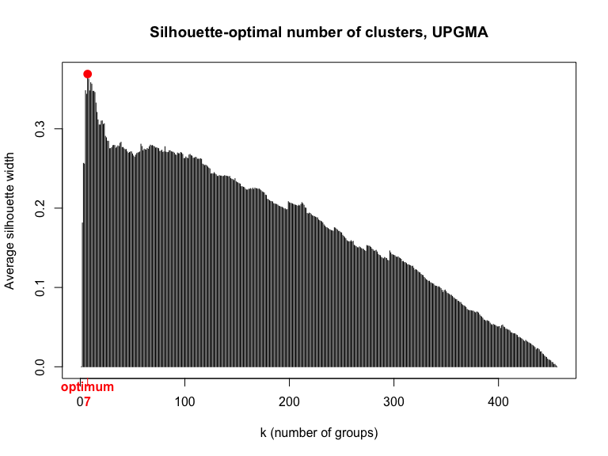
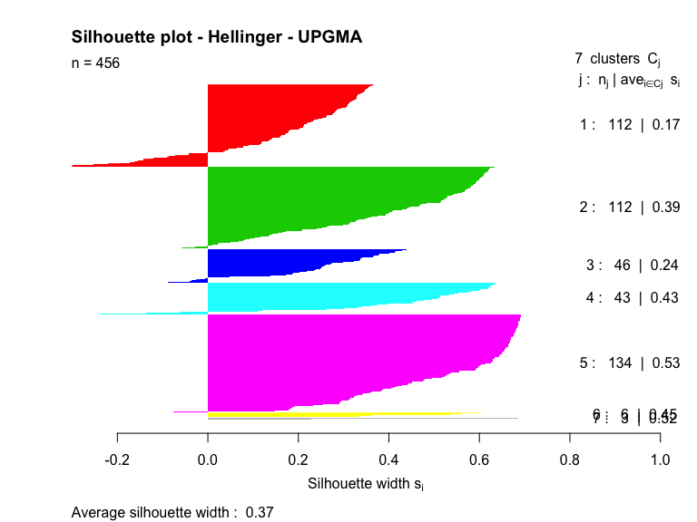
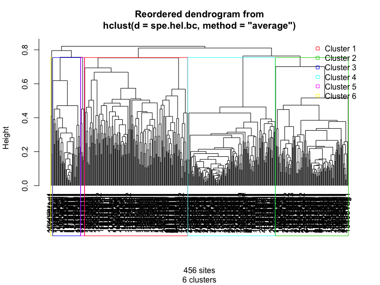
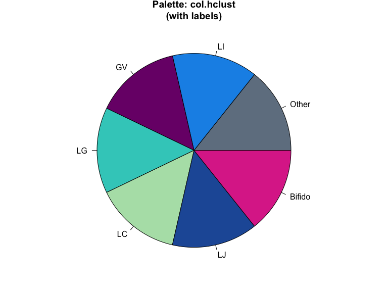
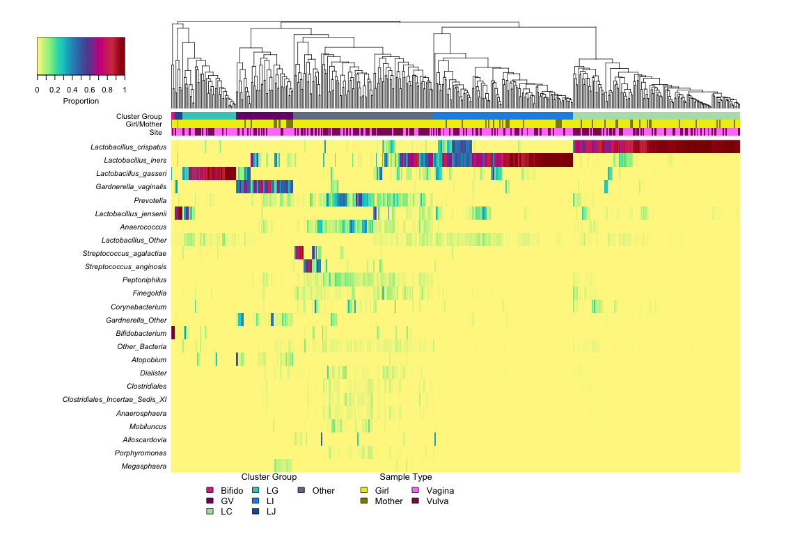
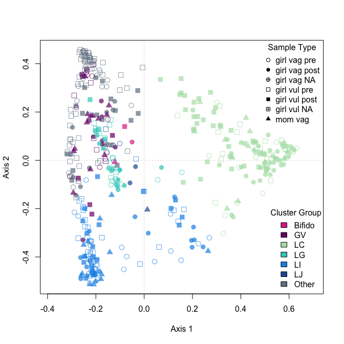
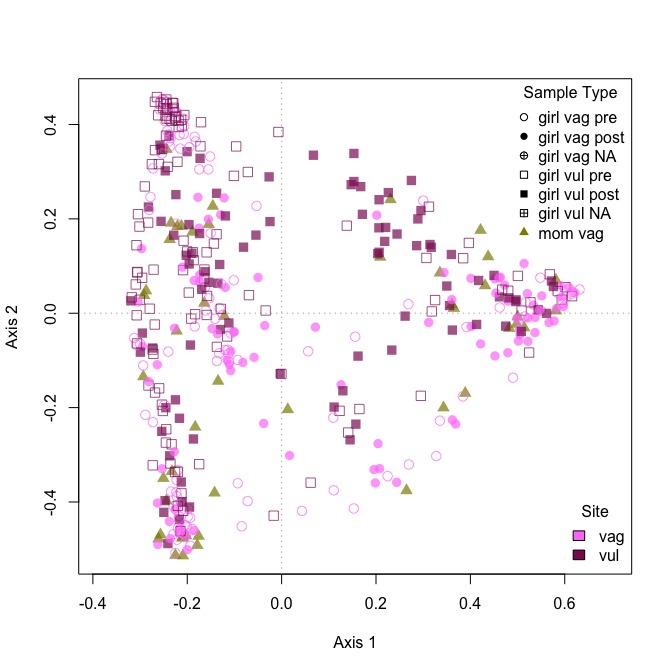
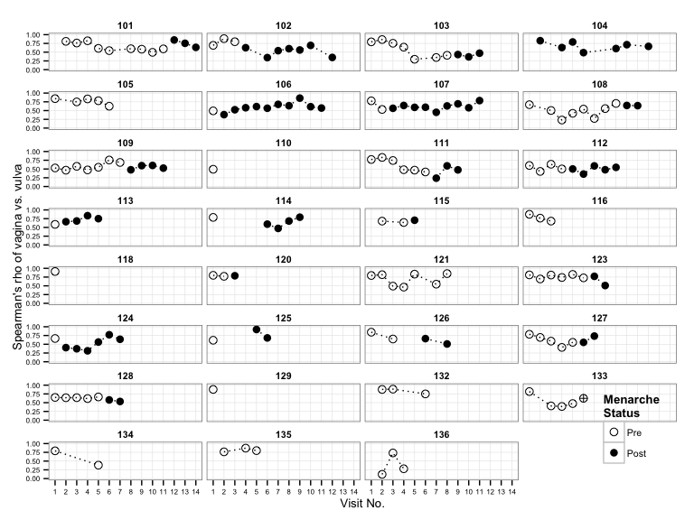
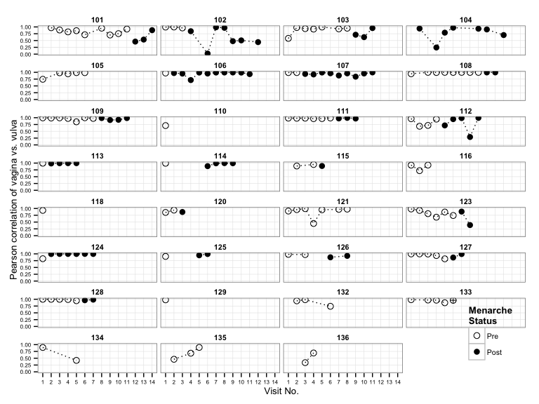

# Comparisons of girls' vaginal and vulvar microbiota
Roxana J. Hickey <roxana.hickey@gmail.com>  
Last updated March 9, 2015  

***
## Description
This is a supplement to the paper "Vaginal microbiota of adolescent girls prior to the onset of menarche resemble those of reproductive-age women" by Hickey et al. The code works through comparisons of vaginal and vulvar microbiota of perimenarcheal girls. The analyses can be run directly from the R Markdown file using RStudio. It should be run after "01-data-prep.Rmd".

See the project repository at http://github.com/roxanahickey/adolescent for more information.

**Update 2015-01-08: I added “echo=FALSE” options to the chunks of code that make a graph. View full code in R Markdown script.**

**Update 2015-03-09: Updated all figure legends and numbering to be consistent with final publication version (accepted 2015-02-18).**

## Objective
In earlier analyses ("02-hclust-pcoa.Rmd", "03-community-dynamics.Rmd", "04-lmm-lab-ph.Rmd") we focused on vaginal microbiota; now we want to extend our analyses to compare vulvar microbiota alongside vaginal microbiota. Here we perform hierarchical clustering and PCoA with both vaginal and vulvar data (similar to in "02-hclust-pcoa.Rmd") in addition to correlation analysis (part III) and indicator species analysis (part IV).

***
# Initial setup

Clear the workspace; load data and necessary packages.

```r
rm(list=ls())

load("data-postproc/01-data-prep-last-run.RData")

library(ape)
```

```
## Warning: package 'ape' was built under R version 3.1.1
```

```r
library(cluster)
library(ggplot2)
library(indicspecies)
```

```
## Warning: package 'indicspecies' was built under R version 3.1.1
```

```
## Loading required package: permute
```

```r
library(plyr)
library(reshape)
```

```
## 
## Attaching package: 'reshape'
## 
## The following objects are masked from 'package:plyr':
## 
##     rename, round_any
```

```r
library(vegan)
```

```
## Loading required package: lattice
## This is vegan 2.0-10
```

```r
## Display session info
sessionInfo()
```

```
## R version 3.1.0 (2014-04-10)
## Platform: x86_64-apple-darwin10.8.0 (64-bit)
## 
## locale:
## [1] en_US.UTF-8/en_US.UTF-8/en_US.UTF-8/C/en_US.UTF-8/en_US.UTF-8
## 
## attached base packages:
## [1] stats     graphics  grDevices utils     datasets  methods   base     
## 
## other attached packages:
## [1] vegan_2.0-10       lattice_0.20-29    reshape_0.8.5     
## [4] plyr_1.8.1         indicspecies_1.7.2 permute_0.8-3     
## [7] ggplot2_1.0.0      cluster_1.15.2     ape_3.1-4         
## 
## loaded via a namespace (and not attached):
##  [1] colorspace_1.2-4 digest_0.6.4     evaluate_0.5.5   formatR_0.10    
##  [5] grid_3.1.0       gtable_0.1.2     htmltools_0.2.4  knitr_1.6       
##  [9] lme4_1.1-7       MASS_7.3-33      Matrix_1.1-4     minqa_1.2.3     
## [13] munsell_0.4.2    nlme_3.1-117     nloptr_1.0.4     proto_0.3-10    
## [17] Rcpp_0.11.2      reshape2_1.4     rgeos_0.3-6      rmarkdown_0.2.49
## [21] scales_0.2.4     sp_1.0-15        splines_3.1.0    stringr_0.6.2   
## [25] tools_3.1.0      yaml_2.1.13
```

***
# I. Hierarchical clustering of vaginal and vulvar microbiota
The first set of analyses involves clustering vaginal and vulvar samples based on bacterial community composition and selecting the optimal clustering model and number of clusters. The approaches are based on those outlined in the following texts:  
* Legendre P, Legendre L. (2012). _Cluster analysis._ 3rd ed. Elsevier.
* Borcard D, Gillet F, Legendre P. (2011). _Numerical ecology with R._ Springer.

## Hellinger standardization of taxon abundance data
First, we standardize our bacterial read abundances using the Hellinger method. This is a recommended approach when the "species" are sparsely populated at some sites, resulting in many zeros in the species abundance matrix. We then compute the Bray-Curtis dissimilarity matrix from the Hellinger standardized abundance matrix. This will be used in subsequent clustering and ordination analyses.


```r
## Transform the abundance and proportion matrices because sites should be in rows, species in columns
spe.abund <- t(abund.red)
spe.prop <- t(prop.red)

## Perform the Hellinger transformation
spe.hel <- decostand(spe.abund, method="hellinger")

## Compute the Bray-Curtis dissimilarity matrix from the Hellinger standardized species table
spe.hel.bc <- vegdist(spe.hel, method="bray")
```

## Hierarchical clustering
Now we will perform hierarchical clustering using multiple linkage strategies (single, complete, average/UPGMA, Ward) and select the optimal one using Gower's distance. Then we'll select the optimal number of clusters using the maximum silhouette width.

 

```
## null device 
##           1
```

## Selection of optimal clustering model
Next we select the best clustering method by determining the cophenetic distance of each hierarchical clustering, followed by calculation of the Gower distance (Gower 1983), which is the sum of squared differences between the original and cophenetic distances. The method with the lowest Gower distance is considered the optimal clustering model for the distance matrix used. Below, this method identifies average/UPGMA is the best clustering model.


```r
## Calculate cophenetic distance for each hclust object
spe.hb.single.coph <- cophenetic(spe.hb.single)
spe.hb.complete.coph <- cophenetic(spe.hb.complete)
spe.hb.upgma.coph <- cophenetic(spe.hb.upgma)
spe.hb.ward.coph <- cophenetic(spe.hb.ward)

## Calculate the Gower distance
gow.dist.single <- sum((spe.hel.bc-spe.hb.single.coph)^2)
gow.dist.complete <- sum((spe.hel.bc-spe.hb.complete.coph)^2)
gow.dist.upgma <- sum((spe.hel.bc-spe.hb.upgma.coph)^2)
gow.dist.ward <- sum((spe.hel.bc-spe.hb.ward.coph)^2)

## Compare Gower distances and identify the lowest
gow.dist.single; gow.dist.complete; gow.dist.upgma; gow.dist.ward # Lowest score is UPGMA
```

```
## [1] 23702
```

```
## [1] 6076
```

```
## [1] 1802
```

```
## [1] 175612953
```

## Selection of optimal number of clusters
Now we pick the optimal number of clusters according silhouette widths (Rousseew quality index). To do this we plot the average silhouette widths for all partitions except for the trivial partition in a single group (k=1). We find that six clusters are identified as optimal.

 

```
##  Silhouette-optimal number of clusters k = 7 
##  with an average silhouette width of 0.3691
```

 

```
## Loading required package: gclus
```

 

Assign the group IDs as a new variable in the metadata and define colors for each group:

```r
## Add the group assignments as a variable to the metadata
meta$hclust <- cutg

## Define new colors and names for hclust groups (I determined these by
## looking at the heatmap in the next step then coming back to name the
## clusters and set colors that match the dominant taxon, if any)
col.hclust <- c("1"="slategrey", 
                "2"=col.taxa["Lactobacillus_iners"], 
                "3"=col.taxa["Gardnerella_vaginalis"], 
                "4"=col.taxa["Lactobacillus_gasseri"], 
                "5"=col.taxa["Lactobacillus_crispatus"], 
                "6"=col.taxa["Lactobacillus_jensenii"], 
                "7"=col.taxa["Bifidobacterium"])
names(col.hclust) <- c("Other", "LI", "GV", "LG", "LC", "LJ", "Bifido")

## Replace cluster numbers with new names in metadata
meta$hclust <- gsub("1", "Other", meta$hclust)
meta$hclust <- gsub("2", "LI", meta$hclust)
meta$hclust <- gsub("3", "GV", meta$hclust)
meta$hclust <- gsub("4", "LG", meta$hclust)
meta$hclust <- gsub("5", "LC", meta$hclust)
meta$hclust <- gsub("6", "LJ", meta$hclust)
meta$hclust <- gsub("7", "Bifido", meta$hclust)

## Add these colors as a new variable to col.meta.vag
col.meta$hclust <- col.hclust[meta$hclust]

## Print pie charts to show color palette
par(mar=c(1,1,2,1))
pie(rep(1,7), col=col.hclust, 
    main="Palette: col.hclust\n(with labels)", 
    labels=names(col.hclust))
```

 

```r
dev.off()
```

```
## null device 
##           1
```

Now we visualize community composition as a heatmap along with the UPGMA dendrogram and cluster assignments just determined:

## Figure S6. Bacterial community composition of the vulvar and vaginal microbiota of girls and vaginal microbiota of mothers sampled longitudinally.
**Note: In the final publication version, I flipped the orientation of the dendrogram horizontally and moved all legend items to the top left of the plot.**

Each column in the dendrogram and heatmap represents the vulvar or vaginal microbiota sampled from a single individual at a single point in time. In total 456 samples are represented: 198 vaginal samples and 211 vulvar samples from 31 girls, and 47 vaginal samples from 24 mothers. e dendrogram represents the average linkage (UPGMA) hierarchical clustering of samples based on the Bray-Curtis dissimilarity matrix computed from Hellinger standardized taxon abundance data. The colored bars below the dendrogram represent sample type (girl/mother, vagina/vulva) and hierarchical cluster assignments. Clusters are named to signify the most abundant taxon, when applicable: LC (_Lactobacillus crispatus_ dominant, n=134), ‘Other’ (n=117), LI (_L. iners_, n=107), LG (_L. gasseri_, n=49), GV (_Gardnerella vaginalis_, n=47), and ‘Bifido’ (_Bifidobacterium_, n=3). e heatmap represents proportions (prior to Hellinger standardization) of the 25 overall most abundant taxa within each community as indicated by the legend at top right.


```
## Loading required package: gplots
```

```
## Warning: package 'gplots' was built under R version 3.1.1
```

```
## KernSmooth 2.23 loaded
## Copyright M. P. Wand 1997-2009
## 
## Attaching package: 'gplots'
## 
## The following object is masked from 'package:stats':
## 
##     lowess
```

 

```
## null device 
##           1
```

***
# II. PCoA of vaginal and vulvar microbiota
Now we perform PCoA to obtain a more nuanced picture of the similarities and differences among samples. Again, the approaches are based on those outlined in the following texts:  
* Legendre P, Legendre L. (2012). _Cluster analysis_. 3rd ed. Elsevier.
* Borcard D, Gillet F, Legendre P. (2011). _Numerical ecology with R_. Springer.

## Setup PCoA
*Note: the PCoA method below produces negative eigenvalues unless corrected, which can be problematic for interpreting the R^2\-like ratio (essentially variance explained by an eigenvalue in PCA). See Legendre & Legendre Numerical Ecology Ch 9 for more discussion of this (p. 505 in 3rd edition 2012). However, as long as the largest-value negative eigenvalue is smaller in absolute value than any of the positive eigenvalues of interest (typically the first two), the interpretation is still meaningful. A correction was suggested by Cailliez & Pagès to adjust the R^2\-like ratio when negative eigenvalues are present -- see Legendre & Legendre p. 506, eq. 9.48.*


```r
## Calculate PCoA on Bray-Curtis dissimilarity matrix
spe.hb.pcoa <- cmdscale(vegdist(spe.hel), eig=TRUE, k=nrow(spe.hel)-1)
```

```
## Warning: only 165 of the first 455 eigenvalues are > 0
```

```r
## Calculate species scores
spe.hb.wa <- wascores(spe.hb.pcoa$points, spe.hel)

## Apply Cailliez correction using ape::pcoa to obtain R^2-like ratios
spe.hb.c.pcoa <- pcoa(vegdist(spe.hel), correction="cailliez")

## R^2-like ratio for first three axes
spe.hb.c.pcoa$values$Rel_corr_eig[1:3]
```

```
## [1] 0.12953 0.09386 0.05782
```

```r
## ~ Total variance explained by first two axes
sum(spe.hb.c.pcoa$values$Rel_corr_eig[1:2])
```

```
## [1] 0.2234
```

```r
## Note: we will still use the PCoA computed from cmdscale for plotting 
## since it is compatible with vegan's ordiplot functions (next section). 
## I had difficulty applying the Cailliez correction to the cmdscale PCoA 
## object which is why I used the above ape::pcoa function. If you run it 
## without the Cailliez correction (uncomment spe.hb.pcoa.2 above first), 
## you get the same eigenvalues as from the cmdscale method. See below:

## PCoA from ape::pcoa without the Cailliez correction
spe.hb.pcoa.2 <- pcoa(vegdist(spe.hel))

## Compare to PCoA from stats::cmdscale
head(spe.hb.pcoa$eig)
```

```
## [1] 40.312 30.700 18.615 11.912  6.384  4.794
```

```r
head(spe.hb.pcoa.2$values$Eigenvalues)
```

```
## [1] 40.312 30.700 18.615 11.912  6.384  4.794
```

## PCoA plots
Now we can plot the PCoA and overlay different variables with point shapes and colors. We'll keep it simple by using only the first 2 axes, which as we saw above account for ~22% of the variance after applying the Cailliez correction. We'll look at the same plot colored according to different metadata variables to look for any interesting patterns in the data:

* Color-coding by hierarchical cluster group
* Color-coding by body site


```
## Warning: Species scores not available
```

 

```
## Warning: Species scores not available
```

 

***
# III. Correlation of paired vaginal and vulvar samples
Next, we want to determine correlations among paired vagina-vulva samples to get an idea of how similar they are in taxonomic composition. Pearson correlation is one of the most commonly used measures and calculates the strength of the linear relationship between normally distributed variables. However, our variables (taxon abundances) are not expected to be related linearly, and in most cases they are not normally distributed. Outliers or extreme values therefore have a strong influence on the correlation. Spearman correlation, on the other hand, considers only the rank-order of variables. Spearman makes no assumptions about the distributions or linear relationship among variables, so large and small outliers have much less effect. This is more appropriate to our dataset. Because we are considering rank-order only, we would get the same result on either the taxon proportion table or the Hellinger-standardized abundance table. Below we calculate the Spearman correlation on the untranformed taxon proportion table. 


```r
meta.paired <- subset(meta.orig, vag==TRUE & vul==TRUE & type=="girl")
prop.vag.pr <- prop.red[,colnames(prop.red) %in% meta.paired$sample.ID.vag]
prop.vul.pr <- prop.red[,colnames(prop.red) %in% meta.paired$sample.ID.vul]

## Compute Spearman correlation on proportion data
cor.vag.vul.sp <- cor(prop.vag.pr, prop.vul.pr, method="spearman")

## Extract diagonal (vagina-vulva pairs)
cor.vag.vul.sp.pr <- diag(cor.vag.vul.sp)
hist(cor.vag.vul.sp.pr, breaks=30)
```

 

```r
mean(cor.vag.vul.sp.pr)
```

```
## [1] 0.6252
```

```r
median(cor.vag.vul.sp.pr)
```

```
## [1] 0.6323
```

```r
meta.paired$cor.spearman <- cor.vag.vul.sp.pr

gg.cor.vag.vul.sp <- ggplot(meta.paired, aes(x=visit, y=cor.spearman, shape=men.stat))

gg.cor.vag.vul.sp + geom_point(size=3) + 
  geom_line(lty=3) +
  facet_wrap( ~ subject, ncol=4) +
  scale_shape_manual(values=c(16, 1), 
                     breaks=c("pre", "post"), 
                     labels=c("Pre", "Post"),
                     name="Menarche\nStatus", na.value=10) +
  xlab("Visit") +
  ylab("Spearman's rho of vagina vs. vulva") +
  scale_x_discrete(1:14, name="Visit No.") +
  ylim(0,1) +
  theme_cust_nominor +
  theme(axis.text=element_text(size=6),
        legend.position=c(1,0),
        legend.justification=c(1,0))
```

```
## geom_path: Each group consist of only one observation. Do you need to adjust the group aesthetic?
## geom_path: Each group consist of only one observation. Do you need to adjust the group aesthetic?
## geom_path: Each group consist of only one observation. Do you need to adjust the group aesthetic?
```

 

For curiosity's sake we can also compute the Pearson correlations (better to do so on the Hellinger-standardized abundance data so as to lessen effects of very high and very low abundances). The correlations are indeed higher for most cases except those with the starkest differences in composition. However, this should be interpreted with caution since Pearson assumes normal distributions and linear dependence among variables, and many taxa in our dataset have heavily skewed abundance distributions even after the Hellinger transformation (the Spearman method does not rely on these assumptions).


```r
spe.hel <- decostand(t(abund.red), method="hellinger")
spe.hel.vag.pr <- t(spe.hel[rownames(spe.hel) %in% meta.paired$sample.ID.vag,])
spe.hel.vul.pr <- t(spe.hel[rownames(spe.hel) %in% meta.paired$sample.ID.vul,])

## Compute the Pearson correlation on Hellinger-transformed data
cor.vag.vul.hel.pe <- cor(spe.hel.vag.pr, spe.hel.vul.pr, method="pearson")

## Extract diagonal (vagina-vulva pairs)
cor.vag.vul.hel.pe.pr <- diag(cor.vag.vul.hel.pe)
hist(cor.vag.vul.hel.pe.pr, breaks=30)
```

 

```r
mean(cor.vag.vul.hel.pe.pr)
```

```
## [1] 0.8841
```

```r
median(cor.vag.vul.hel.pe.pr)
```

```
## [1] 0.9579
```

```r
meta.paired$cor.pearson.hellinger <- cor.vag.vul.hel.pe.pr
```


```
## Warning: Removed 1 rows containing missing values (geom_point).
```

```
## geom_path: Each group consist of only one observation. Do you need to adjust the group aesthetic?
## geom_path: Each group consist of only one observation. Do you need to adjust the group aesthetic?
## geom_path: Each group consist of only one observation. Do you need to adjust the group aesthetic?
```

```
## Warning: Removed 1 rows containing missing values (geom_path).
```

 

```
## Warning: Removed 1 rows containing missing values (geom_point).
```

```
## geom_path: Each group consist of only one observation. Do you need to adjust the group aesthetic?
## geom_path: Each group consist of only one observation. Do you need to adjust the group aesthetic?
## geom_path: Each group consist of only one observation. Do you need to adjust the group aesthetic?
```

```
## Warning: Removed 1 rows containing missing values (geom_path).
```

 

***
# IV. Indicator 'species' (taxa) analysis of vaginal vs. vulvar samples
Indicator species analysis was performed to identify taxa most strongly associated with, but not necessarily most abundant within, different groups of samples. The first analysis was performed on vaginal and vulvar samples from girls only. Samples were separated into four groups encompassing premenarcheal and postmenarcheal vaginal and vulvar samples. Taxa with an indicator value of at least 0.5 and p-value less than or equal to 0.01 are results reported below.

## IndVal by body site and menarcheal status
We first test for indicator "species" (in our case, taxa which include species, genus, family and order levels) ofgroups of samples separated by type:
* Girl vagina premenarche (n=110)
* Girl vagina postmenarche (n=87)
* Girl vulva premenarche (n=119)
* Girl vulva postmenarche (n=91)

*Note: we will ignore the two samples for which menarche status is unknown, 13306Vag1 and 13306Vul1. I chose not to include the mother samples in this analysis because there are substantially fewer samples in that group, and groups LG and Other were very much underrepresented (even though we have commonly observed similar community types in reproductive age women in other studies).*

In this analysis we will test for indicator taxa of combinations of sample groups in addition to single groups. Note that slightly different results may be obtained each time this is run, particularly for the more weakly associated taxa. For that reason, the results reported in the manuscript include only those with an IndVal statistic >=0.5 and p-value <= 0.01.

### Indicator taxa for groups of vaginal and vulvar microbiota of adolescent girls

```r
## Reduce the metadata and taxon table for ease of use below
meta.girl <- subset(meta, type=="girl" & men.stat %in% c("pre", "post"))
prop.girl <- prop.red[,meta$type=="girl" & meta$men.stat %in% c("pre","post")]

## Calculate IndVal and summarize (note that slightly different results may be obtained each time)
ind.girl.sampletype <- multipatt(data.frame(t(prop.girl)), meta.girl$type.site.men.stat, func="IndVal.g")
summary(ind.girl.sampletype, alpha=0.01) # list all results with p<=0.01
```

```
## 
##  Multilevel pattern analysis
##  ---------------------------
## 
##  Association function: IndVal.g
##  Significance level (alpha): 0.01
## 
##  Total number of species: 79
##  Selected number of species: 36 
##  Number of species associated to 1 group: 0 
##  Number of species associated to 2 groups: 14 
##  Number of species associated to 3 groups: 22 
## 
##  List of species associated to each combination: 
## 
##  Group girl.vag.post+girl.vul.post  #sps.  2 
##                             stat p.value   
## Lactobacillus_gigeriorum   0.487   0.005 **
## Lactobacillus_coleohominis 0.435   0.005 **
## 
##  Group girl.vag.pre+girl.vul.pre  #sps.  6 
##                                stat p.value   
## Mobiluncus                    0.605   0.005 **
## Propionimicrobium             0.497   0.005 **
## Fastidiosipila                0.480   0.005 **
## Lachnospiracea_incertae_sedis 0.412   0.010 **
## Actinobaculum                 0.331   0.005 **
## Arcanobacterium               0.327   0.005 **
## 
##  Group girl.vul.post+girl.vul.pre  #sps.  6 
##                     stat p.value   
## Segniliparus       0.609   0.005 **
## Murdochiella       0.590   0.005 **
## Fusobacterium      0.577   0.005 **
## Paraprevotella     0.413   0.010 **
## Olsenella          0.412   0.010 **
## Peptostreptococcus 0.350   0.005 **
## 
##  Group girl.vag.post+girl.vul.post+girl.vul.pre  #sps.  4 
##                  stat p.value   
## Actinomycetales 0.684   0.005 **
## Staphylococcus  0.604   0.010 **
## Veillonellaceae 0.473   0.005 **
## Megasphaera     0.458   0.010 **
## 
##  Group girl.vag.pre+girl.vul.post+girl.vul.pre  #sps.  18 
##                                  stat p.value   
## Prevotella                      0.904   0.005 **
## Peptoniphilus                   0.878   0.005 **
## Anaerococcus                    0.873   0.005 **
## Dialister                       0.818   0.005 **
## Clostridiales                   0.805   0.005 **
## Corynebacterium                 0.782   0.005 **
## Anaerosphaera                   0.772   0.005 **
## Clostridiales_Incertae_Sedis_XI 0.748   0.005 **
## Porphyromonas                   0.682   0.005 **
## Campylobacter                   0.663   0.005 **
## Gallicola                       0.600   0.005 **
## Facklamia                       0.572   0.005 **
## Streptococcus_Other             0.567   0.005 **
## Varibaculum                     0.562   0.005 **
## Peptococcus                     0.540   0.005 **
## Porphyromonadaceae              0.529   0.005 **
## Anaerovorax                     0.503   0.005 **
## Actinomyces                     0.471   0.005 **
## ---
## Signif. codes:  0 '***' 0.001 '**' 0.01 '*' 0.05 '.' 0.1 ' ' 1
```

```r
## Extract results for which IndVal stat >= 0.5 and pval <= 0.01
ind.girl.sampletype.res <- ind.girl.sampletype$sign[ind.girl.sampletype$sign$p.value <= 0.01 & ind.girl.sampletype$sign$stat >= 0.5,]
remove.na <- grep("NA", rownames(ind.girl.sampletype.res))
ind.girl.sampletype.res <- ind.girl.sampletype.res[-remove.na,]

## Run a bootstrapped analysis of IndVal associations for all individual groups
ind.girl.sampletype.boot <- strassoc(data.frame(t(prop.girl)), meta.girl$type.site.men.stat, func="IndVal.g", nboot=100)
rownames(ind.girl.sampletype.boot$stat) <- rownames(ind.girl.sampletype.boot$lowerCI)
rownames(ind.girl.sampletype.boot$stat) <- gsub(" ", ".", rownames(ind.girl.sampletype.boot$stat))
ind.girl.sampletype.boot.assoc <- ind.girl.sampletype.boot$stat[rownames(ind.girl.sampletype.boot$stat) %in% rownames(ind.girl.sampletype.res),]

## Combine IndVal stats/pvals with bootstrapped associations and write table
ind.girl.sampletype.df <- cbind(ind.girl.sampletype.res, 
                                ind.girl.sampletype.boot.assoc[match(rownames(ind.girl.sampletype.res), 
                                                                     rownames(ind.girl.sampletype.boot.assoc)),])
write.csv(ind.girl.sampletype.df, "misc/indicspecies-sampletype-groups.csv")
```

## IndVal for UPGMA hierarchical cluster groups
The second indicator species analysis is based on the six groups determined by hierarchical clustering earlier. This is somewhat circular since those groups were clustered on the basis of community composition, but it does help to highlight which taxa are most strongly associated with each group, which might be difficult to determine just looking at the dendrogram and heatmap. We're considering all combinations of groups here, but you could also look at taxa associated with individual groups by adding the option duleg==TRUE to the multipatt() command.

### Indicator taxa for groups of vaginal and vulvar samples from girls and mothers as determined by UPGMA hierarchical clustering


```r
## Calculate IndVal and summarize
ind.hbaclust.single <- multipatt(data.frame(t(prop.red)), meta$hclust, func="IndVal.g")
summary(ind.hbaclust.single, alpha=0.01) # list all results with p<=0.01
```

```
## 
##  Multilevel pattern analysis
##  ---------------------------
## 
##  Association function: IndVal.g
##  Significance level (alpha): 0.01
## 
##  Total number of species: 79
##  Selected number of species: 23 
##  Number of species associated to 1 group: 11 
##  Number of species associated to 2 groups: 3 
##  Number of species associated to 3 groups: 8 
##  Number of species associated to 4 groups: 1 
##  Number of species associated to 5 groups: 0 
##  Number of species associated to 6 groups: 0 
## 
##  List of species associated to each combination: 
## 
##  Group Bifido  #sps.  2 
##                  stat p.value   
## Bifidobacterium 0.982   0.005 **
## Aerococcus      0.967   0.005 **
## 
##  Group GV  #sps.  2 
##                    stat p.value   
## Gardnerella_Other 0.935   0.005 **
## Atopobium         0.772   0.010 **
## 
##  Group LC  #sps.  1 
##                          stat p.value   
## Lactobacillus_crispatus 0.933   0.005 **
## 
##  Group LJ  #sps.  1 
##                         stat p.value   
## Lactobacillus_jensenii 0.921   0.005 **
## 
##  Group Other  #sps.  5 
##                                  stat p.value   
## Campylobacter                   0.835   0.005 **
## Clostridiales_Incertae_Sedis_XI 0.828   0.005 **
## Porphyromonas                   0.794   0.010 **
## Peptococcus                     0.703   0.010 **
## Propionimicrobium               0.651   0.005 **
## 
##  Group Bifido+Other  #sps.  1 
##               stat p.value   
## Segniliparus 0.709    0.01 **
## 
##  Group GV+LJ  #sps.  1 
##                        stat p.value   
## Gardnerella_vaginalis 0.956   0.005 **
## 
##  Group GV+Other  #sps.  1 
##             stat p.value   
## Mobiluncus 0.771   0.005 **
## 
##  Group Bifido+GV+Other  #sps.  2 
##                  stat p.value   
## Dialister       0.928   0.005 **
## Veillonellaceae 0.699   0.005 **
## 
##  Group Bifido+LG+LJ  #sps.  1 
##                       stat p.value   
## Lactobacillus_gasseri 0.91   0.005 **
## 
##  Group GV+LJ+Other  #sps.  5 
##                stat p.value   
## Prevotella    0.939   0.005 **
## Anaerococcus  0.926   0.005 **
## Peptoniphilus 0.925   0.005 **
## Clostridiales 0.858   0.005 **
## Anaerosphaera 0.850   0.005 **
## 
##  Group GV+LI+LJ+Other  #sps.  1 
##                      stat p.value   
## Lactobacillus_iners 0.891   0.005 **
## ---
## Signif. codes:  0 '***' 0.001 '**' 0.01 '*' 0.05 '.' 0.1 ' ' 1
```

```r
## Summarize results with p<=0.01
ind.hbaclust.single.res <- ind.hbaclust.single$sign[ind.hbaclust.single$sign$p.value <= 0.01,]
remove.na <- grep("NA", rownames(ind.hbaclust.single.res))
ind.hbaclust.single.res <- ind.hbaclust.single.res[-remove.na,]

## Run a bootstrapped analysis of IndVal associations for all individual groups
ind.hbaclust.single.boot <- strassoc(t(prop.red), meta$hclust, func="IndVal.g", nboot=100)
rownames(ind.hbaclust.single.boot$stat) <- rownames(ind.hbaclust.single.boot$lowerCI)
rownames(ind.hbaclust.single.boot$stat) <- gsub(" ", ".", rownames(ind.hbaclust.single.boot$stat))
ind.hbaclust.single.boot.assoc <- ind.hbaclust.single.boot$stat[rownames(ind.hbaclust.single.boot$stat) %in% rownames(ind.hbaclust.single.res),]

## Combine IndVal stats/pvals with bootstrapped associations and write table
ind.hbaclust.single.df <- cbind(ind.hbaclust.single.res, 
                                ind.hbaclust.single.boot.assoc[match(rownames(ind.hbaclust.single.res), 
                                                                     rownames(ind.hbaclust.single.boot.assoc)),])
write.csv(ind.hbaclust.single.df, "misc/indicspecies-hclust-groups.csv")
```

***
# Save R workspace
This will save the workspace (data) in two separate images: one named with today's date, in case you ever need to restore that version, and another with a non-dated name that can be easily loaded into subsequent analyses.

### Cleanup

```r
rm(fcol, ind.girl.sampletype, ind.girl.sampletype.boot, ind.girl.sampletype.boot.assoc,
   ind.girl.sampletype.res, ind.hbaclust.single, ind.hbaclust.single.boot, 
   ind.hbaclust.single.boot.assoc, ind.hbaclust.single.res, asw, cutg, gg.cor.vag.vul,
   gg.cor.vag.vul.pe, gg.cor.vag.vul.sp, gow.dist.complete, gow.dist.single,
   gow.dist.upgma, gow.dist.ward, k, k.best, pick, remove.na, rsum, sil,
   spe.hb.complete.coph, spe.hb.single.coph, spe.hb.upgma.coph, spe.hb.ward.coph)
```


```r
save.image(paste("data-postproc/05-vaginal-vulva-comparison-", Sys.Date(), ".RData", sep=""))
save.image(paste("data-postproc/05-vaginal-vulva-comparison-last-run.RData", sep=""))
```
