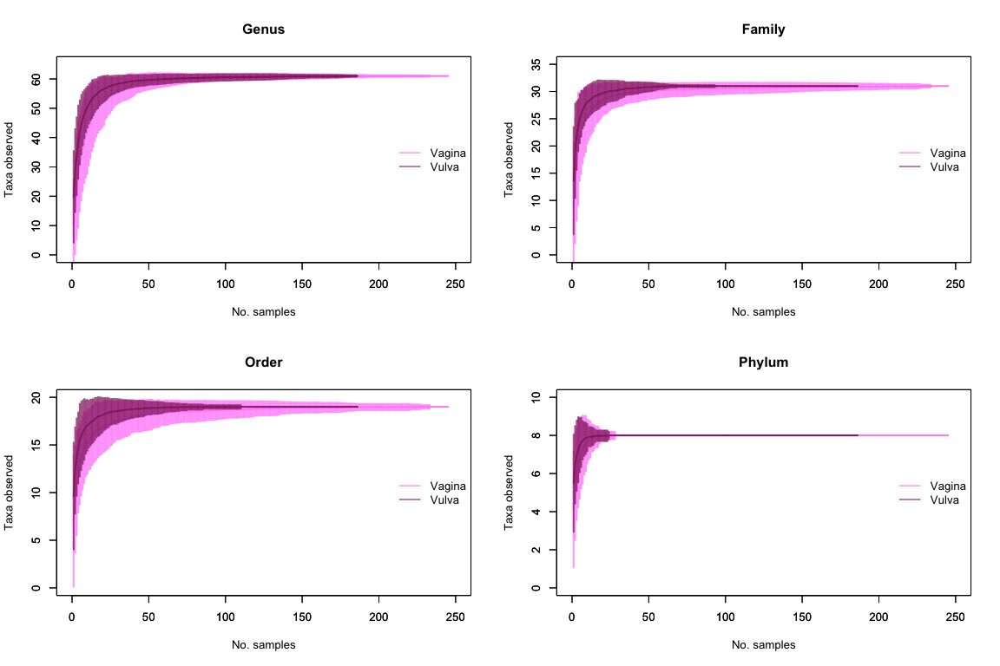

# Post-review additional analyses
Roxana J. Hickey <roxana.hickey@gmail.com>  
Last updated March 9, 2015  

***
## Description
This is a supplement to the paper "Vaginal microbiota of adolescent girls prior to the onset of menarche resemble those of reproductive-age women" by Hickey et al. These analyses were added after an initial round of peer review. Minor changes were made to other scripts and noted accordingly.

See the project repository at http://github.com/roxanahickey/adolescent for more information.

**Update 2015-03-09: Updated all figure legends and numbering to be consistent with final publication version (accepted 2015-02-18).**

## Objective
These analyses address two reviewer requests: 1) explore how pH varies with respect to community cluster group (from the hierarchical clustering in 02-hclust-pcoa.Rmd) and 2) how community diversity changes with respect to Tanner stage, menarche status and pH.

***
## Initial setup

Load in data from previous analyses.

```r
rm(list=ls())

load("data-postproc/01-data-prep-last-run.RData")
load("data-postproc/02-hclust-pcoa-last-run.RData")
load("data-postproc/03-community-dynamics-last-run.RData")
load("data-postproc/04-lmm-lab-ph-last-run.RData")
load("data-postproc/05-vaginal-vulva-comparison-last-run.RData")

library(ggplot2)
library(vegan)
```

```
## Loading required package: permute
## Loading required package: lattice
## This is vegan 2.0-10
```

```r
library(reshape)
library(tidyr)
```

```
## Warning: package 'tidyr' was built under R version 3.1.2
```

```
## 
## Attaching package: 'tidyr'
## 
## The following object is masked from 'package:reshape':
## 
##     expand
```

```r
library(grid)
library(nparcomp)
```

```
## Warning: package 'nparcomp' was built under R version 3.1.2
```

```
## Loading required package: multcomp
```

```
## Warning: package 'multcomp' was built under R version 3.1.2
```

```
## Loading required package: mvtnorm
```

```
## Warning: package 'mvtnorm' was built under R version 3.1.1
```

```
## Loading required package: survival
## Loading required package: splines
## Loading required package: TH.data
```

```
## Warning: package 'TH.data' was built under R version 3.1.2
```

```r
library(pgirmess)

source("http://www.jennajacobs.org/R/rarefaction.txt")

## Display session info
sessionInfo()
```

```
## R version 3.1.0 (2014-04-10)
## Platform: x86_64-apple-darwin10.8.0 (64-bit)
## 
## locale:
## [1] en_US.UTF-8/en_US.UTF-8/en_US.UTF-8/C/en_US.UTF-8/en_US.UTF-8
## 
## attached base packages:
## [1] splines   grid      stats     graphics  grDevices utils     datasets 
## [8] methods   base     
## 
## other attached packages:
##  [1] pgirmess_1.5.9  nparcomp_2.5    multcomp_1.3-8  TH.data_1.0-6  
##  [5] survival_2.37-7 mvtnorm_1.0-0   tidyr_0.2.0     reshape_0.8.5  
##  [9] vegan_2.0-10    lattice_0.20-29 permute_0.8-3   ggplot2_1.0.0  
## 
## loaded via a namespace (and not attached):
##  [1] boot_1.3-11      coda_0.16-1      colorspace_1.2-4 deldir_0.1-7    
##  [5] digest_0.6.4     evaluate_0.5.5   formatR_0.10     gtable_0.1.2    
##  [9] htmltools_0.2.4  knitr_1.6        LearnBayes_2.15  lme4_1.1-7      
## [13] MASS_7.3-33      Matrix_1.1-4     minqa_1.2.3      munsell_0.4.2   
## [17] nlme_3.1-117     nloptr_1.0.4     plyr_1.8.1       proto_0.3-10    
## [21] Rcpp_0.11.2      reshape2_1.4     rgdal_0.9-1      rmarkdown_0.2.49
## [25] sandwich_2.3-2   scales_0.2.4     sp_1.0-15        spdep_0.5-82    
## [29] splancs_2.01-36  stringr_0.6.2    tools_3.1.0      yaml_2.1.13     
## [33] zoo_1.7-11
```

# I. Vaginal pH across community cluster groups
'Bifido' cluster is excluded because there are only two samples, and pH data for only one sample. The second plot will be saved as Figure S2.

```
## Warning: Removed 76 rows containing non-finite values (stat_boxplot).
```

 

## Figure S2. Vaginal pH across hierarchical cluster groups.
**Note: I annotated the figure with p-values in Illustrator for the final publication version.**

Vaginal microbiota were grouped into hierarchical clusters, listed in the legend at right. A multiple comparisons test using Tukey's method was used to identify significant differences in vaginal pH between clusters. P-values less than 0.05 are shown on the plot with a connector indicating the two groups being compared. Each box represents the interquartile range, the whiskers represent the upper and lower quartiles, the horizontal line represents the median, and open circles represent outliers.

```
## Warning: Removed 76 rows containing non-finite values (stat_boxplot).
```

 

### Kruskal-Wallis rank sum test
It appears from these plots that vaginal pH is considerably higher in the GV and Other clusters. Now we'll perform some simple stats to see how significant these differences are. We'll use the Kruskal-Wallis rank sum test, a nonparametric group comparison test. We are violating some assumptions because we technically have repeated measures within individuals, but to get a rough idea of differences in pH across groups we're going to treat the groups as independent. We will, however, exclude the Bifido group as it only has 2 samples (and one of them is missing pH data). We'll also exclude the 77 cases for which pH data are unavailable.

```r
summary(factor(meta.vag$hclust))
```

```
## Bifido     GV     LC     LG     LI     LJ  Other 
##      2     30     87     22     71      8     25
```

```r
meta.vag.ph <- na.exclude(meta.vag[,c("subject","type","ph","hclust")]) # n=168
# Remove Bifido group samples
meta.vag.ph <- subset(meta.vag.ph, hclust %in% c("GV","LC","LG","LI","LJ","Other")) # n=167

kruskal.test(ph ~ factor(hclust), data=meta.vag.ph)
```

```
## 
## 	Kruskal-Wallis rank sum test
## 
## data:  ph by factor(hclust)
## Kruskal-Wallis chi-squared = 42.48, df = 5, p-value = 4.719e-08
```

This test confirms there is a significant difference among the six groups (p=4.7E-08), but not which groups differ from others. The kruskalmc function from package pgirmess allows us to perform multiple pairwise comparisons after a Kruskal-Wallis test (i.e. a posthoc test). According to documentation the procedure was developed by Patrick Giraudoux based on Siegel and Castellan (1988) Non parametric statistics for the behavioural sciences. MacGraw Hill Int., New York. pp 213-214.

```r
kruskalmc(ph ~ factor(hclust), data=meta.vag.ph)
```

```
## Multiple comparison test after Kruskal-Wallis 
## p.value: 0.05 
## Comparisons
##          obs.dif critical.dif difference
## GV-LC     57.033        34.81       TRUE
## GV-LG     30.641        45.11      FALSE
## GV-LI     44.011        37.06       TRUE
## GV-LJ     22.114       104.82      FALSE
## GV-Other  16.348        49.65      FALSE
## LC-LG     26.391        37.62      FALSE
## LC-LI     13.021        27.46      FALSE
## LC-LJ     34.919       101.82      FALSE
## LC-Other  73.381        42.96       TRUE
## LG-LI     13.370        39.71      FALSE
## LG-LJ      8.528       105.78      FALSE
## LG-Other  46.989        51.66      FALSE
## LI-LJ     21.898       102.61      FALSE
## LI-Other  60.359        44.80       TRUE
## LJ-Other  38.462       107.80      FALSE
```

### Tukey's test for multiple comparisons
The kruskalmc test above identified the following contrasts as significantly different ("TRUE" in table): GV vs. LC, GV vs. LI, Other vs. LC, Other vs. LI. An alternative and more robust approach that will also give us p-values is the nparcomp function from the package by the same name. We'll use the Tukey method. Note again that we are treating samples as independent although truly they are not.

```r
tukey.mc <- nparcomp(ph ~ factor(hclust), data=meta.vag.ph, type = "Tukey")
```

```
## 
##  #------Nonparametric Multiple Comparisons for relative contrast effects-----# 
##  
##  - Alternative Hypothesis:  True relative contrast effect p is less or equal than 1/2 
##  - Type of Contrast : Tukey 
##  - Confidence level: 95 % 
##  - Method = Logit - Transformation 
##  - Estimation Method: Pairwise rankings 
##  
##  #---------------------------Interpretation----------------------------------# 
##  p(a,b) > 1/2 : b tends to be larger than a 
##  #---------------------------------------------------------------------------# 
## 
```

```r
summary(tukey.mc)
```

```
## 
##  #------------Nonparametric Multiple Comparisons for relative contrast effects----------# 
##  
##  - Alternative Hypothesis:  True relative contrast effect p is less or equal than 1/2 
##  - Estimation Method: Global Pseudo ranks 
##  - Type of Contrast : Tukey 
##  - Confidence Level: 95 % 
##  - Method = Logit - Transformation 
##  
##  - Estimation Method: Pairwise rankings 
##  
##  #---------------------------Interpretation--------------------------------------------# 
##  p(a,b) > 1/2 : b tends to be larger than a 
##  #-------------------------------------------------------------------------------------# 
##  
##  #----Data Info-------------------------------------------------------------------------# 
##   Sample Size
## 1     GV   22
## 2     LC   68
## 3     LG   18
## 4     LI   44
## 5     LJ    2
## 6  Other   13
## 
##  #----Contrast--------------------------------------------------------------------------# 
##            GV LC LG LI LJ Other
## LC - GV    -1  1  0  0  0     0
## LG - GV    -1  0  1  0  0     0
## LI - GV    -1  0  0  1  0     0
## LJ - GV    -1  0  0  0  1     0
## Other - GV -1  0  0  0  0     1
## LG - LC     0 -1  1  0  0     0
## LI - LC     0 -1  0  1  0     0
## LJ - LC     0 -1  0  0  1     0
## Other - LC  0 -1  0  0  0     1
## LI - LG     0  0 -1  1  0     0
## LJ - LG     0  0 -1  0  1     0
## Other - LG  0  0 -1  0  0     1
## LJ - LI     0  0  0 -1  1     0
## Other - LI  0  0  0 -1  0     1
## Other - LJ  0  0  0  0 -1     1
## 
##  #----Analysis--------------------------------------------------------------------------# 
##         Comparison Estimator Lower Upper Statistic   p.Value
## 1     p( GV , LC )     0.148 0.066 0.298   -5.5802 1.848e-07
## 2     p( GV , LG )     0.253 0.087 0.544   -2.4476 1.429e-01
## 3     p( GV , LI )     0.245 0.116 0.445   -3.5383 5.149e-03
## 4     p( GV , LJ )     0.182 0.032 0.598   -2.2557 2.197e-01
## 5  p( GV , Other )     0.740 0.409 0.921    2.1033 2.991e-01
## 6     p( LC , LG )     0.689 0.481 0.841    2.6027 9.816e-02
## 7     p( LC , LI )     0.573 0.411 0.720    1.2774 8.450e-01
## 8     p( LC , LJ )     0.787 0.591 0.904    3.9726 9.565e-04
## 9  p( LC , Other )     0.885 0.627 0.973    3.8183 1.784e-03
## 10    p( LG , LI )     0.412 0.228 0.625   -1.1670 8.970e-01
## 11    p( LG , LJ )     0.583 0.228 0.869    0.6171 9.981e-01
## 12 p( LG , Other )     0.857 0.498 0.973    2.8388 5.028e-02
## 13    p( LI , LJ )     0.648 0.398 0.836    1.6963 5.696e-01
## 14 p( LI , Other )     0.835 0.580 0.949    3.5618 4.740e-03
## 15 p( LJ , Other )     0.923 0.354 0.996    2.2938 2.026e-01
## 
##  #----Overall---------------------------------------------------------------------------# 
##   Quantile   p.Value
## 1    2.849 1.848e-07
## 
##  #--------------------------------------------------------------------------------------#
```

The test above identifies the same four contrasts as significant, as well as LC vs. LJ (p=0.001). This confirms our visual observation that vaginal pH is significantly higher in the GV and Other clusters relative to each of the _Lactobacillus_-dominant clusters. Save the results as a table and annotate significant values on Figure S2.

```r
res.tukey <- data.frame(tukey.mc$Analysis)
x <- gsub("p( ", "", res.tukey$Comparison, fixed=TRUE)
x <- gsub(",", "vs.", x)
x <- gsub(" )", "", x, fixed=TRUE)
res.tukey$Comparison <- x

write.csv(res.tukey, "supplemental/ph-hclust-tukey.csv", quote=FALSE, row.names=FALSE)
```

# II. Diversity analysis

## Extract genus-level abundance data
Previously (in 01-data-prep.Rmd) we summarized a taxon abundance table that included classifications at several levels (species, genus, etc.). For the diversity analysis we want to work at one level at a time. The table 79taxa_noNA.csv matches each taxon name from the original table to its corresponding genus, family, order and phylum when applicable, and lists "Other" if the classification is not available. We'll use this to construct new abundance tables for each classification level.

```r
taxa.levels <- read.csv("data/79taxa_noNA.csv", header=TRUE)

# first attempt, better below
# class.sum <- function(ab, lv, rank="genus") {
#   tmp <- cbind(lv[colnames(lv)==rank], ab)
#   abund.tmp <- melt(tmp, id.vars=rank)
#   colnames(abund.tmp)[1] <- "level"
#   assign(paste("abund.", rank, sep=""), cast(abund.tmp, variable~level, sum))
# }
# 
# abund.gen <- class.sum(abund.red, taxa.levels, rank="genus")

# function courtesy of Matt Pennell
class_sum <- function(ab, lv, rank="genus"){
    tax <- lv[,c(rank)]
    lab <- lapply(unique(tax), function(x) which(tax == x))
    ## subset abundance by each
    ab_tax <- lapply(lab, function(x) ab[x,])
    res <- lapply(ab_tax, function(x) colSums(x))
    out <- do.call(rbind, res)
    rownames(out) <- unique(tax)
    out
}

abund.gen <- t(class_sum(abund.red, taxa.levels, rank="genus"))
abund.fam <- t(class_sum(abund.red, taxa.levels, rank="family"))
abund.ord <- t(class_sum(abund.red, taxa.levels, rank="order"))
abund.phy <- t(class_sum(abund.red, taxa.levels, rank="phylum"))
```

## Rarefaction analysis
We know from earlier that there is quite a bit of variance in read count across samples. Therefore we want to rarefy our samples prior to doing diversity analyses. Below is a summary of read count number across all 456 samples.

```r
summary(rowSums(abund.gen))
```

```
##    Min. 1st Qu.  Median    Mean 3rd Qu.    Max. 
##     462    2850    3880    4720    5370   31600
```

```r
hist(rowSums(abund.gen), breaks=50, col="yellow2", xlab="Number of Reads", 
     main="Sample Read Counts")
```

 

Here are genus-level rarefaction curves for all 456 samples. Note that in each case, 'Other' is included as its own category, even though it encompasses many taxa that could not be classified to a given level (applies mainly to the genus and family levels). Lines represent the observed number of genera, families, orders or phyla for each vaginal or vulvar swab sample. The x-axis extends to 5000 samples (reads), although the maximum read count was 31,570.
 

```
## null device 
##           1
```

It's also helpful to check accumulation curves to give an idea of how the number of observed taxa is dependent on our sampling depth (i.e. number of vaginal/vulvar swabs collected). In all cases they level out before 50 samples, which is well below our actual sampling number.
 

```
## null device 
##           1
```

## Calculate diversity indices based on fixed sampling depth
Based on the rarefaction curves, we should be safe to subsample n=2000 at the genus level, as most of the curves are saturated by that stage. This will prevent high-read samples from having inflated diversity estimates. 39 samples have less than 2000 sequences, so rather than sample them with replacement we will exclude them from further analysis. At this point we'll calculate genus richness, obtain rarefied genus abundance/proportion tables, and calculate diversity indices. Again, note that 'Other' is retained as a separate category even though it encompasses several taxa that could not be classified at the genus level. Our estimates will therefore be (probably very) conservative.


```r
# Reduce dataset to samples with at least 2000 reads (excludes 39 samples)
abund.gen.2000 <- abund.gen[rowSums(abund.gen)>=2000,] # 417 samples

# Reduce metadata table accordingly with above (to be combined in a few steps)
meta.red <- meta[rownames(meta) %in% rownames(abund.gen.2000),]
ord <- sort(rownames(meta.red))

# Calculate genus richness based on subsampling at n=2000
rare.rich.gen <- rarefy(abund.gen.2000, sample=2000)

# Make rarefied genus abundance and proportion tables
rare.abund.gen.2000 <- rrarefy(abund.gen.2000, sample=2000)
rare.prop.gen.2000 <- prop.table(rare.abund.gen.2000, margin=1)  

# Calculate diversity indicies from rarefied proportion data
rare.shan.gen <- diversity(rare.prop.gen.2000, index="shannon")
rare.simp.gen <- diversity(rare.prop.gen.2000, index="simpson")
rare.invsimp.gen <- diversity(rare.prop.gen.2000, index="invsimpson")

# Combine richness and diversity data with previous metadata
meta.red.comb <- cbind(meta.red[ord,], 
                       richness=rare.rich.gen[ord], 
                       shannon=rare.shan.gen[ord],
                       simpson=rare.simp.gen[ord],
                       invsimp=rare.invsimp.gen[ord])
```

Let's have a quick look at the distributions and relationships among genus richness and diversity indices. I chose to test multiple diversity indices, having no strong a priori reason to prefer one over another. Simpson is often preferred over Shannon because Shannon is sensitive to richness differences among samples. Therefore we'll report Simpson diversity along with richness estimates in the supplemental materials, but continue to explore all of the data here.
 

```
## null device 
##           1
```

## Trends in genus richness and diversity ~ Tanner breast stage (vagina + vulva samples)
 

## Trends in genus richness and diversity ~ menarche status (vagina + vulva samples)
 

***Trends in genus-level richness and Simpson’s diversity index of vaginal and vulvar microbiota with pubertal development and menarche status.*** Genus counts were subsampled at a depth of 2000 observations per sample and used to calculate richness (total number of genera observed) and Simpson's diversity index. In both cases all taxa that could not be classified to the genus level are combined in a single 'Other' category; richness and diversity are therefore underestimated. 415 samples are represented: 181 vaginal samples and 190 vulvar samples from 30 girls, and 44 vaginal samples from 23 mothers. (A) Genus richness in relation to Tanner breast stage (girls only) on the left; richness in relation to menarche status (girls and mothers) on the right. Vagina and vulva samples are represented by light pink and dark magenta coloring, respectively. (B) Simpson's diversity in relation to Tanner breast stage on left, and menarche status on right. Each box represents the interquartile range, the whiskers represent the upper and lower quartiles, the horizontal line represents the median, and open circles represent outliers.

```
## Scale for 'fill' is already present. Adding another scale for 'fill', which will replace the existing scale.
## Scale for 'fill' is already present. Adding another scale for 'fill', which will replace the existing scale.
```

 

## Trends in genus richness and diversity ~ vaginal pH (vagina samples only)

```
## geom_smooth: method="auto" and size of largest group is <1000, so using loess. Use 'method = x' to change the smoothing method.
```

```
## Warning: Removed 62 rows containing missing values (stat_smooth).
## Warning: Removed 7 rows containing missing values (stat_smooth).
## Warning: Removed 69 rows containing missing values (geom_point).
```

```
## geom_smooth: method="auto" and size of largest group is <1000, so using loess. Use 'method = x' to change the smoothing method.
```

```
## Warning: Removed 62 rows containing missing values (stat_smooth).
## Warning: Removed 7 rows containing missing values (stat_smooth).
## Warning: Removed 69 rows containing missing values (geom_point).
```

```
## geom_smooth: method="auto" and size of largest group is <1000, so using loess. Use 'method = x' to change the smoothing method.
```

```
## Warning: Removed 62 rows containing missing values (stat_smooth).
## Warning: Removed 7 rows containing missing values (stat_smooth).
## Warning: Removed 69 rows containing missing values (geom_point).
```

```
## geom_smooth: method="auto" and size of largest group is <1000, so using loess. Use 'method = x' to change the smoothing method.
```

```
## Warning: Removed 62 rows containing missing values (stat_smooth).
## Warning: Removed 7 rows containing missing values (stat_smooth).
## Warning: Removed 69 rows containing missing values (geom_point).
```

 

***Genus-level richness, Simpson’s diversity index and vaginal pH.*** Each point represents a vaginal sample from either a girl or a mother. Vaginal pH was recorded for 120 samples from 24 girls and 37 samples from 21 mothers. (A) Genus-level richness plotted against vaginal pH. A locally weighted scatterplot smoothing (LOESS) function was applied separately to girl and mother data points, with 95% confidence intervals indicated by the light grey regions. (B) Genus-level Simpson's diversity index plotted against vaginal pH with LOESS curves for girls and mothers.

```
## Scale for 'colour' is already present. Adding another scale for 'colour', which will replace the existing scale.
## geom_smooth: method="auto" and size of largest group is <1000, so using loess. Use 'method = x' to change the smoothing method.
```

```
## Warning: Removed 62 rows containing missing values (stat_smooth).
## Warning: Removed 7 rows containing missing values (stat_smooth).
## Warning: Removed 69 rows containing missing values (geom_point).
```

```
## geom_smooth: method="auto" and size of largest group is <1000, so using loess. Use 'method = x' to change the smoothing method.
```

```
## Warning: Removed 62 rows containing missing values (stat_smooth).
## Warning: Removed 7 rows containing missing values (stat_smooth).
## Warning: Removed 69 rows containing missing values (geom_point).
```

 

***
# Save R workspace
This will save the workspace (data) in two separate images: one named with today's date, in case you ever need to restore that version, and another with a non-dated name that can be easily loaded into subsequent analyses.

### Cleanup

```r
rm(meta.red, box.invsimp.ms, box.invsimp.tb, box.ph.hclust, box.ph.hclust2, box.rich.ms, box.rich.tb,
   box.shan.ms, box.shan.tb, box.simp.ms, box.simp.tb, fig.s10a, fig.s10b, fig.s9a1, fig.s9a2, fig.s9b1, fig.s9b2,
   gg.invsimp.ms, gg.invsimp.ph, gg.invsimp.tb, gg.ph.hclust, gg.ph.hclust2, gg.rich.ms, gg.rich.ms, gg.rich.tb,
   gg.shan.ms, gg.shan.ph, gg.shan.tb, gg.simp.ms, gg.simp.ph, gg.simp.tb, ord, scat.invsimp.ph, scat.rich.ph, 
   scat.shan.ph, scat.simp.ph, x)
```

```
## Warning: object 'gg.rich.ms' not found
```


```r
save.image(paste("data-postproc/06-post-review-", Sys.Date(), ".RData", sep=""))
save.image(paste("data-postproc/06-post-review-last-run.RData", sep=""))
```
